## 简介

云组件是一种通过低代码搭建的方式来生产的自定义组件。

云组件的生产过程与搭建页面无异，唯一不同的就是在主场景编排逻辑的部分支持了添加配置项、输入和输出等。

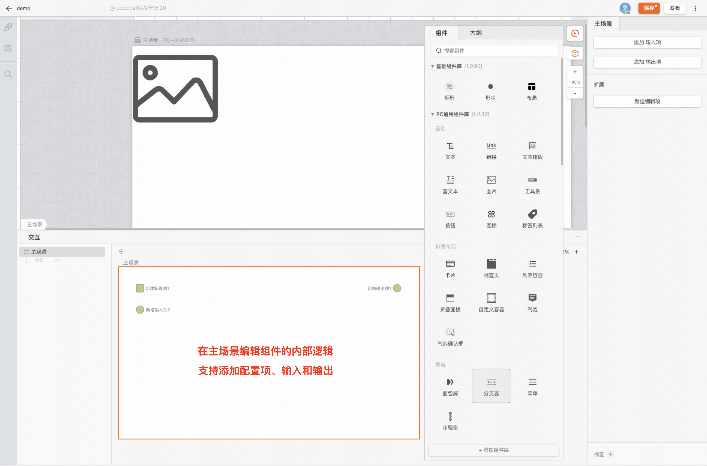

## 使用实践

### 搭建一个表格的自定义项

这里以搭建一个表格的自定义项为例，下图这种自定义项常常存在于多个页面中，每次都从 0 开始搭建肯定是会有很多工作量的

这里我们用云组件来搭建一个这样的组件，完成以下几个需求

- 支持添加到组件表格自定义项中，并且获取表格每一行的数据来渲染
- 加入职位按钮文案可以调整，并且点击后自动调用加入接口

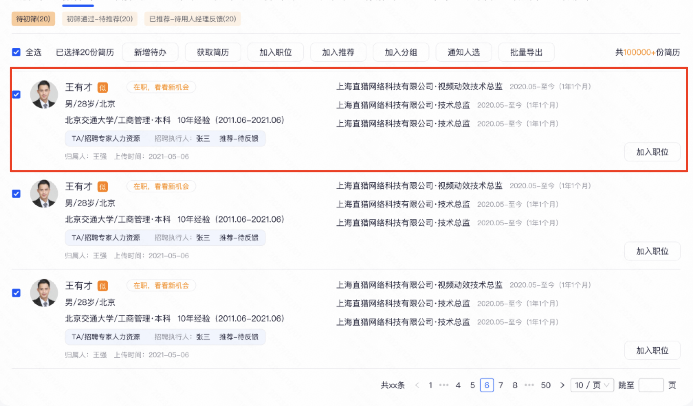

结果演示：

左侧为页面搭建视角、右侧为云组件搭建视角

<iframe style="position: absolute; width: 100%; height: 100%; left: 0; top: 0;" src="//player.bilibili.com/player.html?aid=411807545&bvid=BV1AV411X7j5&cid=1419761314&p=1&autoplay=0" frameborder="no" scrolling="no"></iframe>

### 创建一个云组件

新建一个云组件并配置画布到合适的大小

> 组件搭建过程与搭建页面无异，本篇文档不再展开，可参考 [「开始使用」](/docs/getstarted/user-interface/)

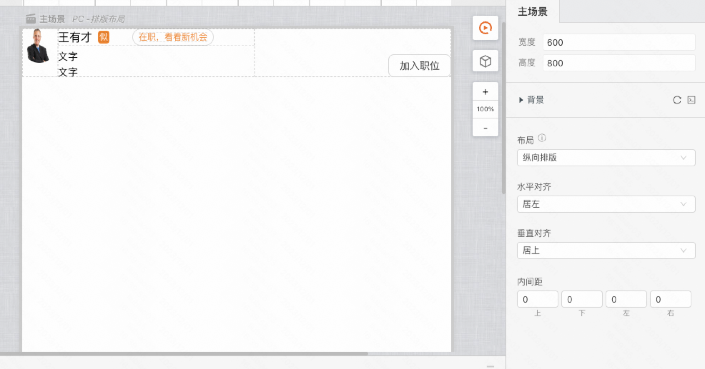

### 搭建配置项和输入输出

添加配置项，命名为「加入按钮标题」，连接到加入按钮的输入项中，支持按钮文本的修改

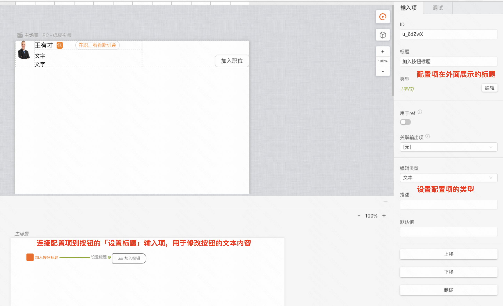

添加输入项，命名为「设置候选人数据」，获取候选人数据，并将数据通过对象取值分发到各个 UI 节点

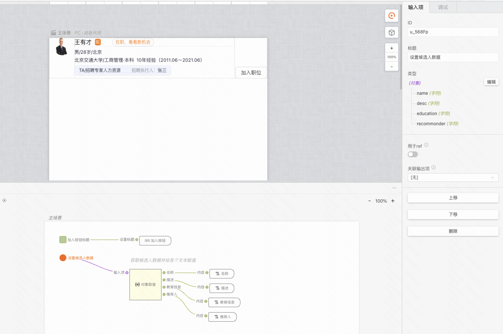

添加输出项，命名为「加入职位成功」，并在按钮单击后请求接口，请求成功后将结果输出

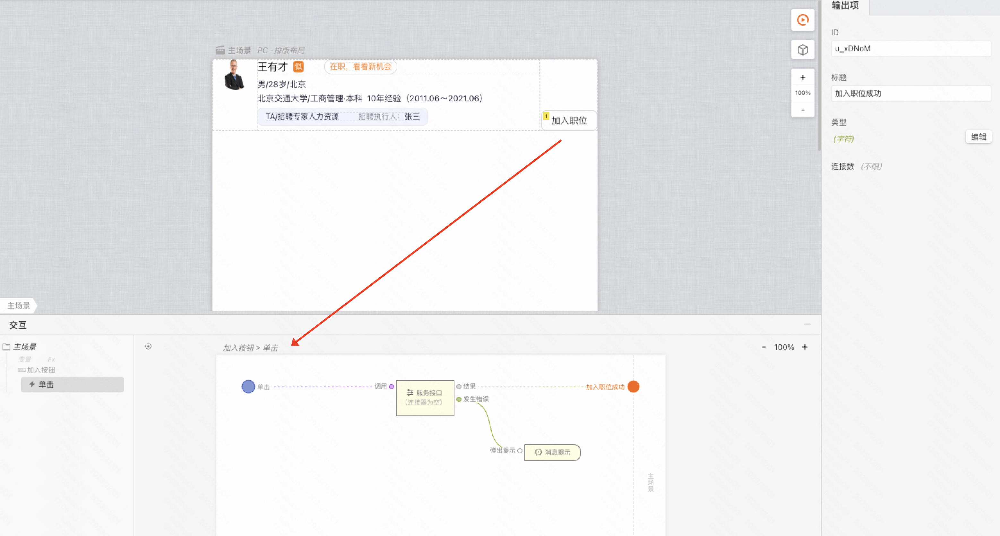

### 发布云组件/添加组件到页面

至此，云组件就可以发布了，点击右上角发布即可发布成功

新建页面，从我的组件中打开物料中心，即可添加组件到页面中

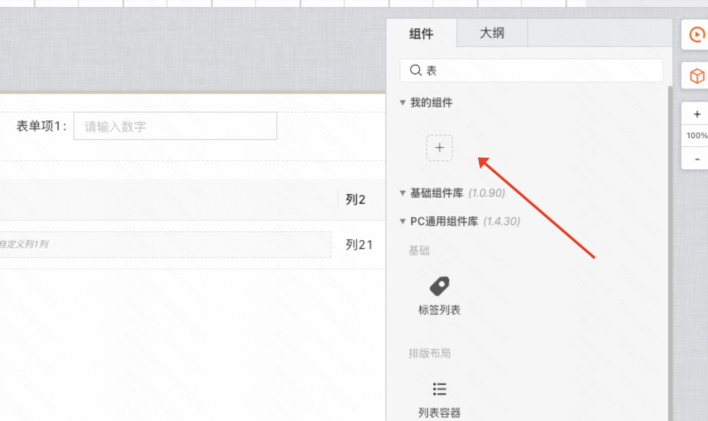

### 使用/测试组件

将添加的组件拖入表格的插槽中，可以看到刚刚的配置项和输入输出都出现了

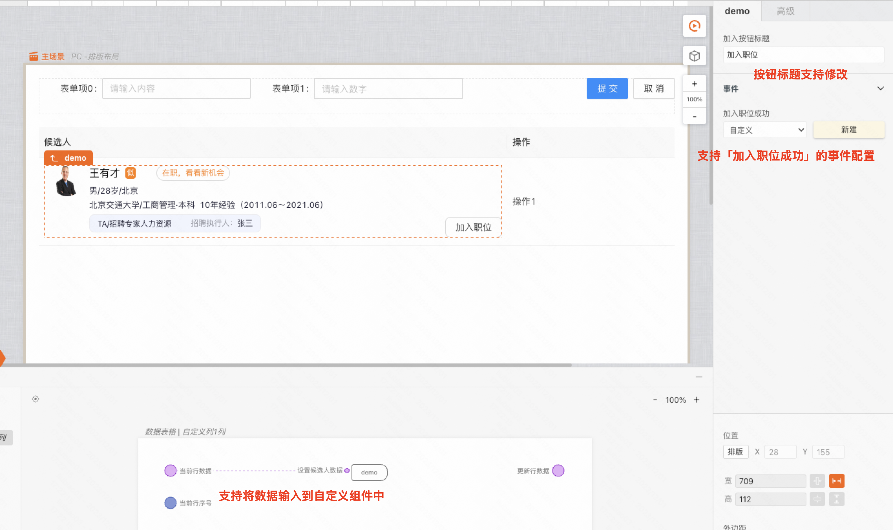

造一个数据给到数据表格，可以看到数据成功传入，页面也正常渲染了三个候选人

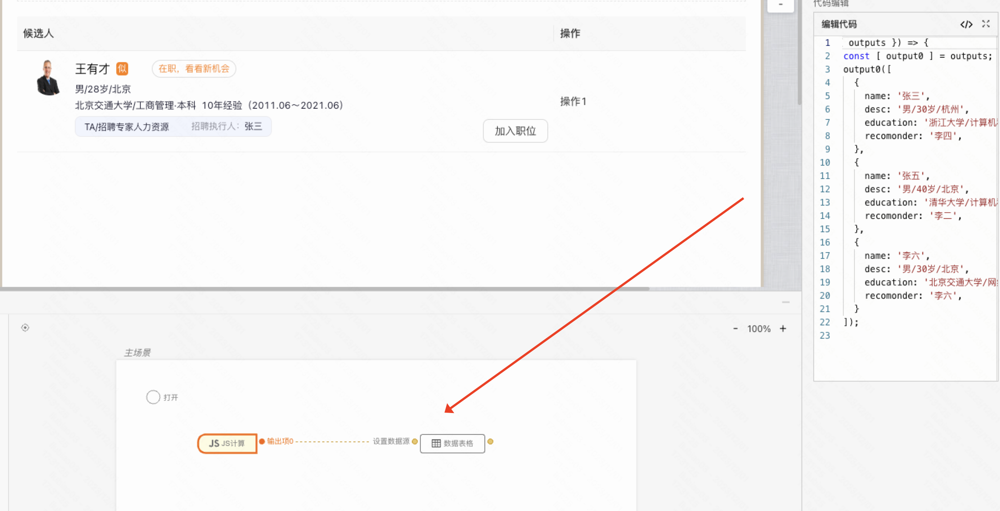

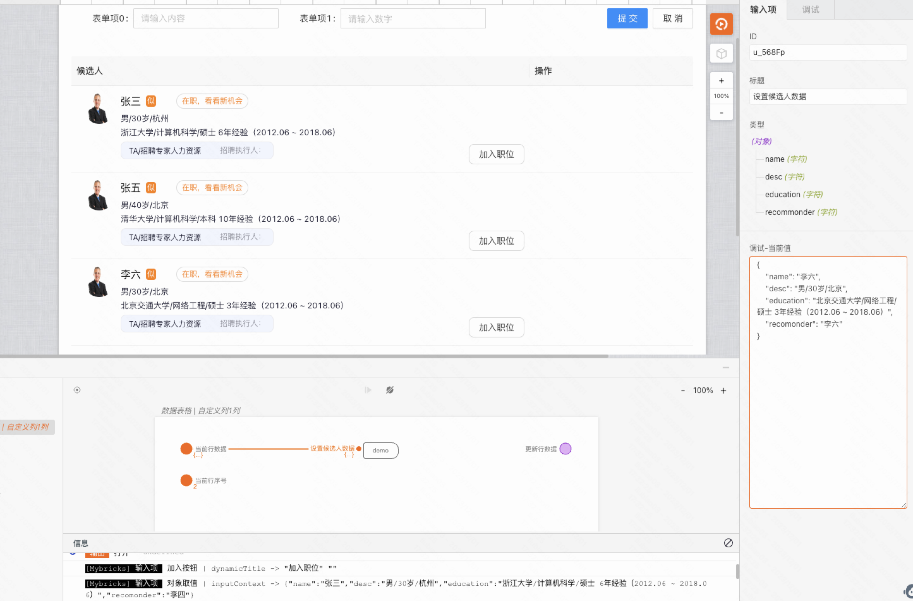

修改按钮文案为 「加入候选池」，可以看到页面也实时修改了

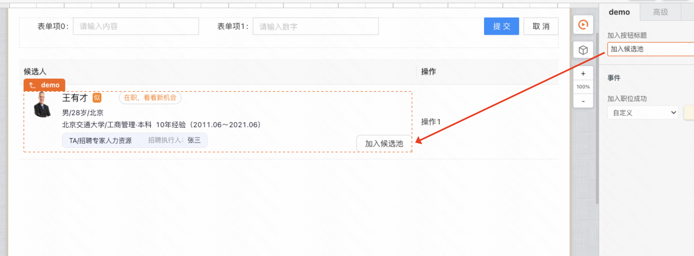
