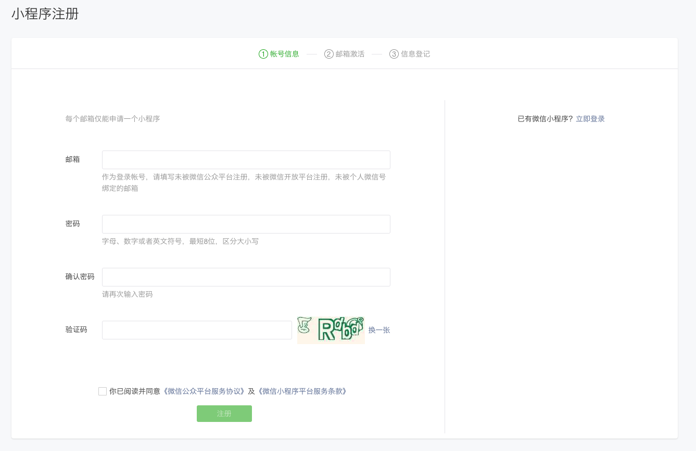
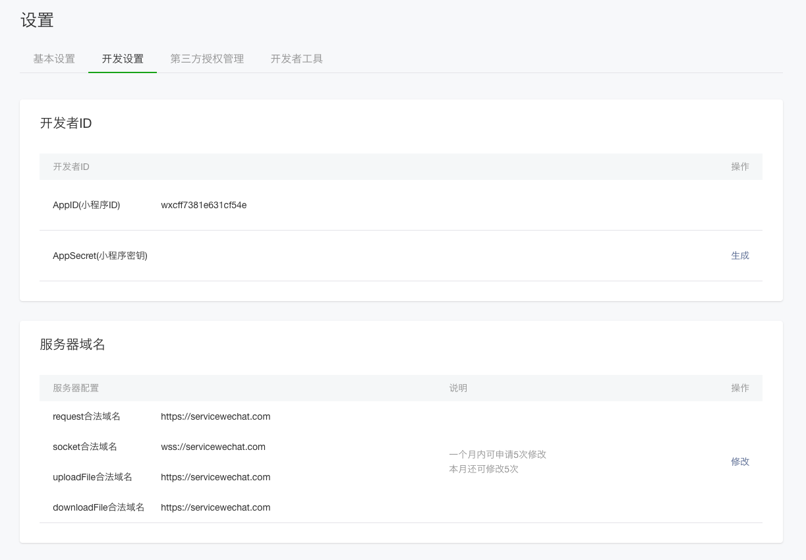
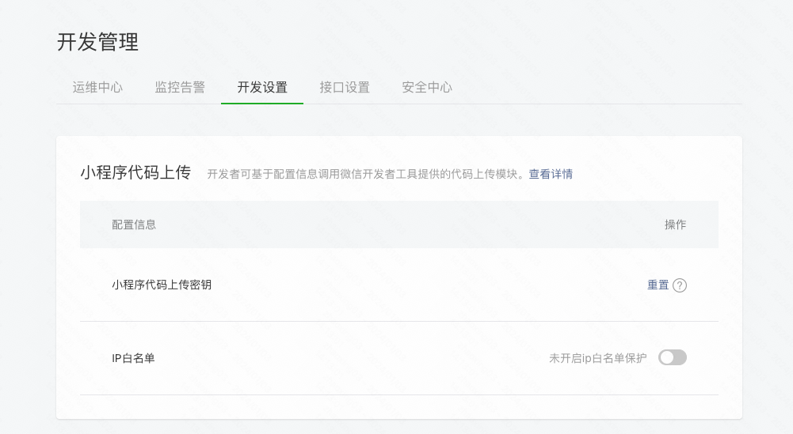
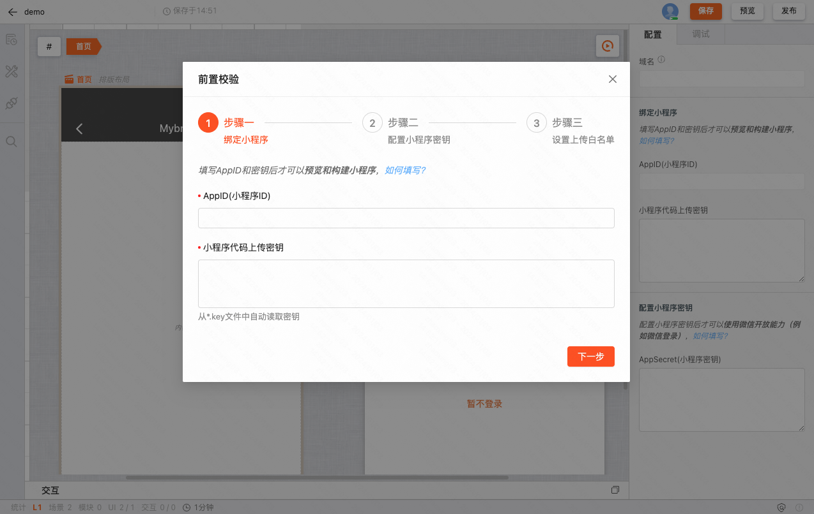

### 概述

小程序扩展是基于 MyBricks 引擎构建的，因此，它们共享相同的基本操作。如需了解详细的信息，可以参考 [基本使用](/docs/getstarted/user-interface/) 文档。

### 申请账号

进入[小程序注册页](https://mp.weixin.qq.com/wxopen/waregister?action=step1) 根据指引填写信息和提交相应的资料，就可以拥有自己的小程序账号。

在这个小程序管理平台，你可以管理你的小程序的权限，查看数据报表，发布小程序等操作。

登录[小程序后台](https://mp.weixin.qq.com/) ，我们可以在菜单 「开发 > 开发设置」 看到小程序的 AppID 了。

### 配置小程序代码上传

小程序构建成功后，代码将通过 [miniprogram-ci](https://www.npmjs.com/package/miniprogram-ci) 上传到微信小程序平台。使用前需要使用小程序管理员身份访问「微信公众平台 > 开发 > 开发设置」后下载代码上传密钥，并配置 IP 白名单，才能进行预览、发布操作。

然后需要将 AppID 和小程序代码上传密钥在页面设置中正确配置，未正确填写在发布前会触发前置校验。

其中需要了解的是：

预览：将小程序发布到**开发版**

发布：将小程序发布到**体验版**

### 开始搭建

在完成上述步骤后，你就可以开始开发你的小程序了。
