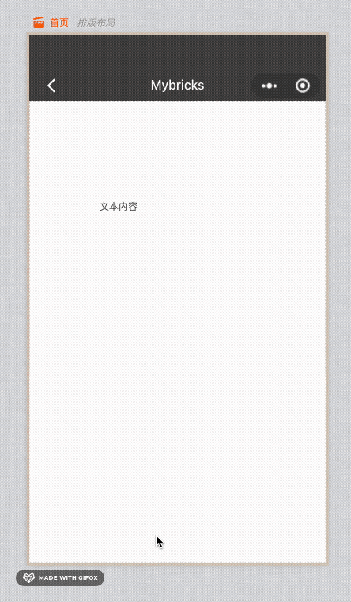
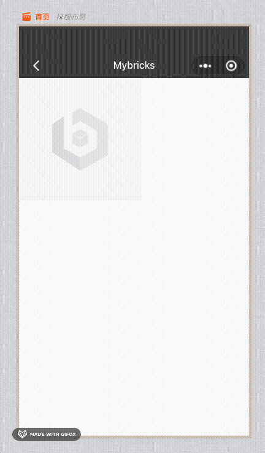
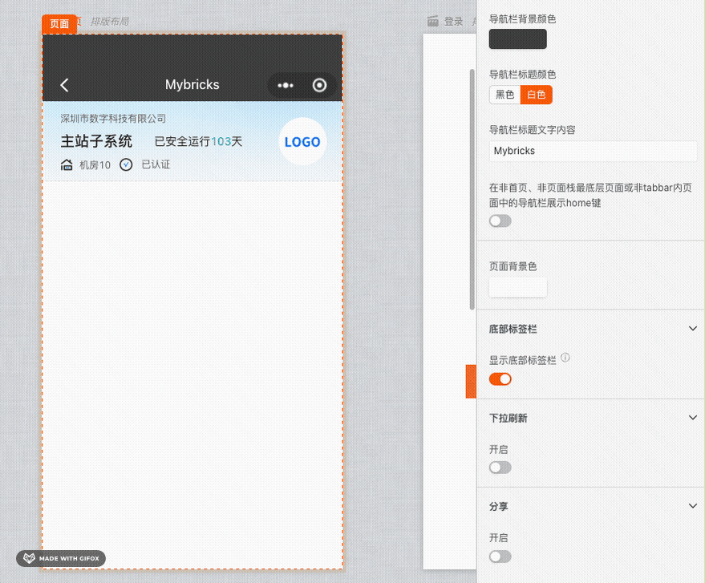
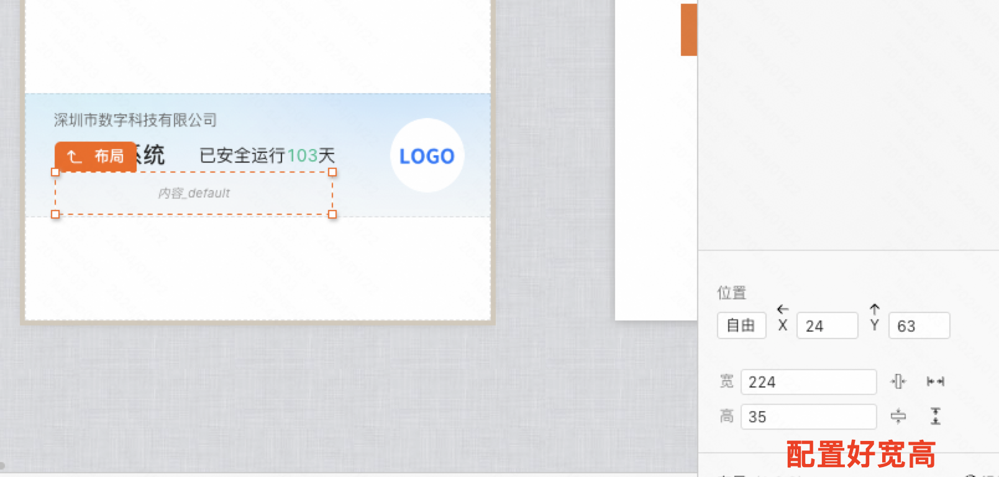
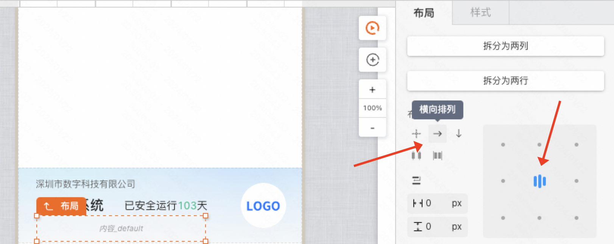
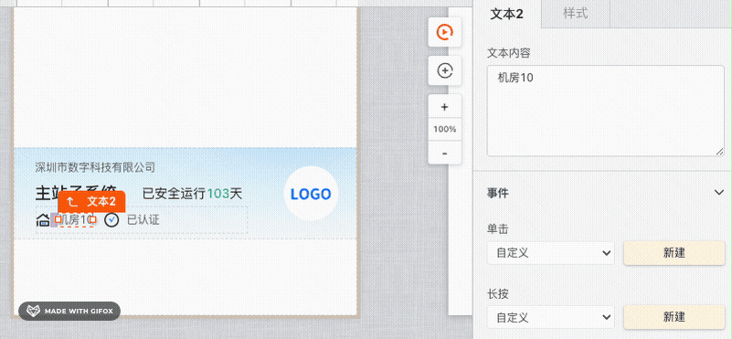

:::tip
本章将学习如何使用Mybricks的布局来搭建小程序的UI界面
:::

## 基本概念
在Mybricks搭建中，我们主要用到的两种布局体系分别是「自由布局」和「流式布局」

### 自由布局
类似PPT等软件，内部的组件可以自由拖动位置

### 流式布局
类似俄罗斯方块，内部的组件会按照某个方向堆叠，下一个组件会堆叠到上一个组件的后面

大部分组件（包含画布）的布局方式为「流式布局」，通过流式布局，我们可以很轻松地拖拽出一个小程序页面的大体框架

但是实际的页面往往比这复杂得多，接下来我们来学习如何搭建更复杂的例子

## 最佳实践

### 搭建一个元素丰富的展示区
对于这种元素比较多，并且不规整的展示区块，我们可以选用自由布局来搭建

#### Step1：添加自由布局组件
添加组件，配置背景图片，同时按照设计稿调整高度

#### Step2：添加/调整内部元素
添加内部组件并调整位置

到这里看上去是已经搭建好了，但是实际上机房右边的数字是动态的，假如数据变长的话，就会出现文字覆盖后面组件的情况

#### Step3：用流式布局处理动态数据
由于流式布局的特性，“**后面的组件会堆叠的前面组件的后面**”，处理这种情况十分方便，我们将一个流式布局配置好宽高拖到目标位置

添加元素，并配置流式布局的内容为「横向排列」「居中排版」

将刚刚自由布局的元素拖到流式布局中，可以看到元素都一个个整齐地排列到了布局中，长文本也不用担心

最后调整下间距，文本不论长度都完美适配了

### 搭建一个配送信息卡片
对于这种元素比较规则，同时希望根据内容改变卡片高度的区块，我们可以选用流式布局来搭建

> **搭建要点**：文字信息都是动态的，比如「配送地址」长度可能出现一行两行三行的情况，此时卡片高度需要自动变化

**施工中...**

<!-- #### Step1：添加流式布局组件

#### Step2： -->

<!-- 详见 [画布视图](/docs/getstarted/geoView/) -->