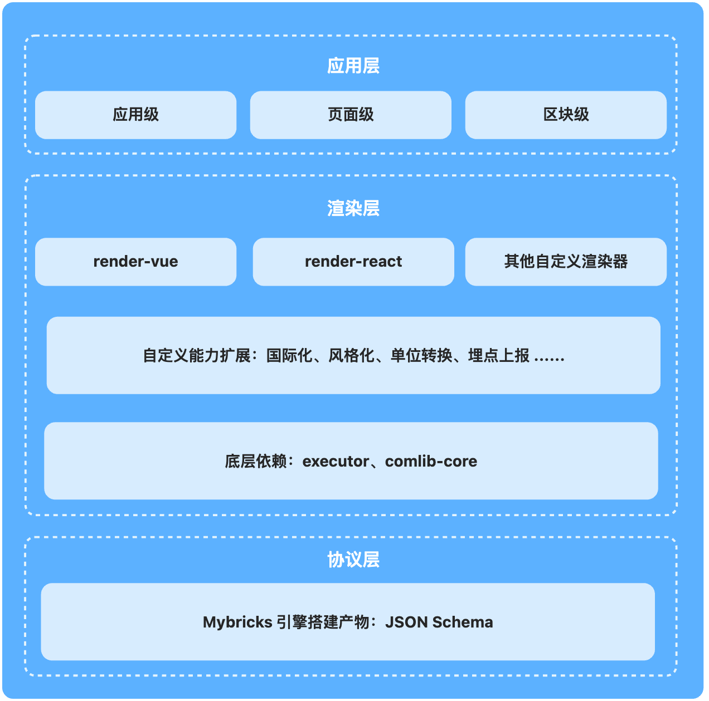
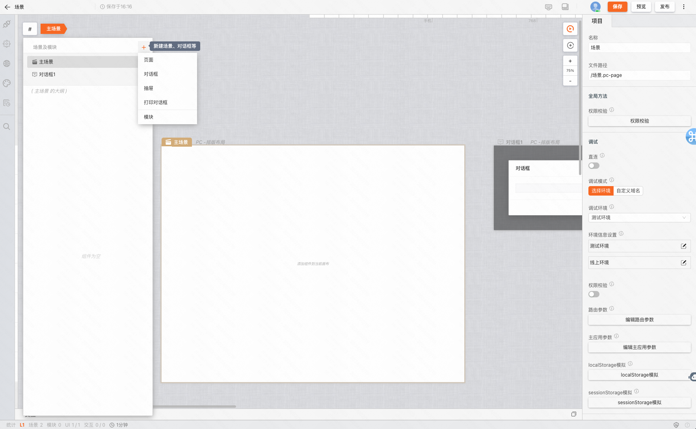

# 搭建产物解析及自定义渲染

MyBricks 通过搭建过程生成一份 JSON 描述，这份描述详细地反映了页面内的组件以及它们之间的交互。我们将解析这份 JSON 描述以渲染最终的页面内容。



<figure>总览</figure>

:::tip
官方团队分别提供了 [React 渲染器](https://github.com/mybricks/render-web) 和 [Vue 渲染器](https://github.com/mybricks/render-web/tree/bugfix/vue-render)、小程序渲染器等，可以点击查看源代码。
:::

## 渲染器的使用

我们可以选择使用现有的渲染器，或者自定义开发一个新的渲染器来进行页面渲染。下面，我们将以官方团队提供的 React 渲染器为例进行说明。


引入必要的资源，注意这里因为通用组件库依赖 react 和 antd，所以这里需要全局引入一下

```
<!-- antd 样式部分 -->
<link rel="stylesheet" type="text/css" href="https://f2.eckwai.com/udata/pkg/eshop/fangzhou/pub/pkg/antd-4.21.6/antd.min.css"/>

<!-- React部分 版本号 -->
<script src="https://f2.eckwai.com/udata/pkg/eshop/fangzhou/pub/pkg/reat-18.0.0/react.production.min.js"></script>
<script src="https://f2.eckwai.com/udata/pkg/eshop/fangzhou/pub/pkg/react-dom-18.0.0/react-dom.production.min.js"></script>

<!-- antd js部分 -->
<script src="https://f2.eckwai.com/udata/pkg/eshop/fangzhou/pub/pkg/antd-4.21.6/antd.min.js"></script>
<script src="https://f2.eckwai.com/udata/pkg/eshop/fangzhou/pub/pkg/ant-design/icons-4.7.0/dist/index.umd.min.js"></script>

<script src="https://f2.eckwai.com/kos/nlav12333/mybricks/plugin-http-connector/1.1.79/index.js"></script>

<!-- 组件库 -->
<script src="https://f2.beckwai.com/udata/pkg/eshop/fangzhou/temp/dhunting/460097841299525editJs.js"></script>
<script src="https://f2.beckwai.com/udata/pkg/eshop/fangzhou/temp/dhunting/460097351385157editJs.js"></script>
<script src="https://f2.beckwai.com/udata/pkg/eshop/fangzhou/temp/dhunting/460097957634117editJs.js"></script>
```

```TSX
import React, { useState, useCallback, useMemo, useEffect } from "react";
import { render } from "@mybricks/render-web";
import { call as callConnectorHttp } from "@mybricks/plugin-connector-http";
import toJSON from "./toJSON";

export default function Render() {
  return render(toJSON, {
    env: {
      i18n(title) {
        return title;
      },
      callConnector(connector, params, connectorConfig = {}) {
        const plugin =
          window[connector.connectorName] ||
          window["@mybricks/plugins/service"];

        const curConnector = (
          schema.plugins[connector.connectorName] || []
        ).find((con) => con.id === connector.id);

        return curConnector
          ? plugin.call(
              { ...connector, ...curConnector },
              params,
              connectorConfig
            )
          : Promise.reject("找不到对应连接器 Script 执行脚本.");
      },
    },
  };
}
```

## 搭建产物解析

### JSON Schema 结构

JSON Schema 根据搭建的场景不同，可以分为多场景和单场景两种结构。

首先，让我们回顾一下场景的概念。如下图所示，如果应用支持通过「导航 > 新建场景对话框」等方式创建新的场景，那么搭建的产物就属于多场景类型。如果不支持，那么产物就属于单场景类型。



<figure>上图即为多场景</figure>

#### 单场景

这通常应用于云组件等应用，其 JSON 描述了一个场景（`scenes`）中的依赖、实例、通信等信息。

```JSON
{
  "deps": [...],    // 页面依赖组件列表
  "coms": {...},    // 组件实例的详细信息，包含了实例ID、配置项、输入项、输出项等
  "slot": {...},    // UI 组件的布局、嵌套关系以及容器的样式信息等
  "cons": [...],    // 逻辑面板的交互信息
  "inputs": [...],  // 全局输入项的信息
  "outputs": [...], // 全局输出项的信息
  ...               // 其他扩展字段，如 themes（主题包）、plugins（插件）等
}
```

#### 多场景

多场景结构适用于更复杂的情况，例如构建一个完整的页面或应用。其 JSON 描述会包含多个场景（`scenes`）的信息。

```JSON
{
  "global": {...},  // 全局变量和函数
  "scenes": [...],  // 包含多个场景的信息，每一项都是一个单独场景的描述
  ...               // 其他扩展字段，如 themes（主题包）、plugins（插件）等
}
```

### JSON Schema 解析

#### 依赖

- **executor** ，用于处理逻辑编排数据流动
- **comlib-core** ， **Mybricks** 引擎内置的逻辑组件（变量、Fx 卡片、类型转换等）

#### 入口

##### 提供一个组件

> 需要兼容不同的 JSON 描述（多场景、非多场景）

```Typescript
<script>
// 非多场景封装组件
import Main from "./Main.vue";
// 多场景封装组件
import MultiScene from "./MultiScene.vue";

export default {
  functional: true,
  render (h, { props }) {
    // 可直接根据 scenes 字段是否为数组来判断是否为多场景 JSON描述
    const scenes = Array.isArray(props.json.scenes);
    // 根据判断使用不同的组件
    const component = scenes ? MultiScene : Main;

    return h(component, { props }, []);
  }
};
</script>
```

##### 组件入参

```JSON
{
  "json": {...},     // JSON描述
  "options:": {       // 自定义配置项目，以下仅供参考
    "env": {...},    // 可通过组件props传入
    "comDefs": {...} // 组件信息
  }
}
```

#### 非多场景（Main.vue）

> 下述流程均依赖上述组件入参

##### 前置处理逻辑

1. 合并自定义组件和引擎内置组件（必须，具体取决于 comDefs 数据解构）

```Typescript
import coreLib from "comlib-core"

coreLib.comAray.forEach(({ namespace, version, runtime }) => {
  comDefs[`${namespace}-${version}`] = {
    runtime
  }
})
```

2. 提供 getComDef 函数（必须，具体取决于 comDefs 数据解构）

```Typescript
<script>
export default {
  methods: {
    getComDef(def) {
      return comDefs[`${def.namespace}-${def.version}`]
    }
  }
}
</script>
```

3. 自定义 **logger** ，打印组件渲染各流程的数据，也可下放给组件 props

> 根据具体场景来定义实现

```Typescript
<script>
export default {
  methods: {
    logger() {
      if (error) {
        this.$notify.error({
          title: '错误',
          message: '这是一条错误的提示消息'
        });
      } else {
        console.log('xx => xxx')
      }
    }
  }
}
</script>
```

4. 其他

##### 使用 executor 注册组件间逻辑交互

```Typescript
<script>
export default {
  created() {
    let refs
    const context = executor({
      json,
      getComDef,
      env,
      ref(_refs) {
        refs = _refs
      },
      logger,
      ...
    })

    // refs 可用于主动触发全局输入项
    this.refs = refs
    // context 提供了根据 组件ID 获取组件信息的能力
    this.context = context
  }
}
</script>
```

##### 判断是否为逻辑面板描述

> 在多场景中，将全局 Fx 作为一个场景来处理

```Typescript
<template v-if="json.rtType === 'js'">
  <!-- 没有UI组件，不需要再往下走了 -->
</template>
<template v-else>
  <!-- 渲染UI组件 -->
  <RenderSlot
    :slot="json.slot"
    :getComDef="getComDef"
    :context="context"
    :logger="logger"
    ...
  />
</template>
```

##### 渲染 UI 组件（slot）

> slot 可以理解为插槽，一个页面就是一个大插槽，插槽内各类组件，组件内也会有插槽，所以这里需要递归遍历组件信息来进行组件的渲染

##### slot 数据格式概述

```JSON
{
  "slot": {
    ...,
    "comAry": [ // 画布内组件信息列表，遍历渲染
      {
        "id": "u_Ccx_6",
        "name": "u_6goJ1",
        "def": {
          "namespace": "mybricks.normal-pc.custom-button", // 组件唯一命名空间
          "version": "1.0.17" // 组件版本号
        }
      },
      {
        "id": "u_fep3u",
        "name": "u_M6Ptm",
        "def": {
          "namespace": "mybricks.normal-pc.custom-container",
          "version": "1.0.12"
        },
        "slots": { // 组件内插槽
          "content": { // 插槽 ID
            "id": "content",
            "title": "内容",
            "comAry": [ // 插槽内组件信息列表，继续遍历渲染
              {
                "id": "u_TLcN0",
                "name": "u_4hRR3",
                "def": {
                  "namespace": "mybricks.normal-pc.text",
                  "version": "1.0.10"
                }
              }
            ],
            "style": {
              "layout": "flex-column",
              "justifyContent": "flex-start",
              "alignItems": "flex-start"
            }
          }
        }
      }
    ],
    "style": { // 插槽样式，一个页面相当于是一个插槽，组件内也会有插槽
      "backgroundColor": "#ffffff",
      "layout": "flex-column",
      "justifyContent": "flex-start",
      "alignItems": "flex-start"
    }
  }
}
```

##### RenderSlot（遍历 slot 内 comAry）

```Typescript
<template>
  <div>
    <component
      v-for="com in comsJSX"
      :key="com.key"
      :is="com.component"
      <!-- ...props -->
    />
  </div>
</template>

<script>
export default {
  created() {
    const {
      style, // 插槽样式
      comAry // 插槽内组件信息列表
    } = slot

    const comsJSX = []

    comAry.forEach((com) => {
      const { id, def } = com
      const comDef = getComDef(def)
      if (comDef) {
        const props = context.get(id)

        comsJSX.push({
          key: id,
          component: RenderCom,
          props: {
            key: id,
            com,
            getComDef,
            context,
            props,
            env,
            logger,
            ...
          }
          })
      } else {
        // 找不到该组件的一些处理逻辑
      }
    })
  }
}
</script>
```

##### RenderCom（渲染组件）

```Typescript
<template>
  <div>
    <component
      :id="id"
      :is="com"
      :data="data"
      :title="title"
      :style="style"
      :slots="slotsProxy"
      :parentSlots="parentSlots"
      :inputs="inputs"
      :outputs="outputs"
      <!-- ...props -->
    />
  </div>
</template>

<script>
export default {
  created() {
    const { id, def, name, slots = {} } = com
    const {
      data,  // 组件初始化数据源
      title, // 组件标题
      style, // 组件样式
    } = props

    const comDef = getComDef(def)

    // 根据style信息做相应处理
    // 拼接具体的css选择器插入style标签 或 是直接使用行内样式
    // 有些场景需要对 style 内的值做处理，例如px转rem、px转vw等

    this.com = comDef.runtime

    if (props.frameId && props.parentComId) {
      const slotProps = context.get(props.parentComId, props.frameId, scope?.parent)
      if (slotProps) {
        // 用于插槽内组件与父组件间的通信
        this.parentSlot = {
          get _inputs() {
            return new Proxy({}, {
              get(target, name) {
                const fn = slotProps._inputRegs[name]
                return fn
              }
            })
          }
        }
      }
    }

    this.slotsProxy = new Proxy(slots, {
      get(target, slotId) {
        const props = context.get(id, slotId, scope)
        return {
          render() { // 组件内调用的render函数
            const slot = slots[slotId]
            return {
               component: RenderSlot, // 插槽继续调用RenderSlot来渲染插槽内组件
              props: {...} // 同上述RenderSlot入参
            }
          },
          get size() { // 插槽内组件数量
            return !!slots[slotId]?.comAry?.length
          },
          inputs: props.inputs,  // 插槽输入
          outputs: props.outputs // 插槽的输出
        }
      }
    })

  }
}
</script>
```

#### 多场景（MultiScene.vue）

> 多场景需要多处理一步全局的 变量 以及 Fx，每个场景的渲染与上述非多场景无异

##### global 数据格式概述

```JSON
{
  "comsReg": {...}, // 全局变量组件信息，内容同上述coms
  "fxFrames": [],   // 全局Fx信息，内容同非多场景json
  ...
}
```

##### 渲染

> 分别将 scenes 和 global 下的 fxFrames 遍历使用 Main.vue 去渲染

```Typescript
<template>
  <div>
    <Main
      v-for="item in json.scenes"
      :json="item"
      :options="options(item.id)"
    />
    <component
      v-for="frame in fxFramesJsx"
      :key="frame.key"
      :is="frame.component"
      :json="frame.json"
      :opts="frame.options"
    />
  </div>
</template>

<script>
import Main from "./Main.vue";
export default {
  components: {
    Main,
  },
  created() {
    // 解析json
    const { scenes, global } = json

    scenes.forEach((scene, index) => {
      // 将global内的组件和连线信息直接注入到各场景
      Object.assign(scene.coms, coms)
      // ...

      // 先展示第一个场景
      scene.show = !index
    })

    // 处理全局Fx
    const { fxFrames } = global
    const fxFramesJsx = []
    fxFrames.forEach((fxFrame) => {
      fxFramesJsx.push({
        key: id,
        component: Main,
        json: {...fxFrame, rtType: 'js'}, // rtType 用于在Main.vue中判断是否有UI组件
        options
      })
    })
  },
  methods: {
    options(id) {
      // 根据具体场景，不同id可以返回不同的配置信息
      return {...}
    }
  }
}
</script>
```
