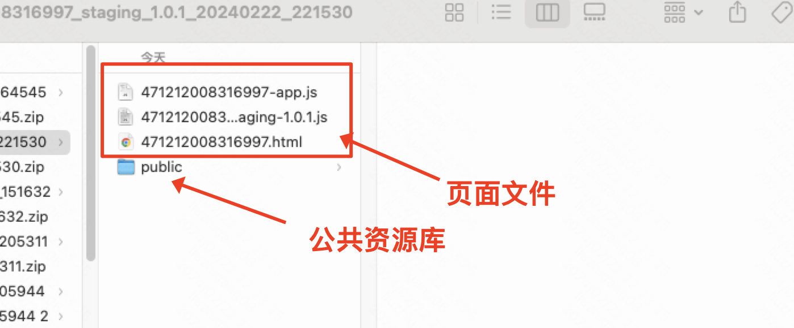
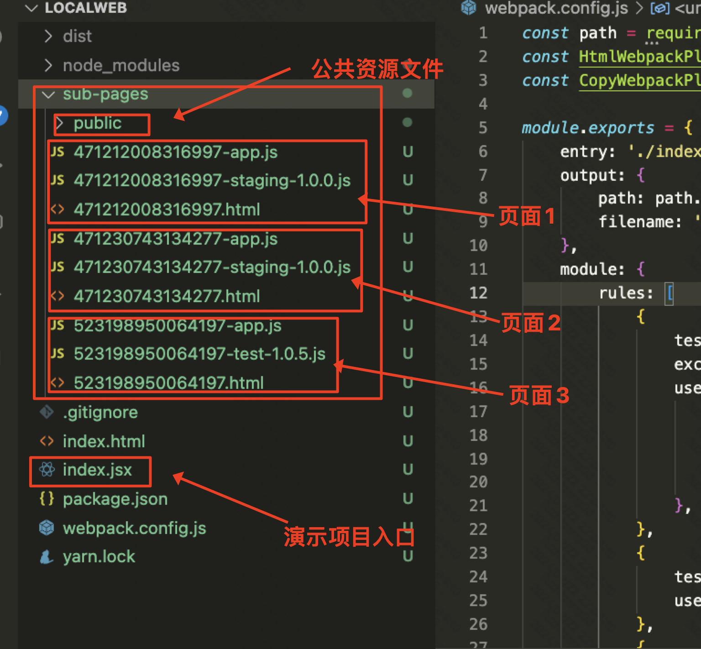
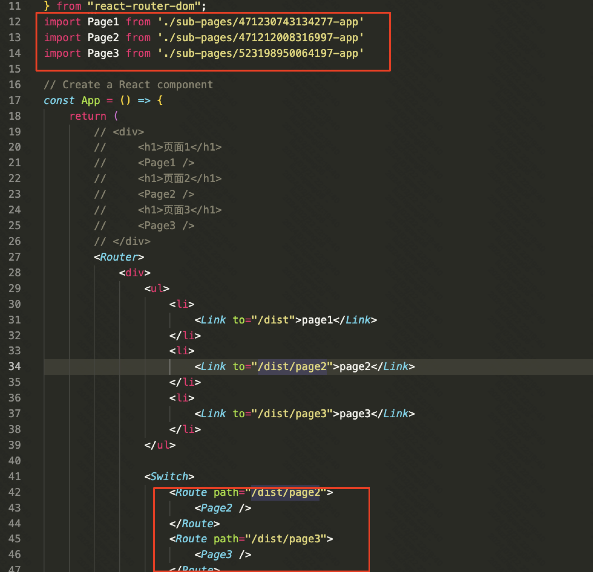
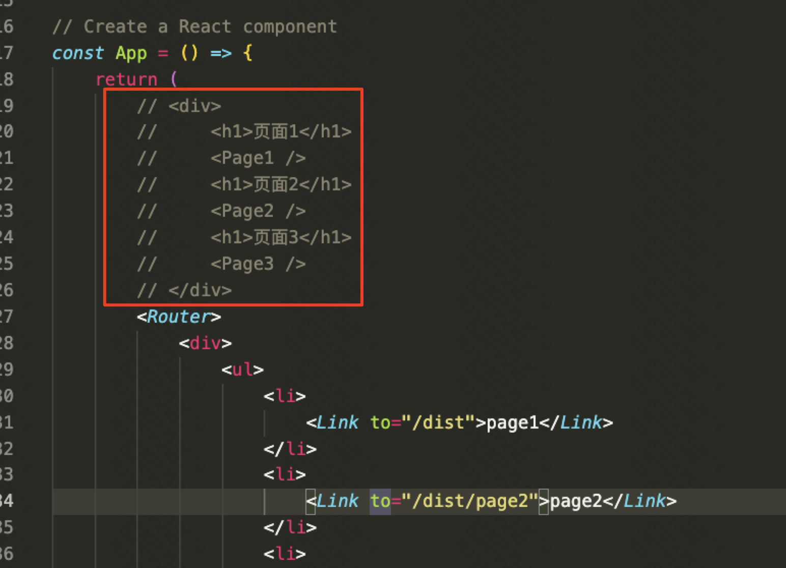

# 下载后的页面如何在项目中使用

- 页面下载的zip包内文件说明如下

-   react演示项目说明

1.  将zip包内的文件复制到 **sub-pages** 下

   -   2个js和一个html文件必须复制
   -   public文件夹可以公用，需要增量复制，如果已经有了，可以不复制

- 

2.  在index.jsx中引用对应的页面组件

   1.  这里演示加载对应的页面组件，并放入react-router中进行展示
   2.  此时xxxxx-app.js文件导出的是普通react组件，可以直接在用户业务代码中使用

3，如何演示

-   npm run build
   -   自动将项目的index文件打包，并自动将sub-pages下的文件都输出到dist目录中
-   npm i -g anywhere安装一个静态资源服务器，并在当前项目目录下执行 \`anywhere\` 启动服务
-   打开浏览器访问  http://localhost:8000/dist
   -   打包和使用anywhere的原理是：

      -   模仿客户页面部署后，将搭建的静态资源和用户资源放到同一个路径下（dist下）
      -   将页面文件和项目文件都放到dist中，通过 localhost/dist来访问项目和各个子页面，保证子页面html和项目可以在同一级url路径下被访问到

-    **注意：每次访问的时候都需要从  http://localhost:8000/dist 直接访问，不要 在http://localhost:8000/dist/page2下进行刷新访问，否则会出错（这与演示项目的配置有关，跟页面组件功能无关）** 
-    **如果路由访问方式有问题，使用注释部分的代码，直接渲染page组件即可** 

   - 