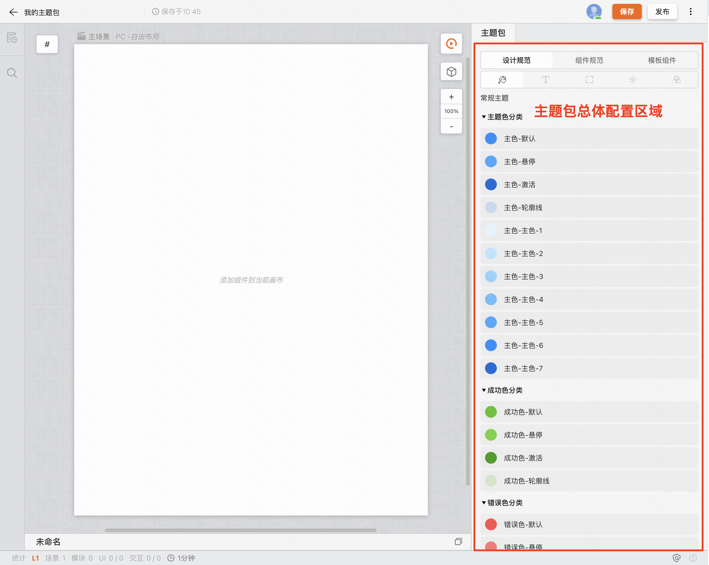
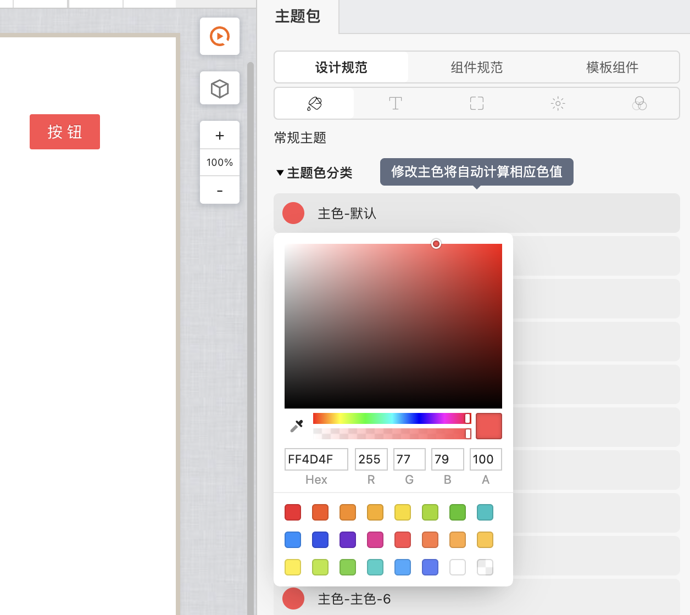
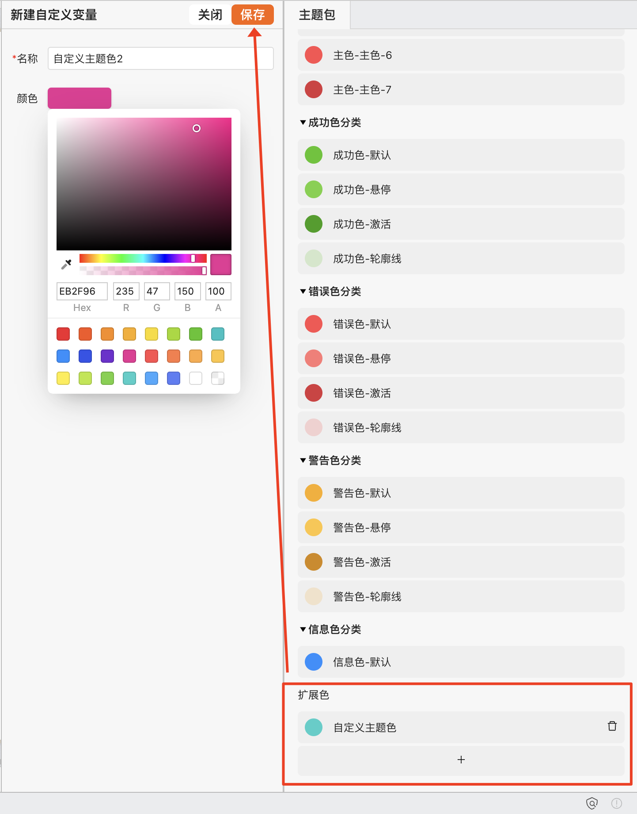
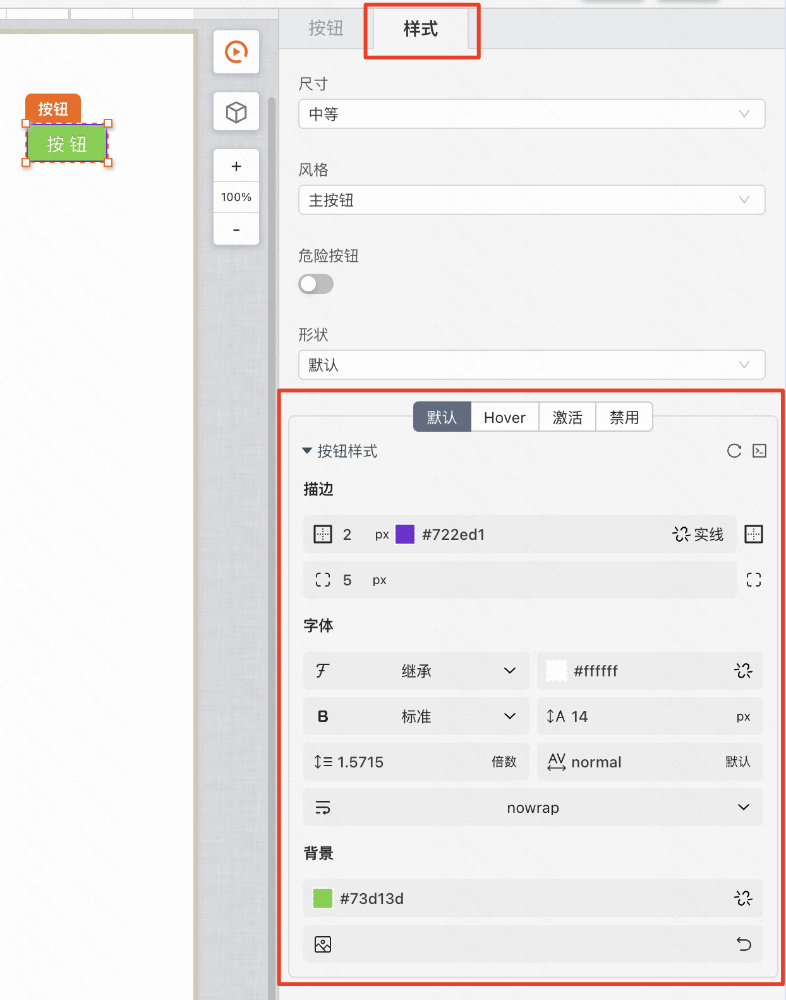
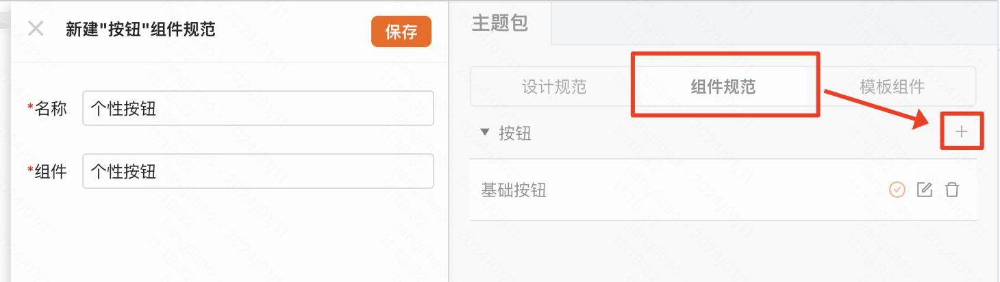
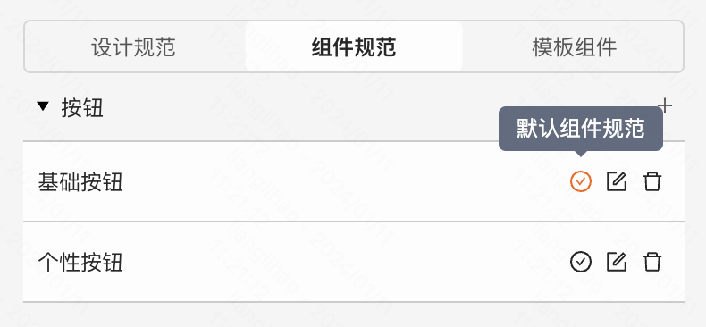
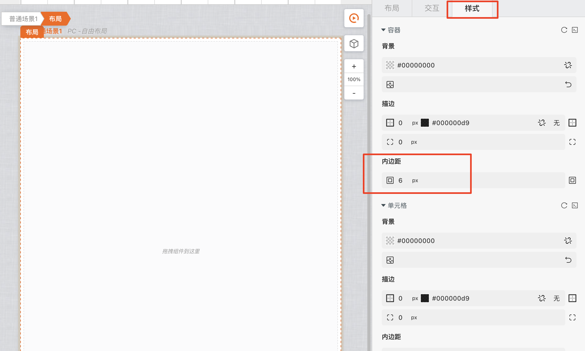
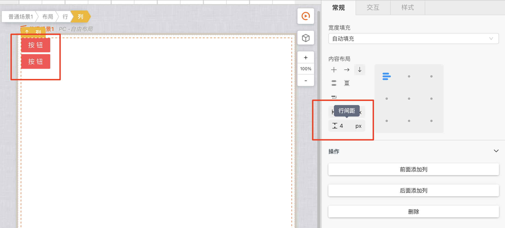
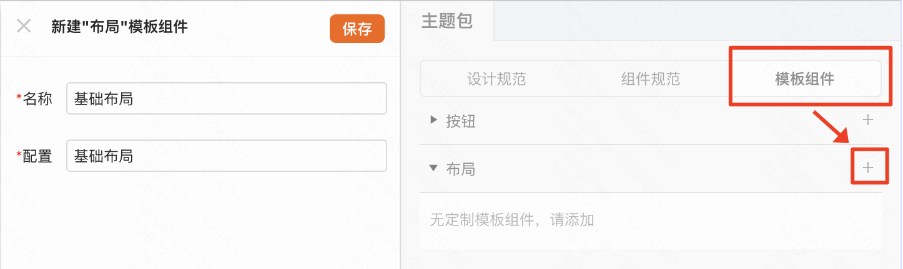
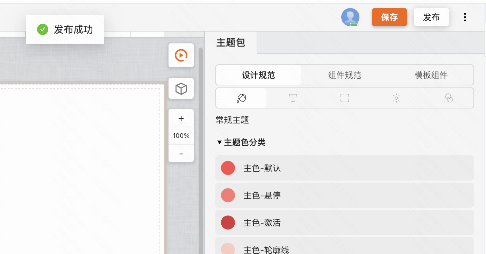

:::tip
通过本章节，了解如何搭建主题包，以丰富和适应各类设计需求。
:::

<figure>总览图</figure>

## 设计规范

> 设计规范包含了已向外提供的所有css变量的配置能力。

### 修改主题色

点击需要修改的颜色，在弹窗的调色板选择所需的颜色即可。

> **注意事项**
>
> “默认”色的修改将会自动计算当前颜色分类下所有颜色值并覆盖

### 创建自定义颜色变量

点击最下方的扩展色“+”，在弹出框中填写相应的变量名称并选择颜色保存即可

## 组件规范

> 组件规范可以针对某个组件来进行更加个性化的配置，下述以按钮组件举例。

### 设计组件规范

选中按钮组件，选择“样式”栏，在下方配置组件样式。

### 添加为组件规范

若组件规范被设置为默认时，最终在使用时，会被用作默认的配置，自动设置到组件上。

## 模板组件

> 模板组件不仅保留了组件的个性化配置，还保留了组件的模型，例如可以提供一个标准的布局，保证页面的调理清晰，下述以布局组件举例。

### 设计模板组件

选中布局组件，选择“样式”栏，在下方配置组件样式，设置边距和单元格内部的行间距。

为多个布局之间留出空间

为内容之间留出空间

### 添加为模板组件

## 发布主题包

主题包搭建完成后，点击发布，发布成功后即可在所有支持了主题包能力（安装了主题包插件）的应用中使用。

