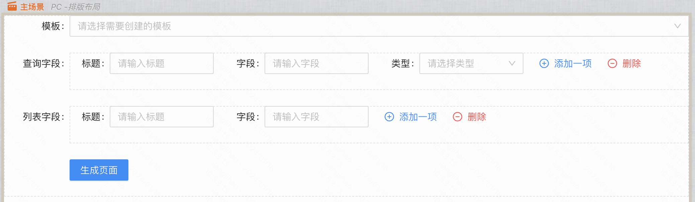
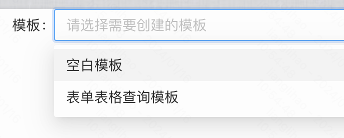
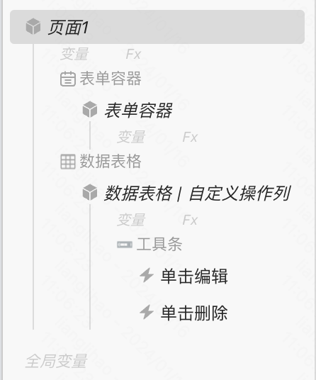
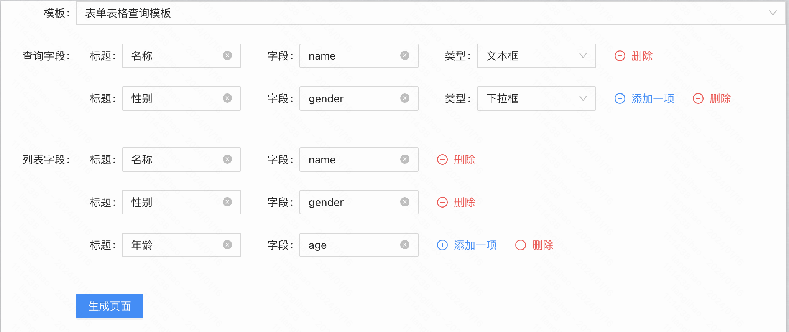
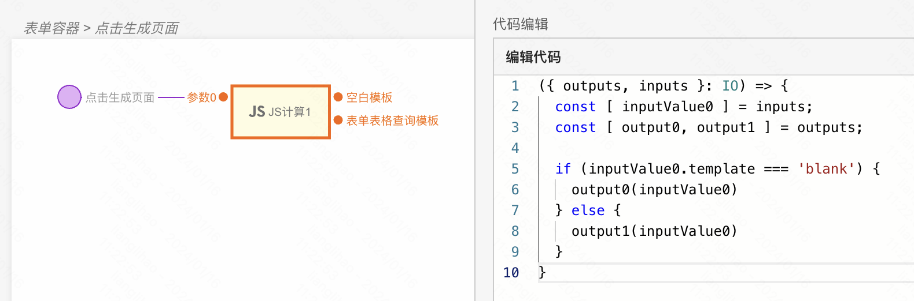
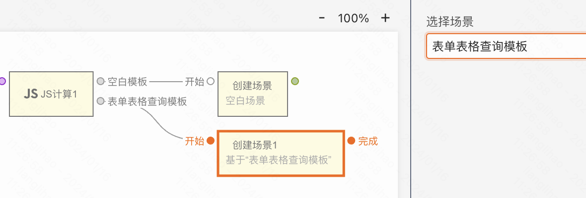
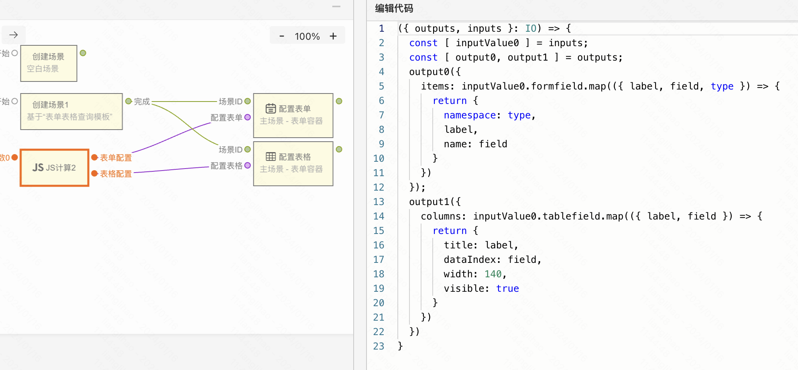
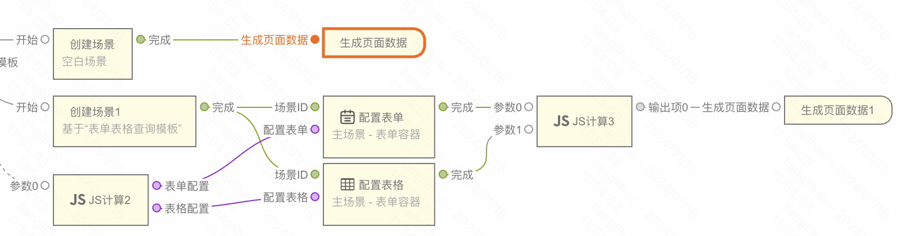

:::tip
通过本章节，了解如何搭建动态模板，区别于静态模板，动态模板通过搭建的配置页面可以对最终产出的模板进行修改和扩展。

阅读此章节前，您需要了解 [如何使用](../../../training/01-head-first/head-first.md) MyBricks 进行搭建。
:::

## 效果演示

在基于模板创建页面的时候，我们可以先通过表单来填写字段，在生成页面的时候，便预置了所填写的信息。

## 搭建配置页面

> 搭建一个用于配置模板的表单，当表单点击“生成页面”按钮，根据表单数据生成最终的页面模板。

### 页面搭建

在搭建的模板配置页面中，可以先选择是创建空白模板，还是基于一个表单表格的查询模板进行修改和扩展。

- 空白模板，即创建一个空页面。

- 表单表格查询模板，即在原有页面的基础上做扩展。

选择”表单表格查询模板“后，展示“查询字段”和“列表字段”的配置，配置完成后点击“生成页面”按钮

### 生成页面逻辑搭建

通过JS计算组件判断需要创建的模板。

- 空白模板，直接将输出连接到“创建场景”组件即可。

- 表单表格查询模板，拖入的“创建场景”需要选择对应的场景模板。

处理配置数据，分别给到“配置表单”和“配置表格”。

在逻辑搭建过程中，可以对多个组件进行修改，也可以添加组件，无论其中逻辑有多么复杂，最终生成页面需要拖入“生成页面数据”组件。

> **注意事项**
>
> “生成页面数据”组件在整个编辑、生成页面的过程中，只会被调用一次，调用一次后生成页面的过程即结束。

