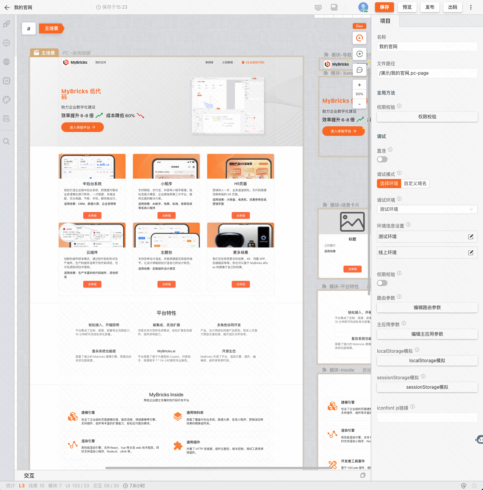

# 快速开始

MyBricks aPaas 平台中内置了多个应用，他们都遵循同一套搭建规则，只需掌握任一应用的使用，即可零成本上手其他应用的搭建。

所以这里我们将以 **PC 页面** 为例，介绍如何从创建到发布一张 **PC 页面**。

### 准备开始

首先你需要在 [**体验平台**](https://my.mybricks.world) 注册一个免费的账号。在这里你可以体验到最新的 MyBricks 特性。

### 工作台界面

登录后进入工作台。我们可以先在左侧栏点击「+」，创建一个协作组。可以方便后续与团队成员进行协同。在点击进入团队空间后，中间即为团队的所有文件，右侧状态栏  处点击可以邀请其他团队成员加入。

### 新建一张 PC 页面

在「团队空间」下，点击右上角 **「新建」按钮**，选择  **PC 页面**。

在弹窗中，我们基于「官网」这个模板，点击 **使用**，根据引导填写完名称等信息，便完成好了新建页面的操作。

系统会在新建页面后，会自动跳转到页面设计器。

<figure>基于模板创建的页面</figure>

## 组件的属性设置

点击组件，可以在右侧属性面板看到组件的可配置属性列表。修改内容即可在画布中实时生效。

## 调试页面

点击画布右上角的「调试」按钮，对页面进行快速的调试。

## 预览页面

点击页面右上角「预览」按钮，即可在新窗口中预览页面效果

## 发布页面

点击页面右上角「发布」按钮，根据弹窗引导，完善信息，即可发布页面。

发布完成后在页面左侧的「发布列表」可以看到发布记录。这里我们点击打开，即可查看发布的页面，或将链接分享给他人。

---

至此，你就已经完成了一张 PC 页面从新建到发布的操作。

## 学习路径

接下来，推荐你按照以下路径，继续探索 MyBricks 的更多功能：

1. [快速搭建增删改查列表页](/training/pc-case/crud/)
2. [基础知识](/docs/basic/user-interface/)
3. [MyBricks 入门课程](/training/head-first/head-first)