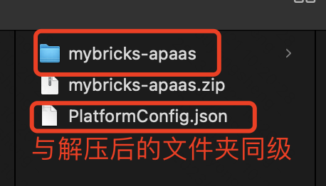

# Mybricks 私有化部署安装介绍

## 物理机部署
### 前置环境配置

1. 容器必须安装有 `MySQL 5.7`、`Node` V14 以上（推荐v14.21.0）（备注，如果安装的是 MySQL8.x，注意密码加密方式设置为：Legacy Password Encryption，切记不要设置为 Strong Password Encryption）

### 开始安装
#### Linux

1. 拿到安装的 `zip` 包，
2. 在zip包的同级目录，新建一个自己的配置文件，并命名为 `PlatformConfig.json`
```
{
  "database": {
    "host": "请填写",
    "user": "请填写",
    "password": "请填写",
    "port": 请填写,
    "databaseName": "请填写"
  },
  "platformDomain": "请填写。（这是部署后的访问地址，例如：http://127.0.0.1:3100或https://my.mybricks.world/等等）",
  "platformPort": 3100,
  "platformConfig": {
    "title": "MyBricks aPaaS Platform"
  },
  "adminUser": {
    "email": "admin@mybricks.world",
    "password": "123456"
  },
  "installApps": [
    {
      "type": "oss",
      "version": "1.2.74",
      "namespace": "mybricks-app-pcspa"
    },
    {
      "type": "npm",
      "path": "mybricks-app-login@0.0.5"
    }
  ]
}
```
目录如下：


3. 将其 `解压` 到文件夹，并`进入 server 文件夹`(确保服务器 `unzip` 命令可用，如果不可用，可提前安装好)
4. `使用管理权限` 执行如下安装命令即可，至此`服务器端的操作结束`，安装完毕后会`自动退出安装服务并拉起搭建服务`

```shell
cd server
sudo bash ./deploy.sh
```

5. 安装过程中查看服务器端的输出日志，出现如下字样了，即可打开浏览器，输入反向代理后的地址,例如：https://mybricks.world

6. 反向代理，需要将搭建服务的接口反向代理出来

7. NG配置: 此时搭建服务已经启动在 3100端口，需要将此端口代理出来, 参考配置如下：
```
server
{

    client_max_body_size 200m; # 勿忘！限制上传大小为 200MB

    location / {
        proxy_pass http://127.0.0.1:3100;
        proxy_set_header Host 127.0.0.1:$server_port;
        proxy_set_header X-Real-IP $remote_addr;
        proxy_set_header X-Forwarded-For $proxy_add_x_forwarded_for;
        proxy_set_header REMOTE-HOST $remote_addr;
        add_header X-Cache $upstream_cache_status;
        proxy_set_header X-Host $host:$server_port;
        proxy_set_header X-Scheme $scheme;
        proxy_cache off;
        proxy_connect_timeout 30s;
        proxy_read_timeout 86400s;
        proxy_send_timeout 30s;
        proxy_http_version 1.1;
        proxy_set_header Upgrade $http_upgrade;
        proxy_set_header Connection "upgrade";
    }
}
```


#### Windows

1. 拿到安装的 `zip` 包，
2. 在zip包的同级目录，新建一个自己的配置文件，并命名为 `PlatformConfig.json`
```
{
  "database": {
    "host": "请填写",
    "user": "请填写",
    "password": "请填写",
    "port": 请填写,
    "databaseName": "请填写"
  },
  "platformDomain": "请填写。（这是部署后的访问地址，例如：http://127.0.0.1:3100或https://my.mybricks.world/等等）",
  "platformPort": 3100,
  "platformConfig": {
    "title": "MyBricks aPaaS Platform"
  },
  "adminUser": {
    "email": "admin@mybricks.world",
    "password": "123456"
  },
  "installApps": [
    {
      "type": "oss",
      "version": "1.2.74",
      "namespace": "mybricks-app-pcspa"
    },
    {
      "type": "npm",
      "path": "mybricks-app-login@0.0.5"
    }
  ]
}
```
3. 将其 `解压` 到文件夹，并`进入 server 文件夹`
4. 双击运行 `deploy.bat` 文件进行平台安装
5. 使用 `管理员权限运行` start.bat 进行服务启动
6. 安装过程中查看服务器端的输出日志，出现如下字样了，即可打开浏览器，输入反向代理后的地址,例如：https://mybricks.world

## 容器部署
请在宿主机上预先安装好docker环境，推荐环境 20.10.21 以上

### 局域网安装
拿到对应的镜像文件执行导入操作（请先确保已经登陆过docker）
```
docker load < ./mybricks-apaas.tar
```

### 启动容器
1. 启动容器前请先在宿主机的如下目录新建文件夹
```
cd /home
mkdir mybricks-apaas
cd mybricks-apaas
mkdir logs
mkdir _localstorage
```
2. 在目录 `/home/mybricks-apaas`目录下新建文件 `PlatformConfig.json`, 文件内容如下（**请替换xxx部分为真实信息**）：
```
{
  "database": {
    "dbType": "MYSQL",
    "host": "xxx",
    "user": "xxx",
    "password": "xxx",
    "port": xxx,
    "databaseName": "xxx",
    "sqlPath": "./resource"
  },
  "platformConfig": {
    "logo": "/mfs/editor_assets/hainiu/logo-dark.975c4e65b9e0cc28f7b4a26f397ca642.svg",
    "title": "前端 | 工作台",
    "favicon": "/mfs/editor_assets/hainiu/1688985105204.c0703a1463af6ad6.ico"
  },
  "adminUser": {
    "email": "admin@mybricks.com",
    "password": "123456"
  },
  "installApps": [],
  "platformDomain": "xxx 部署后的域名，例如：https://my.mybricks.world"
}
```

3. 启动容器

```
docker run -p 14100:4100 -v /home/mybricks-apaas/PlatformConfig.json:/home/apaas/external/PlatformConfig.json -v /home/mybricks-apaas/logs:/home/apaas/logs -v /home/mybricks-apaas/_localstorage:/home/apaas/_localstorage -d --name mybricks-apaas mybricks-apaas:v0.1.8
```

4. NG配置
此时搭建服务已经启动在 14100端口，需要将此端口代理出来, 参考配置如下：
```
server
{

    client_max_body_size 100m; # 勿忘！限制上传大小为 100MB

    location / {
        proxy_pass http://127.0.0.1:14100;
        proxy_set_header Host 127.0.0.1:$server_port;
        proxy_set_header X-Real-IP $remote_addr;
        proxy_set_header X-Forwarded-For $proxy_add_x_forwarded_for;
        proxy_set_header REMOTE-HOST $remote_addr;
        add_header X-Cache $upstream_cache_status;
        proxy_set_header X-Host $host:$server_port;
        proxy_set_header X-Scheme $scheme;
        proxy_connect_timeout 30s;
        proxy_read_timeout 86400s;
        proxy_send_timeout 30s;
        proxy_http_version 1.1;
        proxy_set_header Upgrade $http_upgrade;
        proxy_set_header Connection "upgrade";
    }
}
```

## 安装后配置
安装完毕后，可以使用安装时配置的管理员账号登录进行平台的初始化配置：

登录：部署的域名/adminLogin.html
输入管理员账号密码
进入到管理页面，然后点击 `设置` 中的 `全局设置`，配置个性化数据：站点Logo、页面标题、页面ICON等

### 配置应用白名单
使用管理员账号登录，然后在应用白名单中配置面向普通用户开启的白名单，例如：pc-page


### 备注 1：用户在浏览器中输入的安装配置讲解

```
Connection Host：MySQL安装的IP地址
Connection Port：MySQL安装端口
username：链接MySQL的用户名
password：链接MySQL的密码
DateBase名称：MySQL的DB名称，后续表即将安装至此
```

### 备注 2：安装过程中的服务器端关键日志展示

```shell
# ...日志
【install】未安装，正在执行安装操作
【install】本地 localhost://3000 服务已开启，请打开浏览器，输入反向代理的地址，进行后续数据库配置
# 此时可以，打开发浏览器，输入反向代理后的地址,例如：https://mybricks.world
【install】: 数据库连接成功
【install】: 数据表初始化成功
【install】: 配置持久化成功
# ...
【install】: 应用安装成功
【install】: 停止安装服务成功
【install】: 线上服务启动成功
【install】: 安装服务已退出
```

### 备注 3：PlatformConfig配置详解：

```
platformAppName: 平台服务应用名称
platformDomain：平台部署的http地址
platformPort：平台部署服务端口
```
