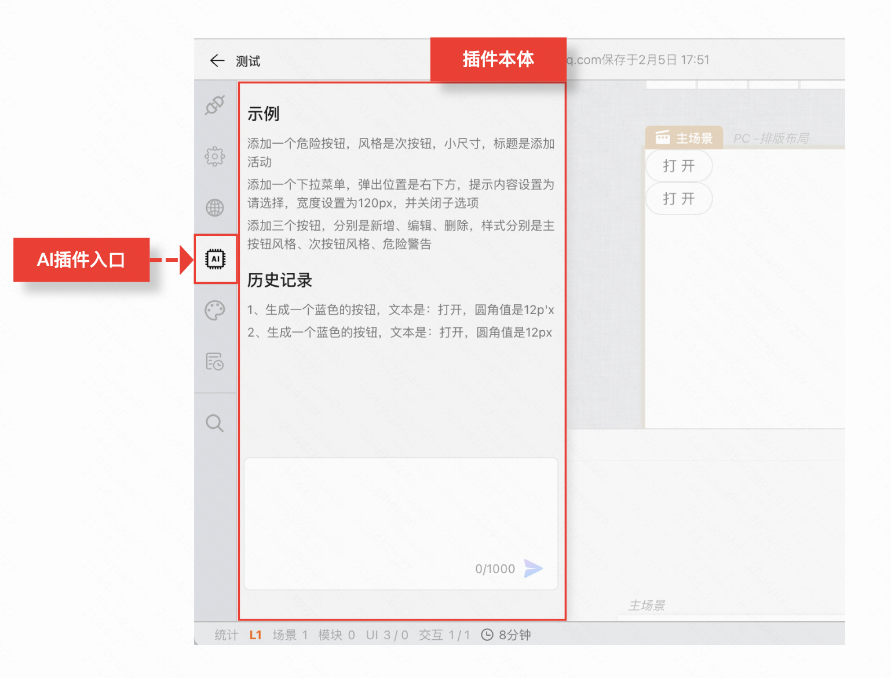

:::tip
本章节以AI插件开发为例，帮助你了解如何开发自定义插件，扩展设计器功能，实现一些个性化的业务需求。
:::

## 插件演示
如下图，用户可以通过AI插件里面的文本输入框，输入一段包含业务诉求的文本，点击“生成”按钮，AI插件会自动识别业务诉求，生成对应的元素。


## 插件的使用方式

### 主应用引入方式
```javascript
import AIPlugin from './ai-plugin'
export default function App() {
    return (
        <SPADesigner
            config={{
                /* 其他配置项省略*/
                plugins: [
                    AIPlugin()
                ]
            }}
        /* 其他配置项省略*/
        />
    )
}
```

### 插件项目示例
#### 入口文件示例
```javascript
import AIPlugin from './ai-plugin'
import icon from './icon.png'
export default function AIPlugin() {
    return {
        name: '@mybricks/ai-plugin',//分配一个唯一的namespaces
        title: 'AI',//插件名称
        author: 'mybricks',//作者
        version: '1.0.0',//版本号
        description: 'AI插件',//插件描述
        contributes: {
            sliderView: {
                //在侧边栏拓展一个Tab
                tab: {
                    title:'AI Copilot',//显示在侧边栏的插件名称
                    apiSet:['command'],//[重要]插件声明所需的apiSet，这里由于是AI驱动页面搭建，所以使用了可以操作页面的api：command
                    icon:icon,//插件图标
                    render(args: any) {
                        return <AIPlugin {...args}></AIPlugin> //这里放置插件的UI
                    }
                }
            }
        },
        render() {

        }
    }
}
```


#### 插件代码示例
```javascript
export default function AIPlugin({command}) {
    //这里只展示了插件的UI、以及apiSet如何开发使用，具体的业务逻辑需要根据实际需求进行定制

    //下面是由AI生成好的，准备添加到页的组件scheme，具体生成过程省略
    const component = {
    "data": [
        {
            "type": "mybricks.normal-pc.custom-button",
            "data": {
                "asMapArea": false,
                "text": "打开详情",
                "dataType": "number",
                "outVal": 0,
                "inVal": "",
                "useIcon": false,
                "isCustom": false,
                "icon": "",
                "size": "middle",
                "type": "default",
                "shape": "round",
                "src": "",
                "showText": true,
                "iconLocation": "front",
                "iconDistance": 8,
                "contentSize": [
                    14,
                    14
                ],
                "style": {
                    "backgroundColor": "#1890ff",
                    "borderRadius": "15px"
                }
            },
            "slots": null
        }
    ]
}

    return (
        //插件主体UI
        <div className={css.container}>
            <input type="text" placeholder="请输入你的搭建诉求"/>
            {/* 这里展示了如何使用插件apiSet的command方法 */}
            <button onClick={() => {
                command.exec("ui.addComs", component);
            }}>生成</button>
        </div>
    )
}

```

