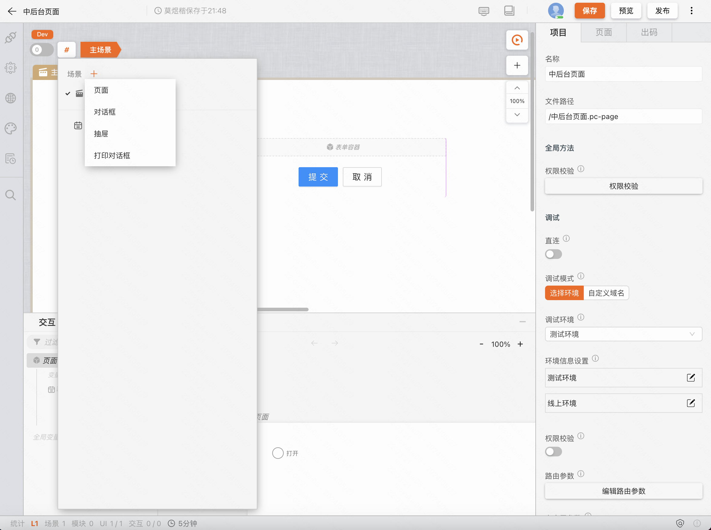
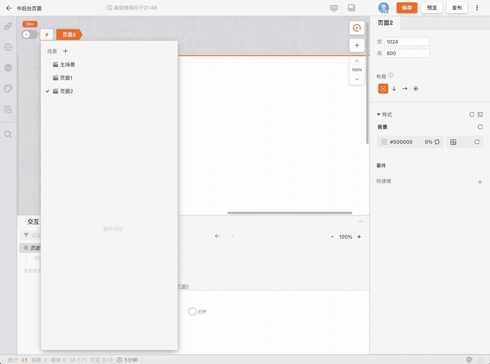
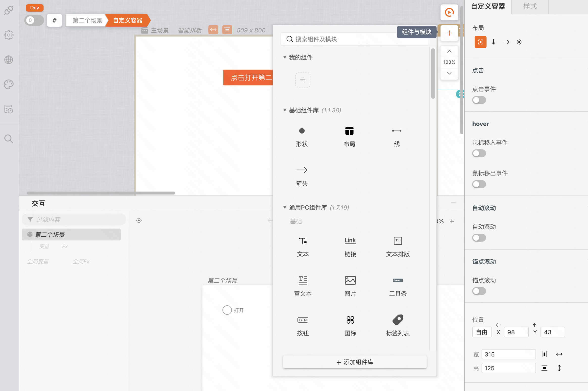

:::tip
通过本章节，了解 MyBricks 设计器（以下简称设计器）的用户界面。
:::

<figure>总览图</figure>

### 基本布局

设计器具有简单直观的布局，可滚动、缩放、伸缩、展开收起等的交互方式可最大化为编辑操作提供空间，同时留出足够的空间来浏览完整上下文。UI 分为五个主要区域：

- **导航栏：** 顶部的导航栏默认包含了文件名称；保存、预览、发布控件等。
- **插件栏：** 左侧的插件栏可为设计器增强各种能力，设计器内置了：版本控制、连接器、主题包、国际化等插件。
- **画布视图：** 中间的画布视图用于制品的 UI 搭建。
- **交互视图：** 下方的交互视图用于制品的逻辑的搭建。
- **编辑视图：** 右侧的编辑视图会根据用户当前所聚焦的组件，切换展示对应的编辑器。

### 多画布（场景）
您可以水平并排添加任意多个画布，当您已经聚焦某一个画布，交互视图会切换至当前画布对应的逻辑内容。多个画布之间支持相互打开以及数据通信。最左侧的画布将在发布时作为入口画布被渲染。

### 大纲和面包屑
画布视图的左上角有一个 **「#」** 导航按钮，点击按钮打开面板后，可以看到面板下方的 **大纲树**，另外你也可以在聚焦某一个组件后，在 **「#」** 导航按钮右侧看到 **面包屑**，点击面包屑的标签可以快速切换组件的聚焦。

### 调试按钮
「调试」按钮在画布视图的右上角，进入调试状态后，界面上的各编辑能力会被锁定，返回设计状态后会恢复。

### 组件按钮
「调试」按钮在画布视图的右上角，点击按钮弹出组件面板。您可从该面板将组件拖入画布，或者通过面板下方「+添加组件库」按钮引入更多组件。

### 画布缩放
如果您的电脑屏幕分辨率很大或很小，可以通过画布视图右上角的「放大画布」、「缩小画布」来进行缩放，以达到合适的展示尺寸。

### 编辑视图
您在分别聚焦**画布视图空白区域**、**画布标题**、**UI组件**、**逻辑组件**时，编辑视图会对应的切换到不同的编辑项。

**双击编辑器第一个 TAB**可对画布、组件等进行自定义命名。

对于编辑器的更多说明，将在[编辑视图](../editView)中详细展开。

### 交互视图
通过点击展开按钮，或者将鼠标悬浮于「交互」标题栏上方进行拖动，可以打开交互视图。

对于交互视图的更多说明，将在[交互视图](../toplView)中详细展开。

