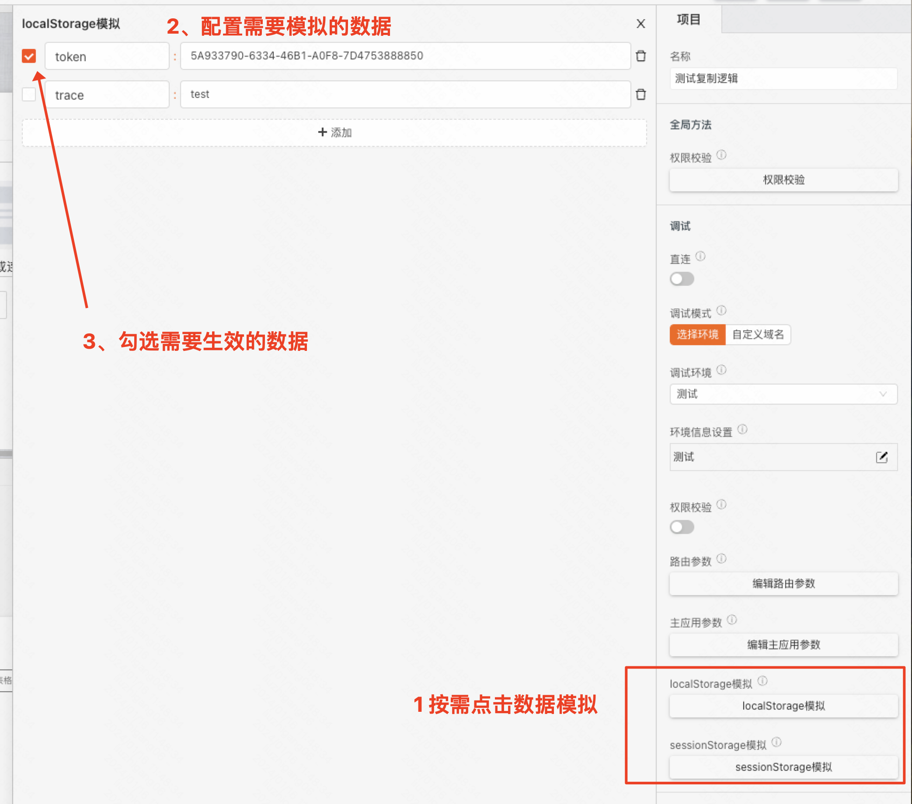
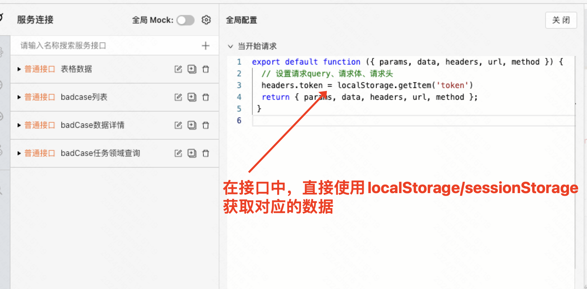
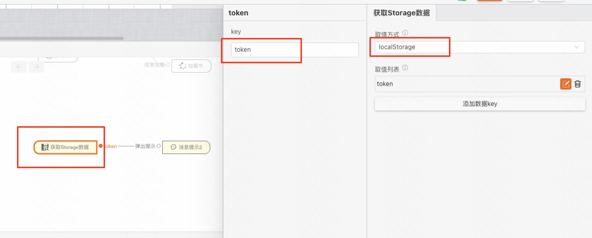

# 自定义storage数据

> 自定义storage数据后，在调试和预览时，会覆盖已有的数据，发布后失效

本章将介绍如何在设计器中自定义localStorage和sessionStorage数据，方便在调试和预览时，使用自定义的数据。

## 使用场景
- 接口在调试时需要使用自定义数据：比如用户信息，页面数据等
- 在调试时，localStorage/sessionStorage使用自定义数据

## 第 1 步：配置storage数据

1.  打开storage数据配置面板
2.  在配置面板中，根据需要添加storage的数据
3.  勾选需要生效的数据

## 第 2 步：如何使用storage数据？

1. 在接口请求的脚本中，直接调用localStorage或sessionStorage
2. 使用storage组件直接获取配置的数据（仅在调试/预览时生效）

- 连接器中使用

- 逻辑编排中使用

## 相关阅读

[异常分类与调试方法](/blog/exception-debugging-methods)