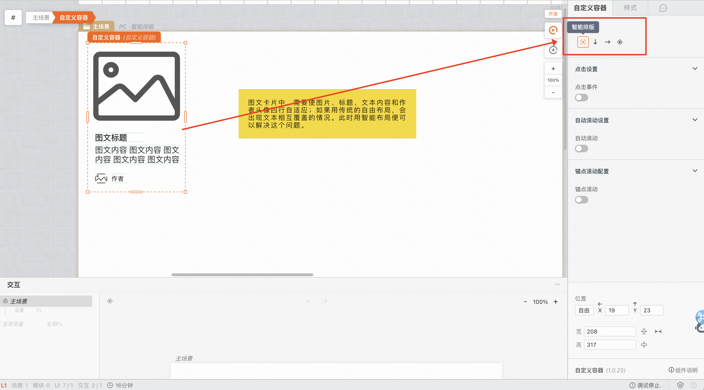
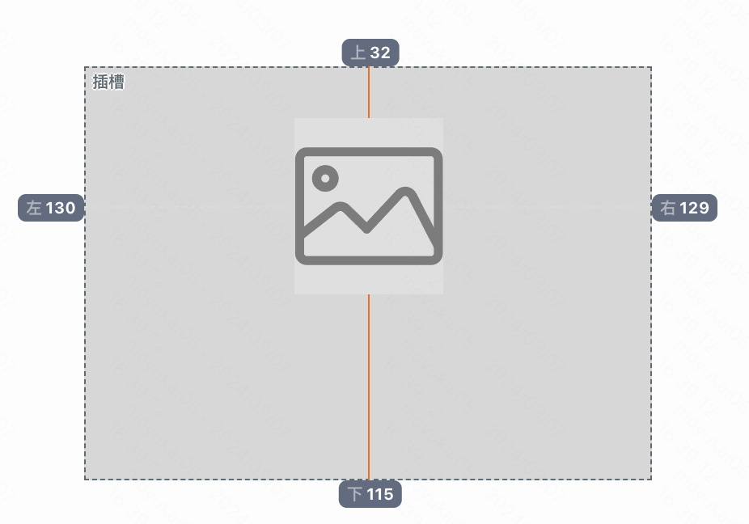
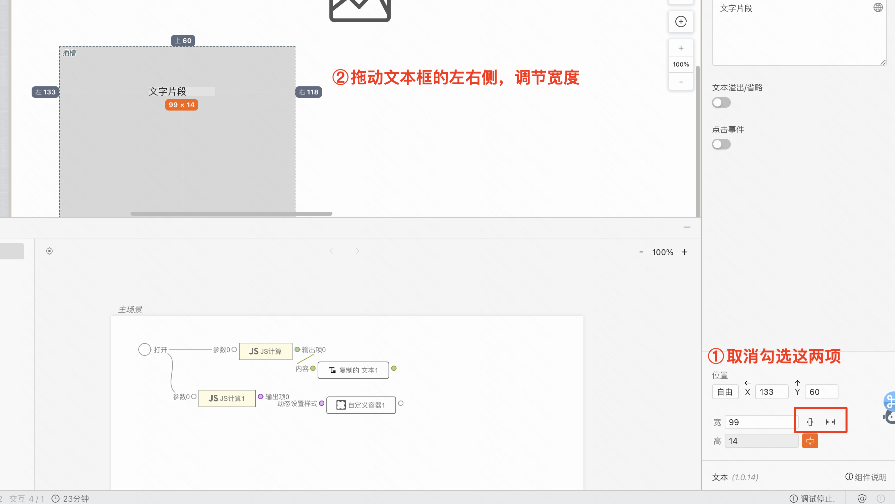

# 智能布局

:::tip
智能布局是MyBricks中的一个重要功能，它可以帮助你快速搭建页面，提高工作效率。
只需要像产品经理一样自由拖拽组件到对应的位置，MyBricks会自动识别你的布局意图（居中、居左…），你只需要关注组件的内容和样式。
:::

## 智能布局常见使用场景
### 图文卡片

## 如何切换到智能布局
目前线上的布局均默认为智能布局，无需切换。   
如需确认，请检查右侧布局面板的布局选项，是否选中了智能布局选项：

## 智能布局的使用方式
### 元素居左、居中、居右…
以上文字位置的定义，只需要拖拽元素到对应的位置即可。届时会有参考线显示出来，帮助你更准确的定位元素。

### 标记元素为自适应、固定宽度…
固定宽度操作方法

