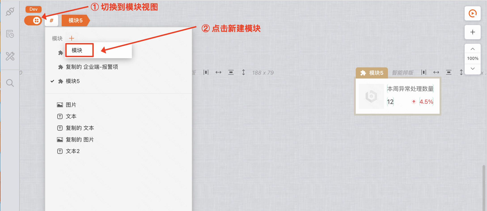
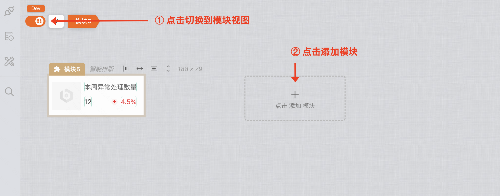
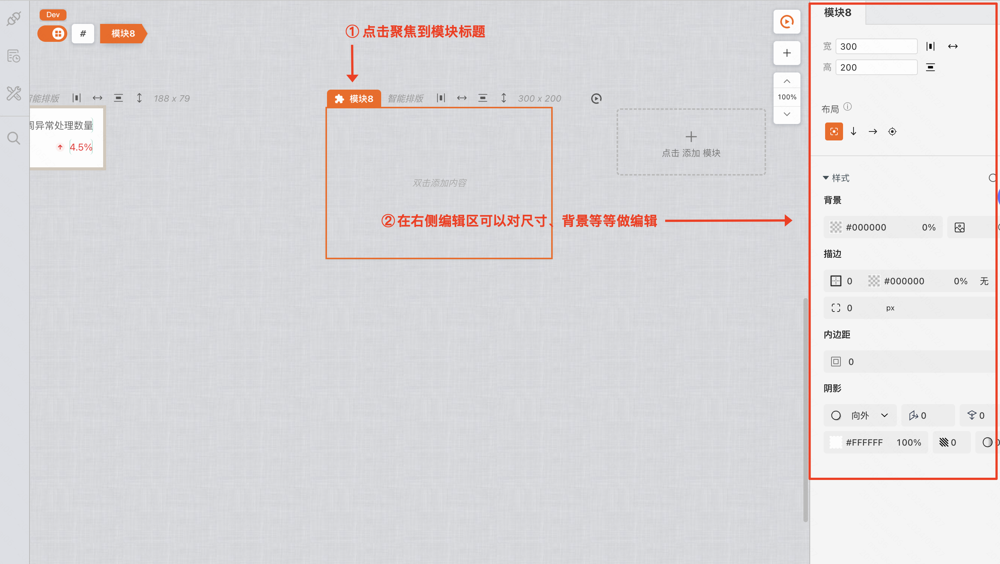
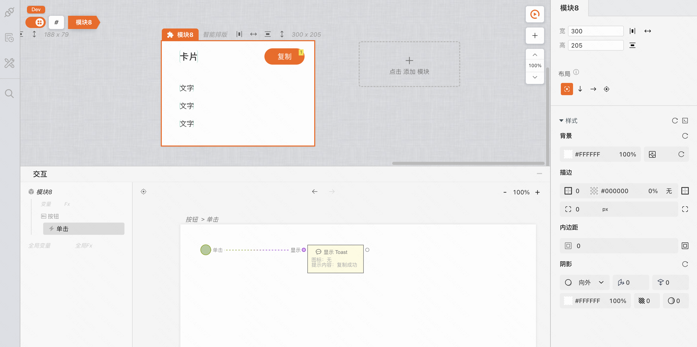
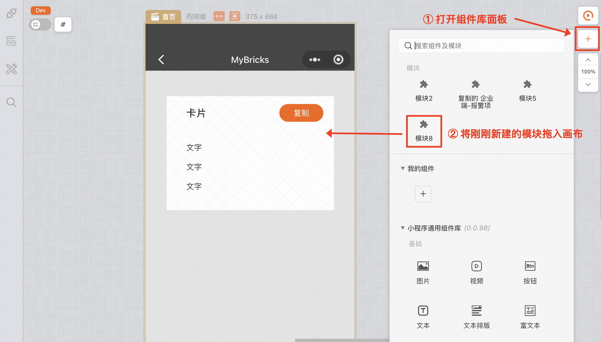
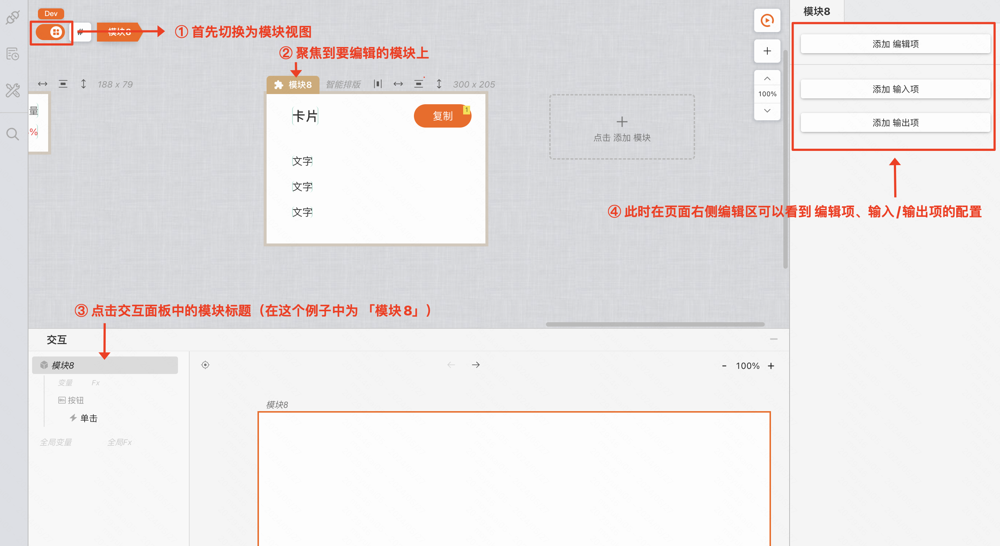
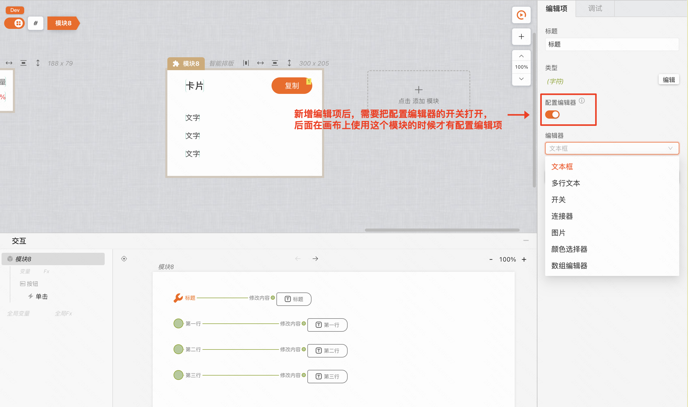
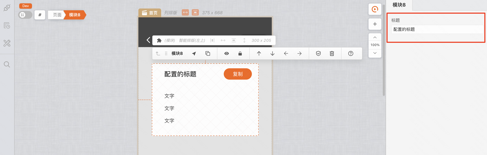

在搭建的过程中，我们通常需要将多个组件进行编组，使其成为一个新的组件，这便有了**封装模块**。

### 创建模块

创建模块，需要首先切换到模块视图，然后 点击 「#」-->「+」-->「模块」，创建模块后，将在画布最右侧新增一个空的模块画布。

也可以在切换到模块视图后，在空画布上点击 「添加模块」 按钮，实现模块的新增

聚焦模块标题，我们可以对其画布进行名称、尺寸、背景、布局方式等的编辑。

并且在模块中，我们可以进行 UI 和逻辑的搭建。

### 为模块添加配置项

当我们通过路径「组件库 > 模块」把一个模块拖入画布时，便完成了一个模块的实例化。画布中的模块将会被斜着的网格覆盖。

但是此时的模块并没有配置项，如果我们期望实例化后的模块之间可以存在差异时，可以为模块添加配置项。

我们再通过场景/模块切换开关，切换回模块视图，并聚焦回模块的交互主卡片。此时在右侧编辑器中可以看到「添加编辑项」、「添加输入项」、「添加输出项」等三个按钮。点击按钮，我们可以为模块添加对应的接口。

如下图，我们为模块添加了编辑项和输出项。

此时我们点击左上角的场景/模块切换开关，再次在主画布中聚焦实例化后的模块即可看到右侧的编辑项。

至此，我们便完成了一个UI组件的封装和使用。

