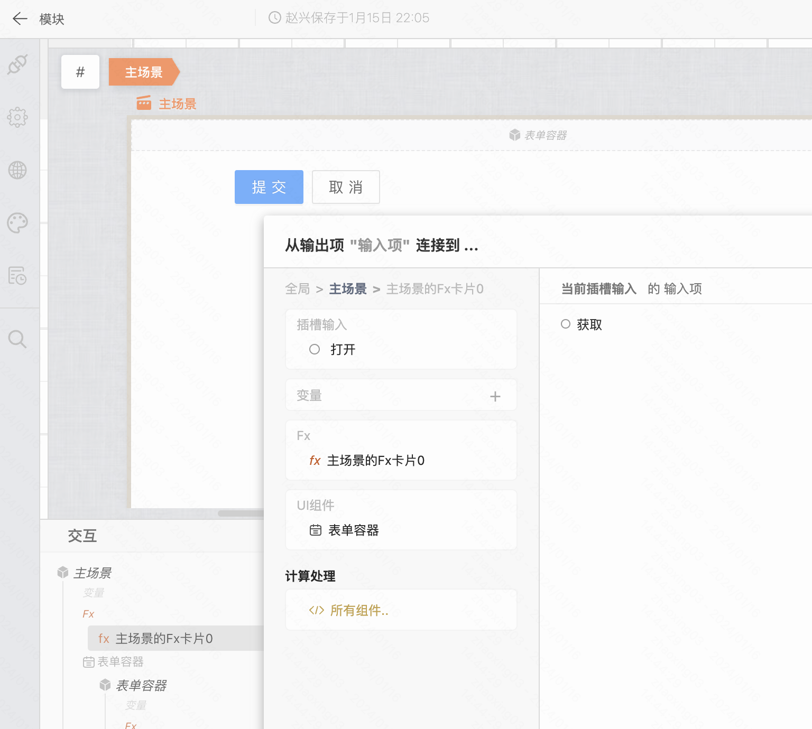
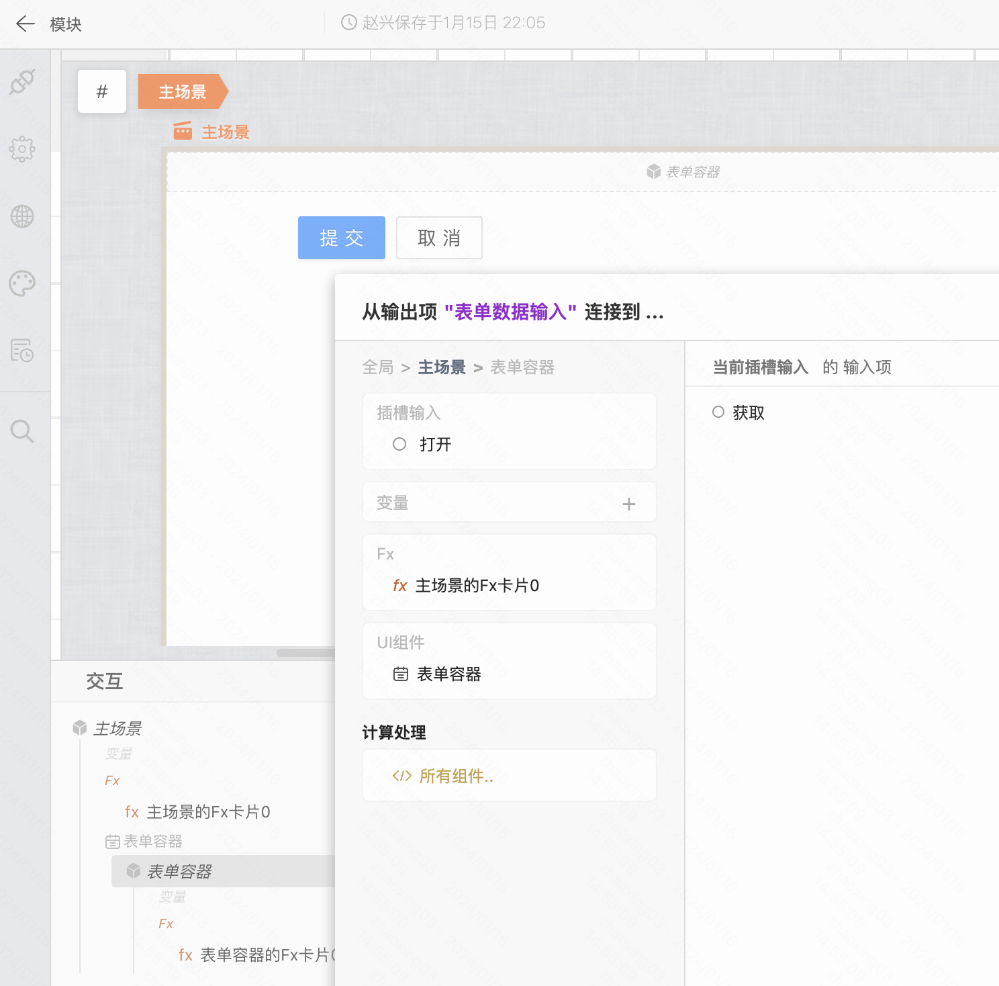
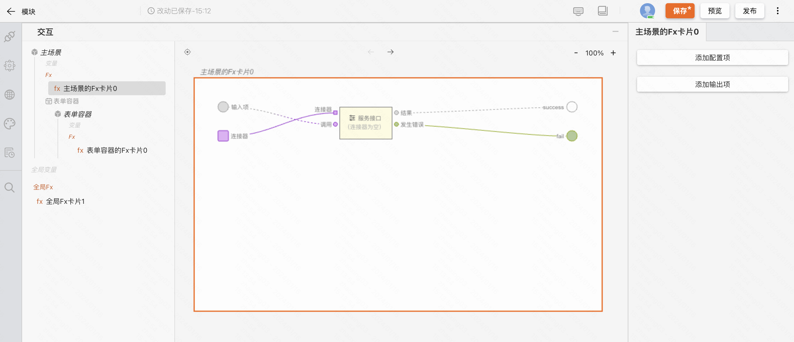
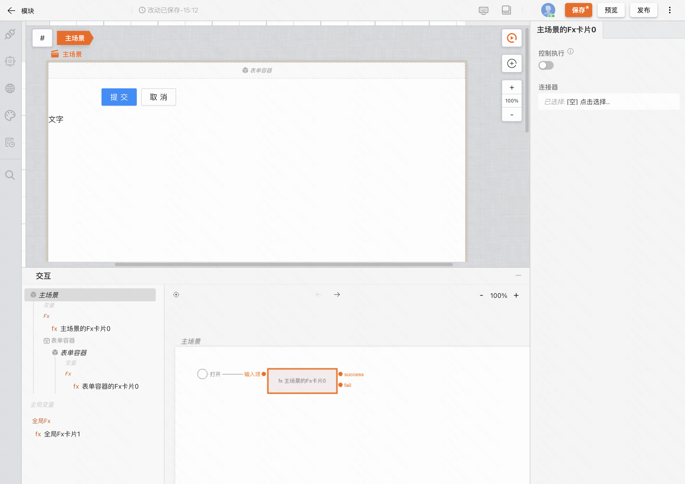

### 创建 Fx

在交互视图的左侧，我们可以通过「Fx」或者「全局 Fx」来创建 Fx 卡片。根据创建的位置不同，可以创建全局 Fx、页面级 Fx、作用域级 Fx等。

在 Fx 卡片中搭建逻辑时需要注意的是，连接 UI 组件等时，需要在交互弹窗面板的左上角切换「全局、主场景、作用域」等区域。

### 为 Fx 添加配置项

通过交互弹窗面板，选择 Fx 的输入项即可完成 Fx 的实例化。

聚焦到 Fx 卡片，在编辑器中可以看到「添加配置项」、「添加输出项」等两个按钮。点击按钮，我们可以为 Fx 添加对应的接口。

此时我们再次在交互画布中聚焦实例化后的 Fx 即可看到右侧的编辑项和节点的输出项。

至此，我们便完成了一个逻辑组件的封装和使用。
