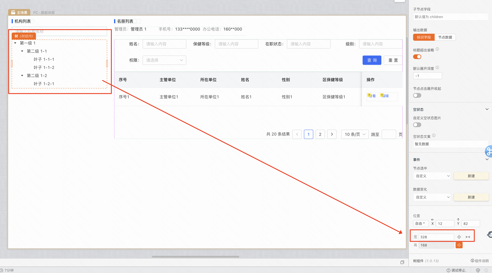
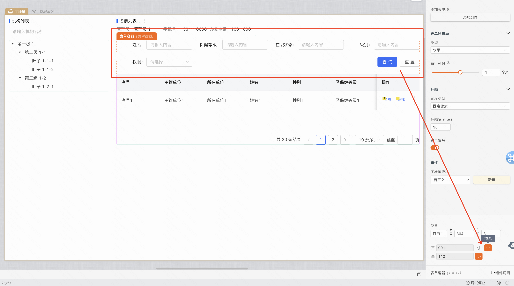
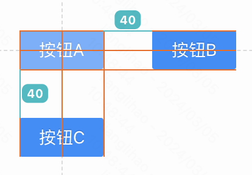
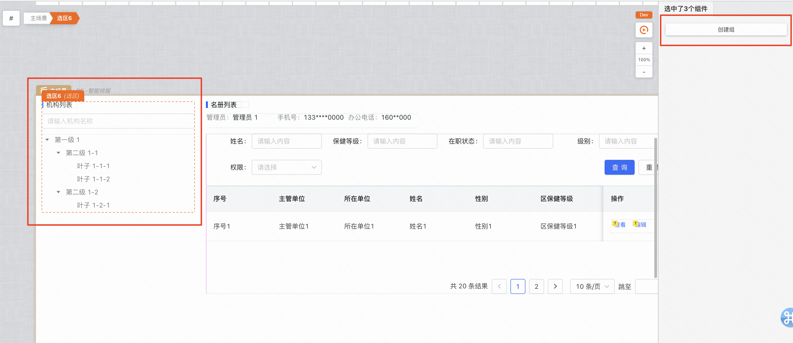

# 智能布局

:::tip
智能布局是MyBricks中的一个重要功能，只需要拖拽组件到对应的位置，MyBricks会自动识别你的布局意图（右对齐、居中…）
:::

## 目前线上布局均默认为智能布局 
如需确认，请检查右侧布局面板的布局选项，是否选中了智能布局选项：

## 智能布局常见使用场景
### 动态文本

### 右对齐

### 居中

### 左侧固定宽度，右侧自适应
在中后台中，经常有左侧栏固定宽度，右侧栏宽度自适应等等动态布局需求。使用智能布局，只需要拖拽元素到对应的位置，并做好标记即可。

## 一分钟上手智能布局

### 左对齐
将文本组件从左到右，对齐即可：

### 右对齐 

### 居中

### 文本宽度、高度自适应

### 实现左侧导航栏固定宽度，右侧内容区自适应布局
固定宽度操作方法：   
1、导航栏：选中左侧导航栏，在右下角编辑器中赋予一个固定值，如328px   
2、内容区：选中右侧内容区，点击右侧编辑器中的「自适应宽度」按钮

### 通过创建组来实现不同的分组布局
一个元素可能与其它多个元素有不同的关系和分组方式，算法无法准确识别用户的意图。图中按钮A可以和按钮B分为一组，也可以与按钮C分为一组。

比如在下面这个例子中，我们把左侧的导航划分为一组，右侧的内容区划分为一组。整体划分语义性更强，更容易理解。

