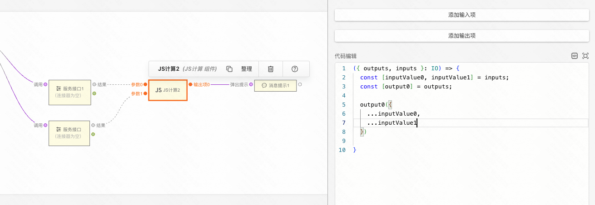

## 1. 基本使用

「JS计算」是一个逻辑组件，在逻辑卡片中，可以通过 **「逻辑连线 > 计算组件 > JS计算」** 来添加；或者通过 **「鼠标右键 > 添加起始组件 > JS计算」** 来添加。


<figure>「逻辑连线 > 计算组件 > JS计算」</figure>


<figure>「鼠标右键 > 添加起始组件 > JS计算」</figure>

**注意：两种不同的添加方式区别在于：**

1. 通过连线添加的 JS计算 需要由前置的节点来触发其执行；通过起始组件添加的 JS计算 会自动运行。
2. 通过连线添加的 JS计算 有入参；通过起始组件添加的 JS计算 没有入参。


在 **代码编辑** 中，可以自由的编写 JS 代码。


```js
({ outputs, inputs }) => {
  const [ inputValue0 ] = inputs; // inputs 对应组件左侧参数列表
  const [ output0 ] = outputs;    // outputs 对应右侧输出项列表

  output0("some data"); // 表示执行输出项0，并传递参数
}
```

## 2. 进阶使用

在「JS计算」的编辑项中，除了上文提到的「代码编辑」，还有 **「添加输入项」和「添加输出项」** 两个按钮。（注：起始组件不支持添加输入项）


<figure>添加输入项</figure>


<figure>添加输出项</figure>

在添加了多个输入项和输出项后，图和代码的对应关系如下图所示：

节点左侧的三个参数分别对应右侧代码 inputs 数组的第0，1，2项，其每一项值为前面节点所传递的参数。

节点右侧的三个输出项分别对应右侧代码 outputs 数组的第0，1，2项，其每一项值为函数，调用该函数时，执行对应的输出项。


:::tip
**特别重要**
:::

当「JS计算」左侧只有一个输入项时，每当有参数到达，「JS计算」中的代码会立即被执行 1 次。

当「JS计算」左侧存在多个输入项时，需要等待所有的参数都到达，「JS计算」中的代码才会在最慢的一个参数到达时，立即被执行 1 次。并且清空所有的参数，重新开始等待。

## 3. 场景举例

利用上面的特性，我们就可以利用「JS计算」来实现一些常用场景。

- 分支逻辑


- 异步等待



- 重复执行


- 数据格式化


## 4. 不能做什么

为了保障安全和稳定性，JS计算 中的代码是在沙箱中运行。因此在代码中，允许读取 window、document等对象（如果有），但是不允许对其进行修改。