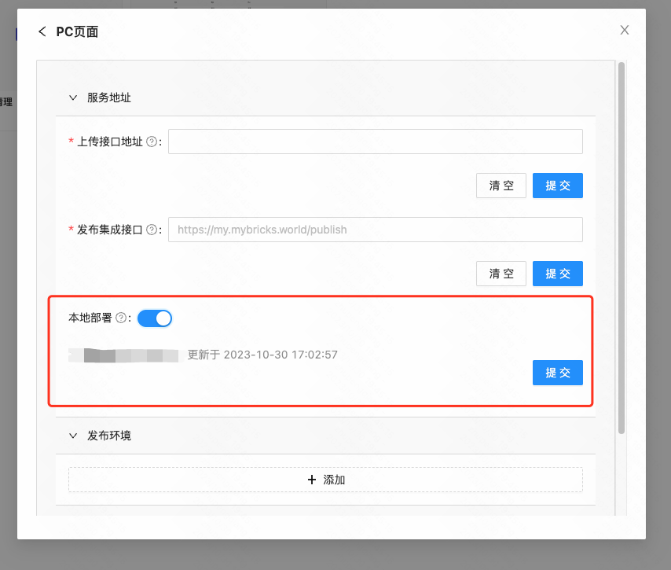
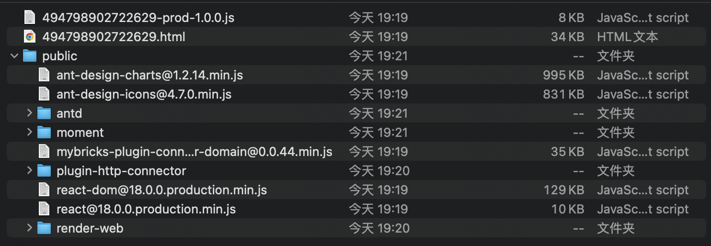
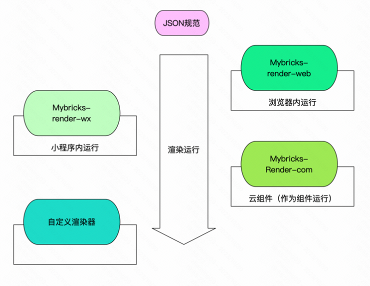
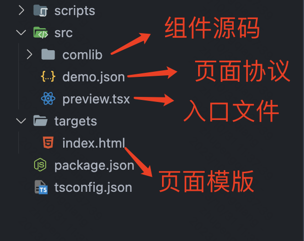

# 一、页面发布

页面发布是指通过Mybricks搭建的页面，发布后生成可用于生产环境的静态资源产物。Html 默认会引用经过CDN优化后的静态资源（公共依赖走CDN）

## 1.1 本地部署模式

静态资源不再依赖CDN，全部本地化。

  

注：前端平台超管权限，可在应用的设置中手动开启本地部署模式



## 1.2 发布集成（推荐）

静态资源推送至服务集成服务接口，统一由发布集成服务管理

  

接入文档：[Mybricks 上传&发布集成接口协议文档](https://docs.qingque.cn/d/home/eZQDqH8Pb6y2V60je9XzqOVr6?identityId=1yuBhO7eZe7)

## 1.3 非发布集成（产物链接不建议直接用于生产）

静态资源上传至当前部署机器磁盘，发布后会得到一个当前 ip/域名 的一个Html 链接

  

# 二、页面产物

## 2.1 产物结构

```Markdown
|-- demo
|   |-- public
|   |   |-- antd
|   |   |   |-- antd@4.21.6.min.js
|   |   |-- render-web
|   |   |-- moment
|   |   |-- ...
|   |-- xxx.html
|   |-- xxx-prod-1.0.0.js
|   |-- ...
```

### 结构示例：



### 发布产物如下：

### 产物运行原理：

 **JSON Schema**  +  **Render-web**  +  **组件产物** 



通用PC组件库开源地址：[https://github.com/mybricks/comlib-pc-normal](https://github.com/mybricks/comlib-pc-normal)

  

## 2.2 出码产物



  

出码产物如下：

# 三、页面集成

PC页面搭建产物，默认已经支持qiankun微前端框架的集成。通过微前端架构可低成本整合进已有前端项目中，前端项目可同时运行传统源码开发页面 + 低代码搭建产物页面。

## 3.1 微前端集成（推荐）

集成手册：[Mybricks 微前端集成手册](https://docs.qingque.cn/d/home/eZQCsy_0F2DF4YmI6gYd1AltP?identityId=1yuBhO7eZe7)

  

## 3.2 iframe集成

```JavaScript
<iframe
  id="inlineFrameExample"
  title="Inline Frame Example"
  width="300"
  height="200"
  src="{发布产物的html链接}">
</iframe>
```

  

## 3.3 单页面落地页

直接拿产物链接进行投放使用（一般适用于简单Demo尝试、营销落地页等场景）