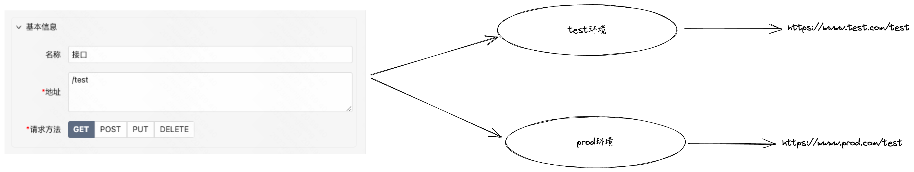
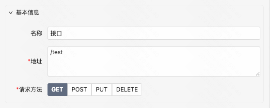
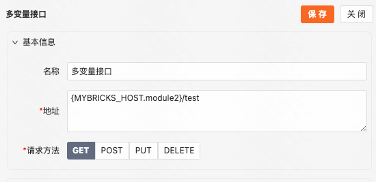

# 一、请求域名配置

## 1.1 默认

默认没有配置多环境时，一连接器内接口配置为准，路径配置为绝对路径，则请求配置的路径的域名。路径配置为相对路径，则请求当前页面部署的环境域名。

  

## 1.2 多环境模式

配置了多环境则根据多环境的域名进行拼接，连接器内路径配置为绝对路径，则请求配置的路径的域名。接口路径配置为相对路径，则会拼接上对应环境的域名。

  



  

## 1.3 自定义模式

通常在企业需要给客户进行私有化部署时，域名无法在页面发布时确定，那么可以走自定义模式，在主应用上定义请求域名，挂到 window 上，子应用页面从window上获取。这样能够实现一次发布，兼容多环境私有化部署的能力

  

主应用配置

```JavaScript
// 主应用处定义 或 从配置文件等其他地方获取
window.MYBRICKS_HOST = {
  default: 'https://my.mybricks.world'
}

// 支持多域名定义
window.MYBRICKS_HOST = {
  default: 'https://my.mybricks.world',
  module1: 'https://my.mybricks.world1',
  module2: 'https://my.mybricks.world2',
  ...
}
```

  

单域名（连接器接口配置相对路径）：



最终发布后请求路径为：{window.MYBRICKS\_HOST.default}/test  => https://my.mybricks.world/test

  

多域名形式（需要额外声明获取的变量名）：



最终发布后请求路径为：{MYBRICKS\_HOST.module2}/test => https://my.mybricks.world/test

  

# 二、项目集成实践

Mybricks推荐qiankun微前端框架来进行集成，qiankun相关文档参考：[https://qiankun.umijs.org/zh](https://qiankun.umijs.org/zh)

## 2.1 Vue 主应用

Demo地址：[https://github.com/mybricks/vue-main](https://github.com/mybricks/vue-main)

## 2.2 React  主应用

Demo地址：[https://github.com/mybricks/react-main](https://github.com/mybricks/react-main)