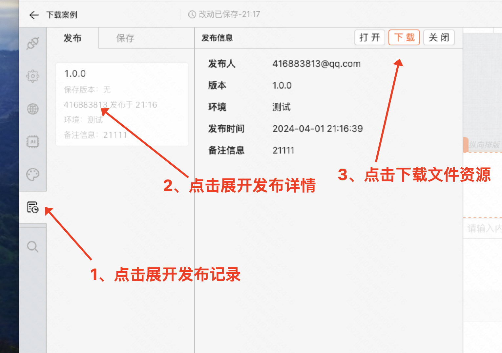
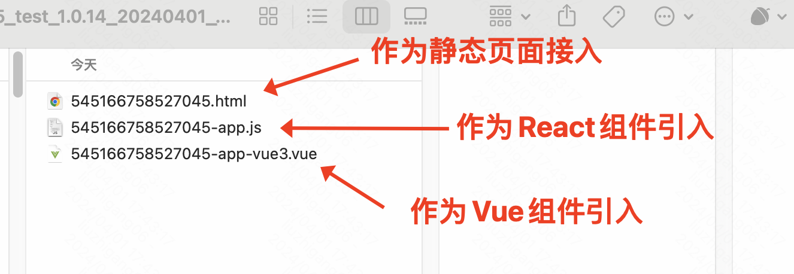

# 下载后的页面如何在项目中使用

## 如何下载

- 页面发布之后，可以在左侧发布记录中找到下载按钮
- [点击下载文档中的 zip 包资源](https://mybricks-material.oss-cn-hangzhou.aliyuncs.com/%E4%B8%8B%E8%BD%BD%E6%96%87%E4%BB%B6%E5%AE%9E%E4%BE%8B.zip)



## 如何使用

- 将 zip 包解压，内包含 3 个文件，各文件使用方法如下
- [点击下载文档中的 zip 包资源](https://mybricks-material.oss-cn-hangzhou.aliyuncs.com/%E4%B8%8B%E8%BD%BD%E6%96%87%E4%BB%B6%E5%AE%9E%E4%BE%8B.zip)



### 方式一：静态 HTML 页面

- 部署成静态页面直接访问
- 如果需要在项目中引入，可通过 qiankun 等微前端框架引用页面 URL 地址即可

### 方式二：作为 React 组件在项目中引入

```ts
import React from 'react'
import LowcodePage from './549439123873861-app'

const App = () => (
  <div style={{ padding: '0 24px' }}>
    <span>React 组件形式引入</span>
    <LowcodePage />
  </div>
)

export default App
```

### 方式三：作为 Vue 组件在项目中引入

Vue3 版本

```html
<template>
  <div>
    <span>Vue 组件形式引入</span>
    <LowcodePage />
  </div>
</template>

<script setup lang="ts">
  import LowcodePage from './549439123873861-app-vue3.vue'
</script>
```
