# 一、快速上手

## 创建 PC 云组件

- 访问 MyBricks 平台：[https://my.mybricks.world/](https://my.mybricks.world/)
- 到一个合适的位置，推荐到一个协作组中，方便协作。
- 点击右上角的 **新建** 按钮，选择 **PC 云组件** 。

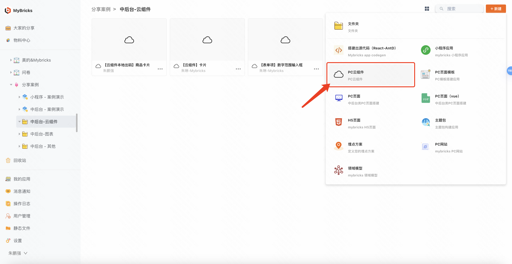

- 输入名称并点击 **确定** ，即可成功创建云组件。

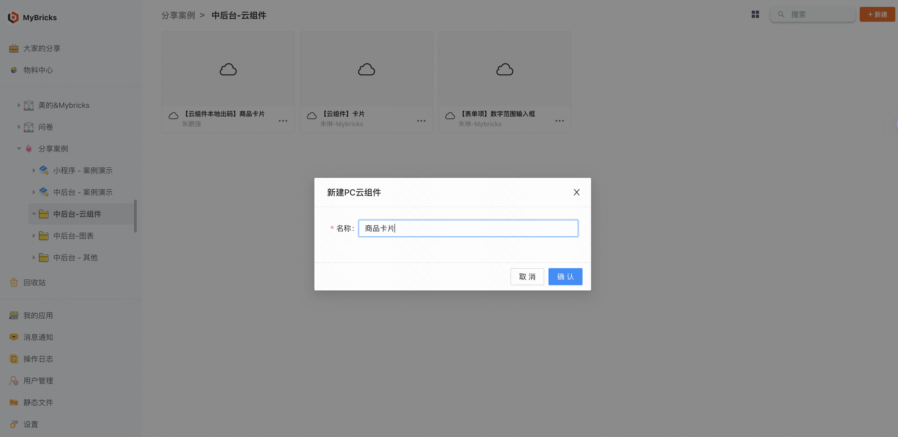

## 搭建一个卡片

完成云组件创建后，您可以开始搭建所需的云组件。

以商品卡片为例：

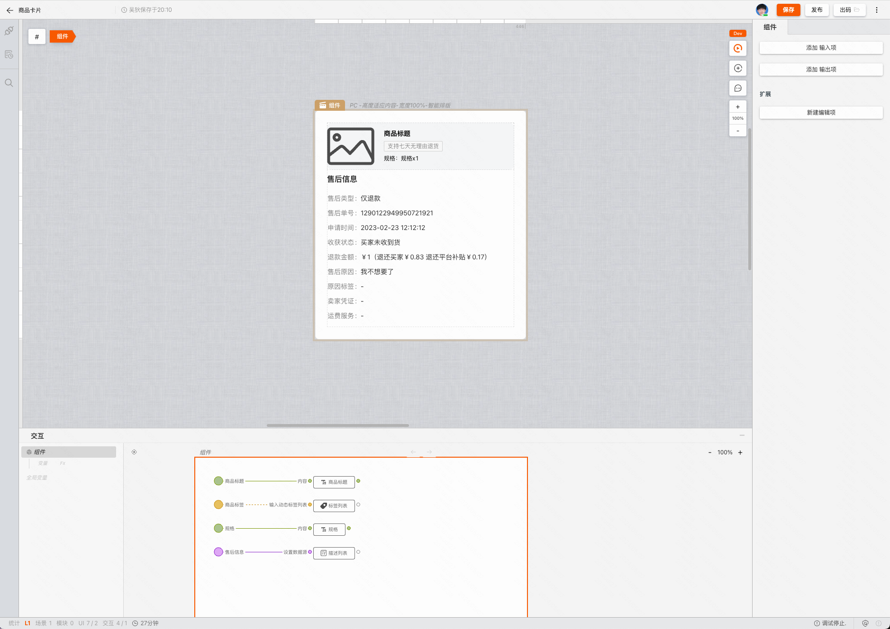

### 第一步 完成 UI 搭建

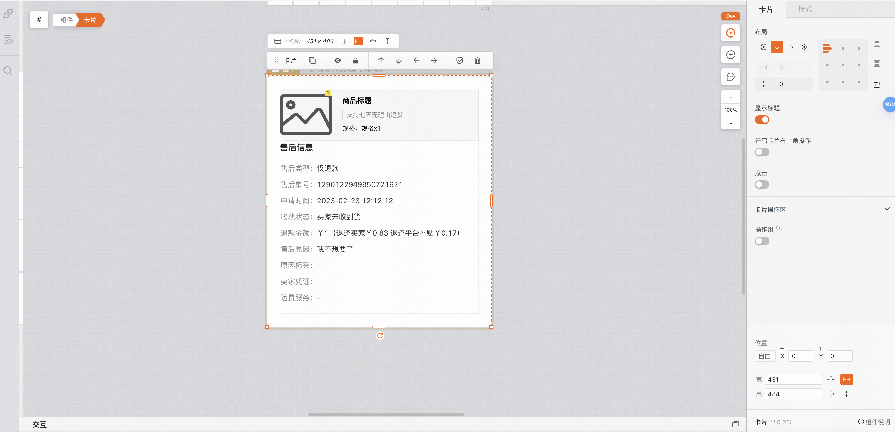

### 第二步 给组件添加交互逻辑

出码的方法在下个小节可以看到

#### 编辑项

编辑项用于定义卡片中的交互起点，数据来自外部输入。在 **根部卡片** 上，可以添加编辑项。

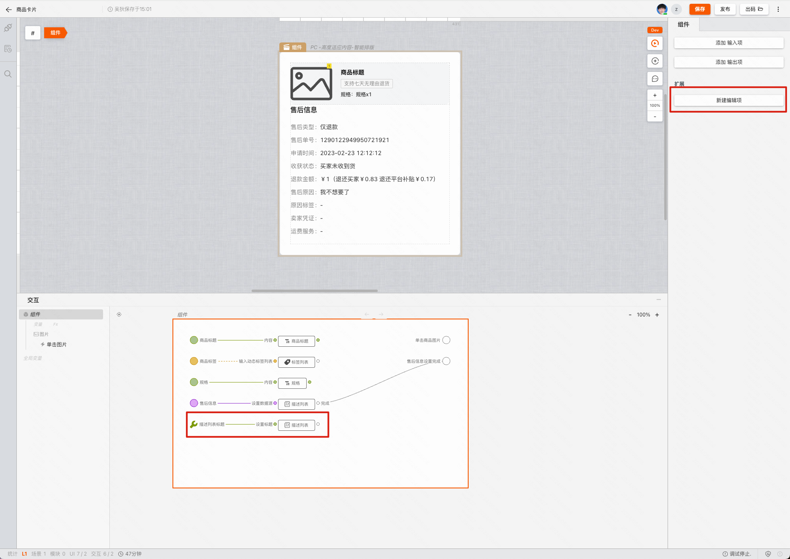

在出码后，编辑项将变成 **组件的一个属性** ，通过给属性传参传入数据。

以描述列表标题编辑项为例，下方代码中，传入了一个自定义的描述列表标题。

```JSX
import React, { useEffect, useRef } from 'react'
import CommodityCard, { ICommodityCardRef } from './CommodityCard';
import './index.less';

export default function TestCodeOut() {
  const ref = useRef<ICommodityCardRef>(null);

  useEffect(() => {
    ref.current?.setAfterSalesInfo({
      type: '仅退款1',
      no: '1290122949952442223',
      time: '2023-02-23 12:12:12',
      status: '买家未收到货',
      money: '￥2（退还买家￥1.83 退还平台补贴￥0.17）',
      reason: '我不想要了',
      credentials: '-',
      reasonTag: '-',
      service: '-'
    })
  }, [])

  return (
    <div className='center'>
      <CommodityCard ref={ref} descListTitle='自定义标题' />
    </div>
  )
}

```

**最终效果**


#### 输入项

输入项用于定义卡片中的交互起点，数据来自外部输入。在 **根部卡片** 上，可以添加输入项。

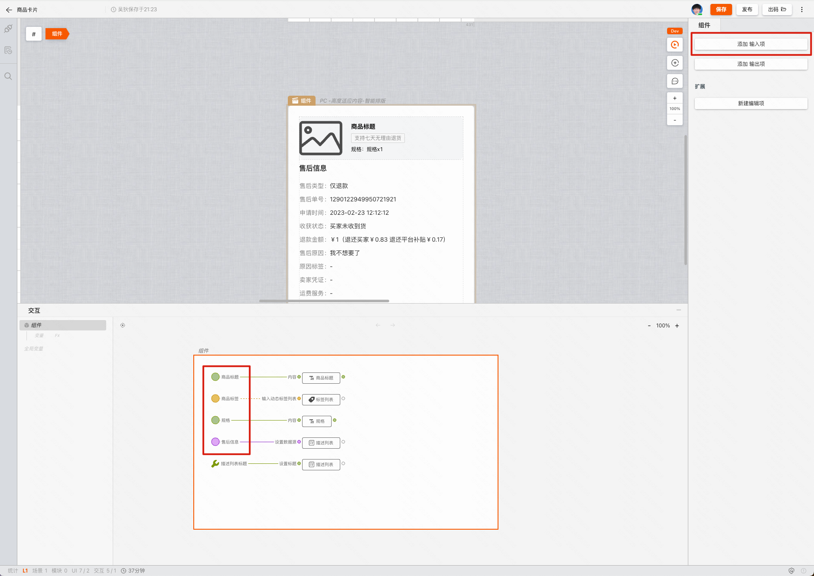

在 **出码后** ，输入项将变成 **由 ref 提供的方法** ，通过调用该方法传入数据。

以售后信息输入项为例，下方代码中，在 useEffect 中为售后信息输入项传入了一份数据。

```JSX
import React, { useEffect, useRef } from 'react'
import CommodityCard, { ICommodityCardRef } from './CommodityCard';

export default function TestCodeOut() {
  const ref = useRef<ICommodityCardRef>(null);

  useEffect(() => {
    ref.current?.setAfterSalesInfo({
      type: '仅退款1',
      no: '1290122949952442223',
      time: '2023-02-23 12:12:12',
      status: '买家未收到货',
      money: '￥2（退还买家￥1.83 退还平台补贴￥0.17）',
      reason: '我不想要了',
      credentials: '-',
      reasonTag: '-',
      service: '-'
    })
  }, [])

  return <CommodityCard ref={ref} />;
}
```

**最终效果**


#### 输出项

输出项用于定义卡片中的交互终点，允许触发外部事件。你可以在 **根部卡片** 上添加输出项。

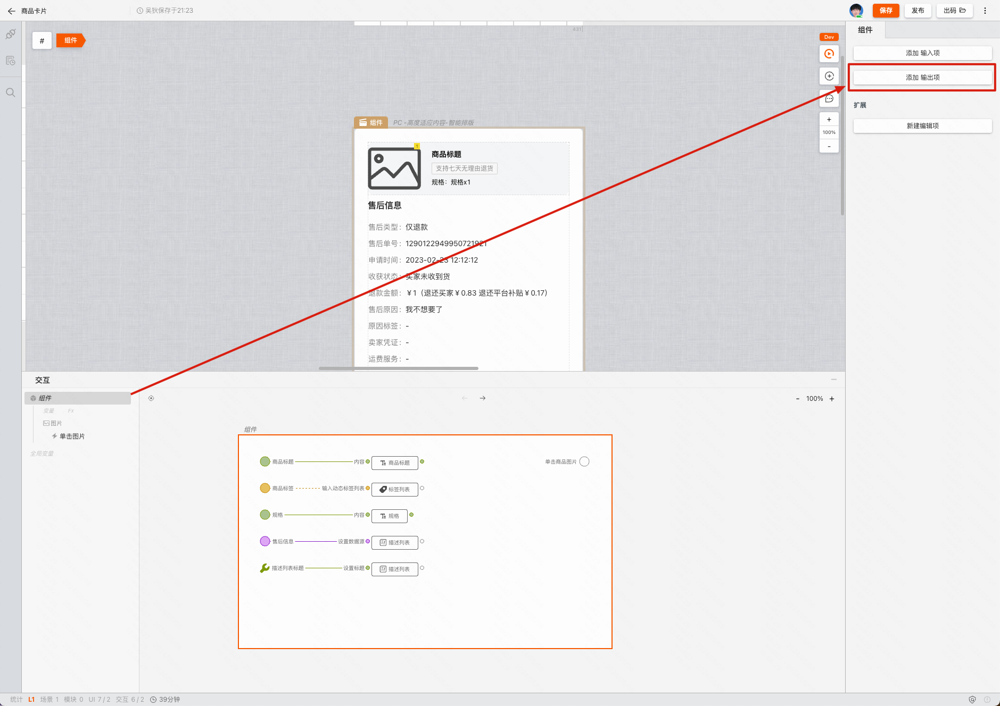

在根部作用域下任意事件中，可以触发输出项

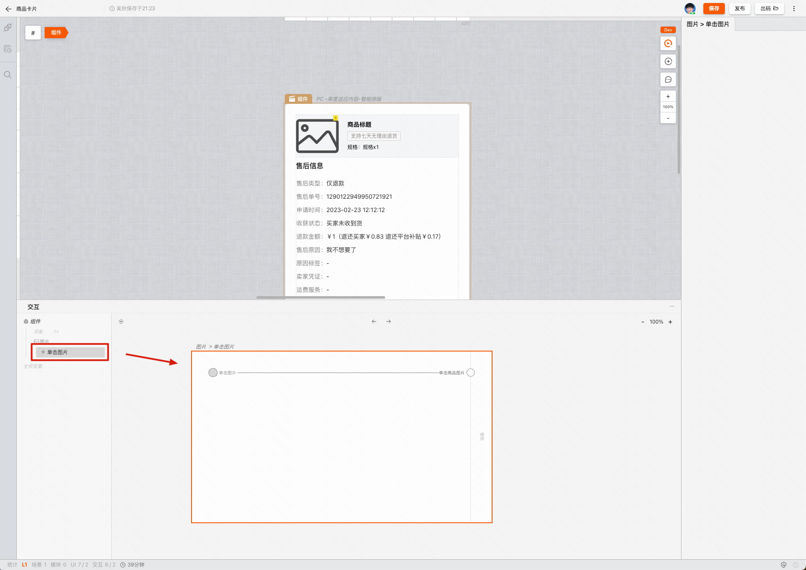

在 **出码后** ，输出项将作为 **组件的一个属性** ，通过触发该属性来执行外部事件。

以单击商品图片输出项为例，下方代码传入了 onImgClick 事件，在单击商品图片后会弹出一条信息

```JSX
import React, { useEffect, useRef } from 'react'
import CommodityCard, { ICommodityCardRef } from './CommodityCard';
import './index.less';
import { message } from 'antd';

export default function TestCodeOut() {
  const ref = useRef<ICommodityCardRef>(null);

  useEffect(() => {
    ref.current?.setAfterSalesInfo({
      type: '仅退款1',
      no: '1290122949952442223',
      time: '2023-02-23 12:12:12',
      status: '买家未收到货',
      money: '￥2（退还买家￥1.83 退还平台补贴￥0.17）',
      reason: '我不想要了',
      credentials: '-',
      reasonTag: '-',
      service: '-'
    })
  }, [])

  return (
    <div className='center'>
      <CommodityCard
        ref={ref}
        onImgClick={() => {
          message.success('单击了商品图片')
        }} />
    </div>
  )
}

```

**最终效果**

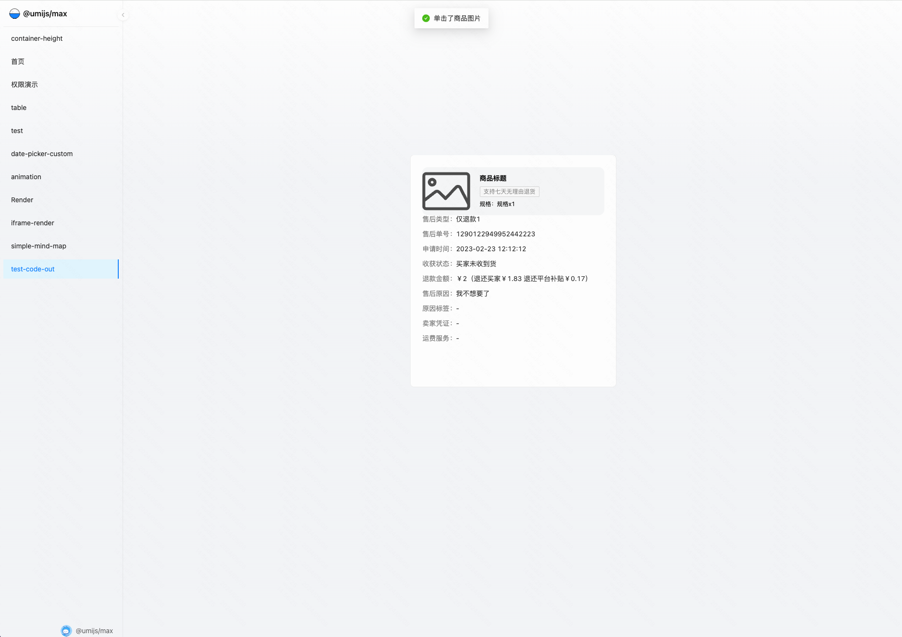

#### 输入项关联输出

通过关联输出项，输入项的触发将等待相关交互完成后再执行后续事件，使其成为一个 Promise。

关联输出项搭建步骤：

1.  在根部卡片上，添加一个输出项，填上输出项的 ID 和标题
2.  选中目标输入项，在右侧编辑面板中的关联输出项部分，关联到刚刚添加的输出项上
3.  在目标输入项的交互逻辑的末尾，连接到关联的输出项

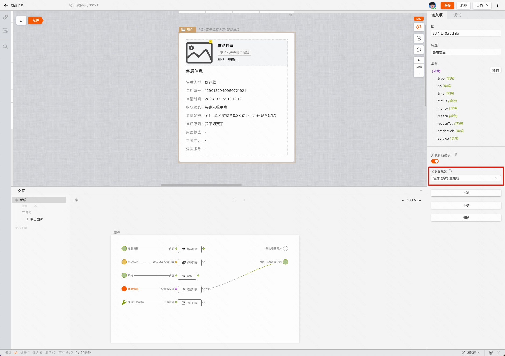

**关联输出项使用 Demo**

```JSX
import React, { useEffect, useRef } from 'react'
import CommodityCard, { ICommodityCardRef } from './CommodityCard';
import './index.less';
import { message } from 'antd';

export default function TestCodeOut() {
  const ref = useRef<ICommodityCardRef>(null);

  useEffect(() => {
    ref.current?.setAfterSalesInfo({
      type: '仅退款1',
      no: '1290122949952442223',
      time: '2023-02-23 12:12:12',
      status: '买家未收到货',
      money: '￥2（退还买家￥1.83 退还平台补贴￥0.17）',
      reason: '我不想要了',
      credentials: '-',
      reasonTag: '-',
      service: '-'
    }).then(() => {
      message.success('设置售后信息完成')
    })
  }, [])

  return (
    <div className='center'>
      <CommodityCard ref={ref} />
    </div>
  )
}

```

**最终效果**

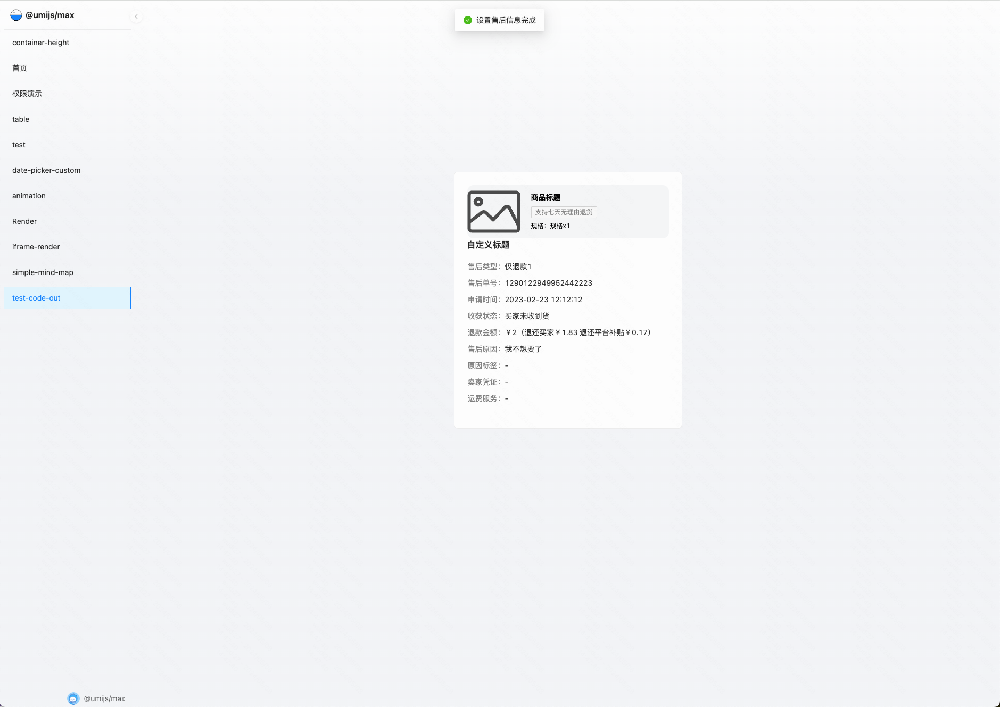

Demo 地址：[https://my.mybricks.world/mybricks-app-pc-cdm/index.html?id=562447376502853](https://my.mybricks.world/mybricks-app-pc-cdm/index.html?id=562447376502853)

## 出码到本地

- 点击右上角的 **导出** 按钮。

- 选择目标框架语言，此处以 React 为例。
- 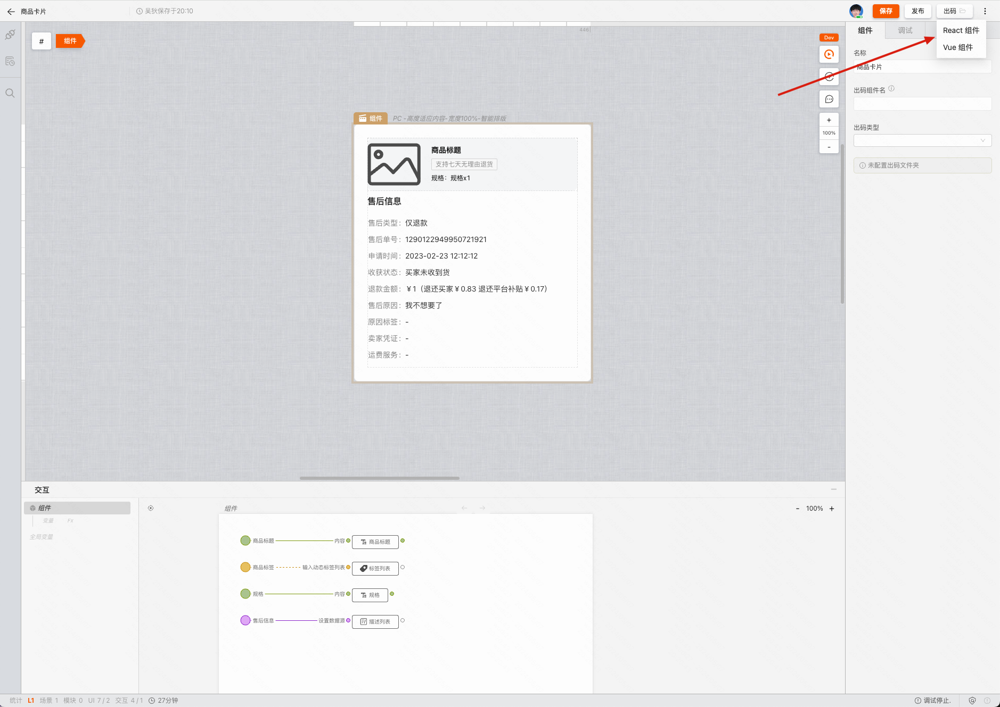
- 输入组件名称并选择目标导出路径以获取相应代码。

- 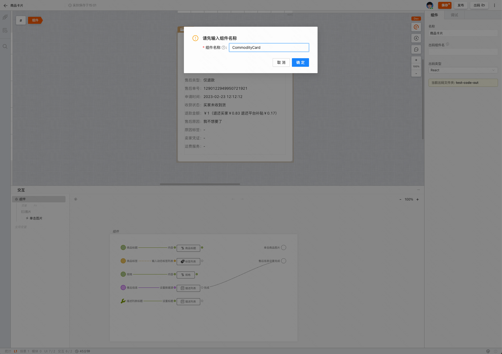
- 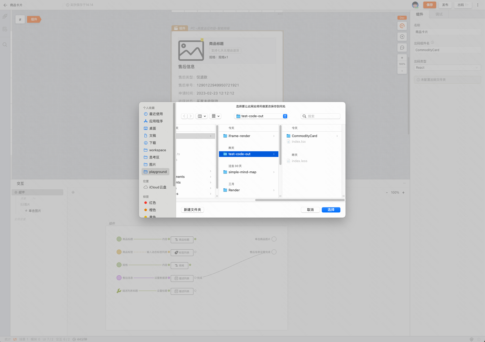

注意事项

- 组件名应采用大驼峰命名法。
- 在索要文件修改权限时，请选择同意。

**出码信息修改**

第一次出码后，如果需要修改出码相关数据，

可以通过点击画布空白处来定位到根组件上，在右侧面板上进行修改，包括 **组件名** 、 **出码类型** 、 **出码位置** 等。

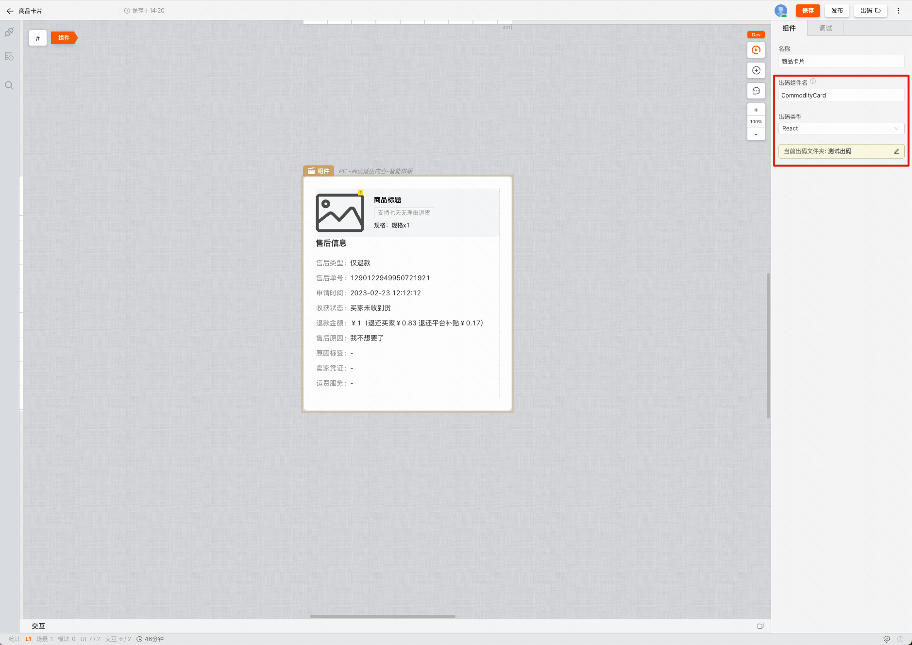

**导出内容和使用方式如下：**

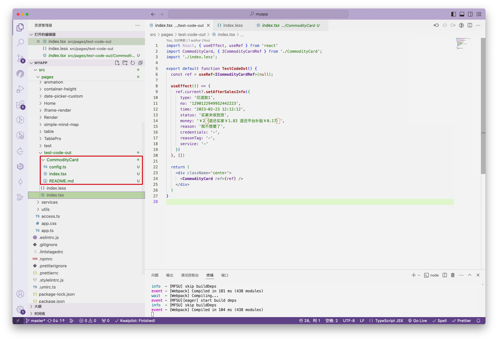

直接在自己的项目代码中引入导出的组件，根据 TS 提示消费即可。

## 安装依赖

运行之前需要安装必要的渲染器包以及相关依赖包

### 本地出码渲染

推荐使用 npm ，只需要安装一个包，执行以下命令

```Bash
npm install @mybricks/renderer-pc -S
```

注意：如果使用 pnpm   或者 yarn，需要额外手动安装 @mybricks/renderer-pc 中 peerDependencies 的依赖

```Bash
npm install antd@4.21.6 @ant-design/icons@4.7.0 moment @mybricks/comlib-basic @mybricks/comlib-pc-normal -S
```

### 根据 JS 文件渲染

```Bash
npm install @mybricks/renderer-pc-cloud -S
```

相关依赖需要进行 externals, webpack 配置示例

```javaScript
module.exports = {
  externals: {
    react: {
        commonjs: 'react',
        commonjs2: 'react',
        amd: 'react',
        root: 'React',
      },
      'react-dom': {
        commonjs: 'react-dom',
        commonjs2: 'react-dom',
        amd: 'react-dom',
        root: 'ReactDOM',
      },
      antd: 'antd',
      '@ant-design/icons': 'icons'
      // 用到 日期 相关组件
      moment: 'moment',
      // 按需 如果用到图表
      '@ant-design/chart': 'Charts'
  }
}

```

```jsx
import React, { useRef, useState } from 'react'
import RendererCloud from '@mybricks/renderer-pc-cloud'

const App = () => {
  const comRef = useRef(null)

  return <RendererCloud ref={comRef} comUrl="" />
}

export default App
```

Tips：内置的组件库 antd 需使用 v4 版本

## 最终效果

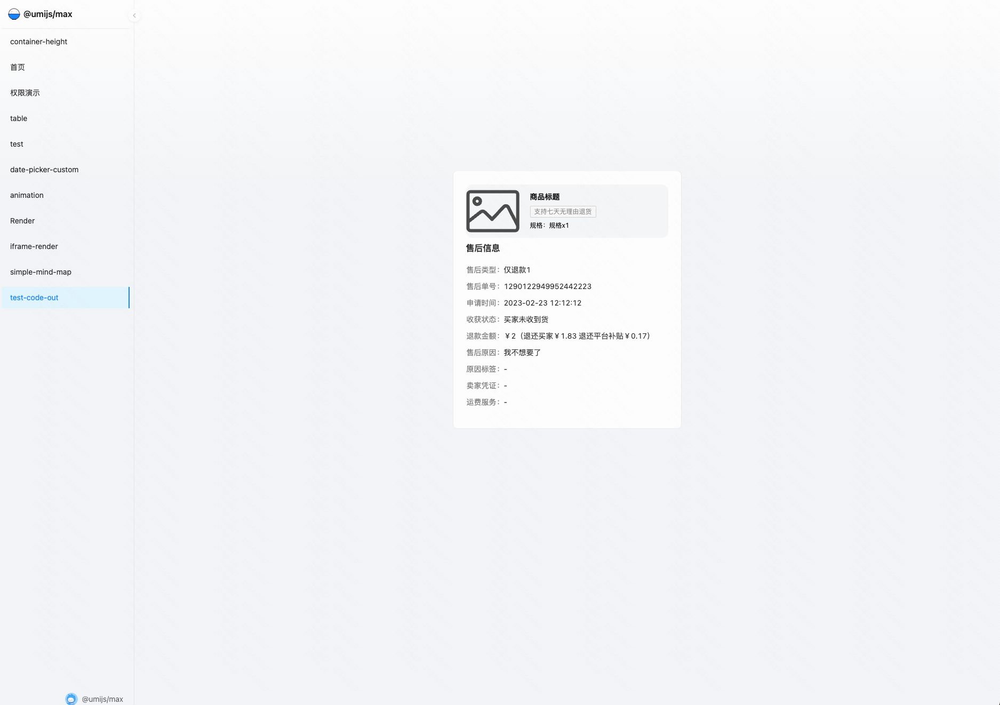

# 二、API 说明

<table style="border:none;border-collapse:collapse"><colgroup><col width="193"><col width="221"><col width="252"><col width="304"></colgroup><tbody><tr style="height:0px"><td style="border-left:solid #d8d8d8 1px;border-right:solid #d8d8d8 1px;border-bottom:solid #d8d8d8 1px;border-top:solid #d8d8d8 1px;vertical-align:top;background-color:#ebedf0;padding:7px 7px 7px 7px"><p dir="ltr" toggle="0" blockstyle="" style="line-height:1.35;margin-top:0pt;margin-bottom:0pt;text-align: center;"><span style="font-size:15px;font-family:Arial,'Microsoft YaHei','微软雅黑','黑体',Heiti,sans-serif,SimSun,'宋体',serif;color:#1f2329;background-color:transparent;font-weight:bold;font-style:normal;font-variant:normal;text-decoration:none;vertical-align:baseline;white-space:pre-wrap;">交互类型</span></p></td><td style="border-left:solid #d8d8d8 1px;border-right:solid #d8d8d8 1px;border-bottom:solid #d8d8d8 1px;border-top:solid #d8d8d8 1px;vertical-align:top;background-color:#ebedf0;padding:7px 7px 7px 7px"><p dir="ltr" toggle="0" blockstyle="" style="line-height:1.35;margin-top:0pt;margin-bottom:0pt;text-align: center;"><span style="font-size:15px;font-family:Arial,'Microsoft YaHei','微软雅黑','黑体',Heiti,sans-serif,SimSun,'宋体',serif;color:#1f2329;background-color:transparent;font-weight:bold;font-style:normal;font-variant:normal;text-decoration:none;vertical-align:baseline;white-space:pre-wrap;">描述</span></p></td><td style="border-left:solid #d8d8d8 1px;border-right:solid #d8d8d8 1px;border-bottom:solid #d8d8d8 1px;border-top:solid #d8d8d8 1px;vertical-align:top;background-color:#ebedf0;padding:7px 7px 7px 7px"><p dir="ltr" toggle="0" blockstyle="" style="line-height:1.35;margin-top:0pt;margin-bottom:0pt;text-align: center;"><span style="font-size:15px;font-family:Arial,'Microsoft YaHei','微软雅黑','黑体',Heiti,sans-serif,SimSun,'宋体',serif;color:#1f2329;background-color:transparent;font-weight:bold;font-style:normal;font-variant:normal;text-decoration:none;vertical-align:baseline;white-space:pre-wrap;">React &nbsp;用法</span></p></td><td style="border-left:solid #d8d8d8 1px;border-right:solid #d8d8d8 1px;border-bottom:solid #d8d8d8 1px;border-top:solid #d8d8d8 1px;vertical-align:top;background-color:#ebedf0;padding:7px 7px 7px 7px"><p dir="ltr" toggle="0" blockstyle="" style="line-height:1.35;margin-top:0pt;margin-bottom:0pt;text-align: center;"><span style="font-size:15px;font-family:Arial,'Microsoft YaHei','微软雅黑','黑体',Heiti,sans-serif,SimSun,'宋体',serif;color:#1f2329;background-color:transparent;font-weight:bold;font-style:normal;font-variant:normal;text-decoration:none;vertical-align:baseline;white-space:pre-wrap;">Vue 3 用法</span></p></td></tr><tr style="height:0px"><td style="border-left:solid #d8d8d8 1px;border-right:solid #d8d8d8 1px;border-bottom:solid #d8d8d8 1px;border-top:solid #d8d8d8 1px;vertical-align:top;padding:7px 7px 7px 7px"><p dir="ltr" toggle="0" blockstyle="" style="line-height:1.35;margin-top:0pt;margin-bottom:0pt;"><span style="font-size:15px;font-family:Arial,'Microsoft YaHei','微软雅黑','黑体',Heiti,sans-serif,SimSun,'宋体',serif;color:#1f2329;background-color:transparent;font-weight:normal;font-style:normal;font-variant:normal;text-decoration:none;vertical-align:baseline;white-space:pre-wrap;">编辑项</span></p></td><td style="border-left:solid #d8d8d8 1px;border-right:solid #d8d8d8 1px;border-bottom:solid #d8d8d8 1px;border-top:solid #d8d8d8 1px;vertical-align:top;padding:7px 7px 7px 7px"><p dir="ltr" toggle="0" blockstyle="" style="line-height:1.35;margin-top:0pt;margin-bottom:0pt;"><span style="font-size:15px;font-family:Arial,'Microsoft YaHei','微软雅黑','黑体',Heiti,sans-serif,SimSun,'宋体',serif;color:#1f2329;background-color:transparent;font-weight:normal;font-style:normal;font-variant:normal;text-decoration:none;vertical-align:baseline;white-space:pre-wrap;">用于静态配置组件的相关状态</span></p></td><td style="border-left:solid #d8d8d8 1px;border-right:solid #d8d8d8 1px;border-bottom:solid #d8d8d8 1px;border-top:solid #d8d8d8 1px;vertical-align:top;padding:7px 7px 7px 7px"><p dir="ltr" toggle="0" blockstyle="" style="line-height:1.35;margin-top:0pt;margin-bottom:0pt;"><span style="font-size:15px;font-family:Arial,'Microsoft YaHei','微软雅黑','黑体',Heiti,sans-serif,SimSun,'宋体',serif;color:#1f2329;background-color:transparent;font-weight:normal;font-style:normal;font-variant:normal;text-decoration:none;vertical-align:baseline;white-space:pre-wrap;">&lt;ComName</span></p><p dir="ltr" toggle="0" blockstyle="" style="line-height:1.35;margin-top:0pt;margin-bottom:0pt;"><span style="font-size:15px;font-family:Arial,'Microsoft YaHei','微软雅黑','黑体',Heiti,sans-serif,SimSun,'宋体',serif;color:#1f2329;background-color:transparent;font-weight:normal;font-style:normal;font-variant:normal;text-decoration:none;vertical-align:baseline;white-space:pre-wrap;">&nbsp;&nbsp;descListTitle="自定义标题"</span></p><p dir="ltr" toggle="0" blockstyle="" style="line-height:1.35;margin-top:0pt;margin-bottom:0pt;"><span style="font-size:15px;font-family:Arial,'Microsoft YaHei','微软雅黑','黑体',Heiti,sans-serif,SimSun,'宋体',serif;color:#1f2329;background-color:transparent;font-weight:normal;font-style:normal;font-variant:normal;text-decoration:none;vertical-align:baseline;white-space:pre-wrap;">/&gt;</span></p><br><p dir="ltr" toggle="0" blockstyle="" style="line-height:1.35;margin-top:0pt;margin-bottom:0pt;"><span style="font-size:15px;font-family:Arial,'Microsoft YaHei','微软雅黑','黑体',Heiti,sans-serif,SimSun,'宋体',serif;color:#1f2329;background-color:transparent;font-weight:normal;font-style:normal;font-variant:normal;text-decoration:none;vertical-align:baseline;white-space:pre-wrap;">&lt;ComName</span></p><p dir="ltr" toggle="0" blockstyle="" style="line-height:1.35;margin-top:0pt;margin-bottom:0pt;"><span style="font-size:15px;font-family:Arial,'Microsoft YaHei','微软雅黑','黑体',Heiti,sans-serif,SimSun,'宋体',serif;color:#1f2329;background-color:transparent;font-weight:normal;font-style:normal;font-variant:normal;text-decoration:none;vertical-align:baseline;white-space:pre-wrap;">&nbsp;&nbsp;descListTitle={descListTitle}</span></p><p dir="ltr" toggle="0" blockstyle="" style="line-height:1.35;margin-top:0pt;margin-bottom:0pt;"><span style="font-size:15px;font-family:Arial,'Microsoft YaHei','微软雅黑','黑体',Heiti,sans-serif,SimSun,'宋体',serif;color:#1f2329;background-color:transparent;font-weight:normal;font-style:normal;font-variant:normal;text-decoration:none;vertical-align:baseline;white-space:pre-wrap;">/&gt;</span></p></td><td style="border-left:solid #d8d8d8 1px;border-right:solid #d8d8d8 1px;border-bottom:solid #d8d8d8 1px;border-top:solid #d8d8d8 1px;vertical-align:top;padding:7px 7px 7px 7px"><p dir="ltr" toggle="0" blockstyle="" style="line-height:1.35;margin-top:0pt;margin-bottom:0pt;"><span style="font-size:15px;font-family:Arial,'Microsoft YaHei','微软雅黑','黑体',Heiti,sans-serif,SimSun,'宋体',serif;color:#1f2329;background-color:transparent;font-weight:normal;font-style:normal;font-variant:normal;text-decoration:none;vertical-align:baseline;white-space:pre-wrap;">&lt;com-name</span></p><p dir="ltr" toggle="0" blockstyle="" style="line-height:1.35;margin-top:0pt;margin-bottom:0pt;"><span style="font-size:15px;font-family:Arial,'Microsoft YaHei','微软雅黑','黑体',Heiti,sans-serif,SimSun,'宋体',serif;color:#1f2329;background-color:transparent;font-weight:normal;font-style:normal;font-variant:normal;text-decoration:none;vertical-align:baseline;white-space:pre-wrap;">&nbsp;&nbsp;descListTitle="自定义标题"</span></p><p dir="ltr" toggle="0" blockstyle="" style="line-height:1.35;margin-top:0pt;margin-bottom:0pt;"><span style="font-size:15px;font-family:Arial,'Microsoft YaHei','微软雅黑','黑体',Heiti,sans-serif,SimSun,'宋体',serif;color:#1f2329;background-color:transparent;font-weight:normal;font-style:normal;font-variant:normal;text-decoration:none;vertical-align:baseline;white-space:pre-wrap;">&gt;&lt;/com-name&gt;</span></p><br><p dir="ltr" toggle="0" blockstyle="" style="line-height:1.35;margin-top:0pt;margin-bottom:0pt;"><span style="font-size:15px;font-family:Arial,'Microsoft YaHei','微软雅黑','黑体',Heiti,sans-serif,SimSun,'宋体',serif;color:#1f2329;background-color:transparent;font-weight:normal;font-style:normal;font-variant:normal;text-decoration:none;vertical-align:baseline;white-space:pre-wrap;">&lt;com-name</span></p><p dir="ltr" toggle="0" blockstyle="" style="line-height:1.35;margin-top:0pt;margin-bottom:0pt;"><span style="font-size:15px;font-family:Arial,'Microsoft YaHei','微软雅黑','黑体',Heiti,sans-serif,SimSun,'宋体',serif;color:#1f2329;background-color:transparent;font-weight:normal;font-style:normal;font-variant:normal;text-decoration:none;vertical-align:baseline;white-space:pre-wrap;">&nbsp;&nbsp;:descListTitle="descListTitle"</span></p><p dir="ltr" toggle="0" blockstyle="" style="line-height:1.35;margin-top:0pt;margin-bottom:0pt;"><span style="font-size:15px;font-family:Arial,'Microsoft YaHei','微软雅黑','黑体',Heiti,sans-serif,SimSun,'宋体',serif;color:#1f2329;background-color:transparent;font-weight:normal;font-style:normal;font-variant:normal;text-decoration:none;vertical-align:baseline;white-space:pre-wrap;">&gt;&lt;/com-name&gt;</span></p></td></tr><tr style="height:0px"><td style="border-left:solid #d8d8d8 1px;border-right:solid #d8d8d8 1px;border-bottom:solid #d8d8d8 1px;border-top:solid #d8d8d8 1px;vertical-align:top;padding:7px 7px 7px 7px"><p dir="ltr" toggle="0" blockstyle="" style="line-height:1.35;margin-top:0pt;margin-bottom:0pt;"><span style="font-size:15px;font-family:Arial,'Microsoft YaHei','微软雅黑','黑体',Heiti,sans-serif,SimSun,'宋体',serif;color:#1f2329;background-color:transparent;font-weight:normal;font-style:normal;font-variant:normal;text-decoration:none;vertical-align:baseline;white-space:pre-wrap;">输入项（普通）</span></p></td><td style="border-left:solid #d8d8d8 1px;border-right:solid #d8d8d8 1px;border-bottom:solid #d8d8d8 1px;border-top:solid #d8d8d8 1px;vertical-align:top;padding:7px 7px 7px 7px"><p dir="ltr" toggle="0" blockstyle="" style="line-height:1.35;margin-top:0pt;margin-bottom:0pt;"><span style="font-size:15px;font-family:Arial,'Microsoft YaHei','微软雅黑','黑体',Heiti,sans-serif,SimSun,'宋体',serif;color:#1f2329;background-color:transparent;font-weight:normal;font-style:normal;font-variant:normal;text-decoration:none;vertical-align:baseline;white-space:pre-wrap;">用于主动调用修改组件的状态的方法</span></p></td><td style="border-left:solid #d8d8d8 1px;border-right:solid #d8d8d8 1px;border-bottom:solid #d8d8d8 1px;border-top:solid #d8d8d8 1px;vertical-align:top;padding:7px 7px 7px 7px"><p dir="ltr" toggle="0" blockstyle="" style="line-height:1.35;margin-top:0pt;margin-bottom:0pt;"><span style="font-size:15px;font-family:Arial,'Microsoft YaHei','微软雅黑','黑体',Heiti,sans-serif,SimSun,'宋体',serif;color:#1f2329;background-color:transparent;font-weight:normal;font-style:normal;font-variant:normal;text-decoration:none;vertical-align:baseline;white-space:pre-wrap;">&lt;ComName</span></p><p dir="ltr" toggle="0" blockstyle="" style="line-height:1.35;margin-top:0pt;margin-bottom:0pt;"><span style="font-size:15px;font-family:Arial,'Microsoft YaHei','微软雅黑','黑体',Heiti,sans-serif,SimSun,'宋体',serif;color:#1f2329;background-color:transparent;font-weight:normal;font-style:normal;font-variant:normal;text-decoration:none;vertical-align:baseline;white-space:pre-wrap;">&nbsp;&nbsp;ref={comRef}</span></p><p dir="ltr" toggle="0" blockstyle="" style="line-height:1.35;margin-top:0pt;margin-bottom:0pt;"><span style="font-size:15px;font-family:Arial,'Microsoft YaHei','微软雅黑','黑体',Heiti,sans-serif,SimSun,'宋体',serif;color:#1f2329;background-color:transparent;font-weight:normal;font-style:normal;font-variant:normal;text-decoration:none;vertical-align:baseline;white-space:pre-wrap;">/&gt;</span></p><br><p dir="ltr" toggle="0" blockstyle="" style="line-height:1.35;margin-top:0pt;margin-bottom:0pt;"><span style="font-size:15px;font-family:Arial,'Microsoft YaHei','微软雅黑','黑体',Heiti,sans-serif,SimSun,'宋体',serif;color:#1f2329;background-color:transparent;font-weight:normal;font-style:normal;font-variant:normal;text-decoration:none;vertical-align:baseline;white-space:pre-wrap;">const comRef = useRef(null)</span></p><p dir="ltr" toggle="0" blockstyle="" style="line-height:1.35;margin-top:0pt;margin-bottom:0pt;"><span style="font-size:15px;font-family:Arial,'Microsoft YaHei','微软雅黑','黑体',Heiti,sans-serif,SimSun,'宋体',serif;color:#1f2329;background-color:transparent;font-weight:normal;font-style:normal;font-variant:normal;text-decoration:none;vertical-align:baseline;white-space:pre-wrap;">comRef.current?.setAfterSalesInfo({})</span></p></td><td style="border-left:solid #d8d8d8 1px;border-right:solid #d8d8d8 1px;border-bottom:solid #d8d8d8 1px;border-top:solid #d8d8d8 1px;vertical-align:top;padding:7px 7px 7px 7px"><p dir="ltr" toggle="0" blockstyle="" style="line-height:1.35;margin-top:0pt;margin-bottom:0pt;"><span style="font-size:15px;font-family:Arial,'Microsoft YaHei','微软雅黑','黑体',Heiti,sans-serif,SimSun,'宋体',serif;color:#1f2329;background-color:transparent;font-weight:normal;font-style:normal;font-variant:normal;text-decoration:none;vertical-align:baseline;white-space:pre-wrap;">&lt;com-name</span></p><p dir="ltr" toggle="0" blockstyle="" style="line-height:1.35;margin-top:0pt;margin-bottom:0pt;"><span style="font-size:15px;font-family:Arial,'Microsoft YaHei','微软雅黑','黑体',Heiti,sans-serif,SimSun,'宋体',serif;color:#1f2329;background-color:transparent;font-weight:normal;font-style:normal;font-variant:normal;text-decoration:none;vertical-align:baseline;white-space:pre-wrap;">&nbsp;&nbsp;ref={comRef}</span></p><p dir="ltr" toggle="0" blockstyle="" style="line-height:1.35;margin-top:0pt;margin-bottom:0pt;"><span style="font-size:15px;font-family:Arial,'Microsoft YaHei','微软雅黑','黑体',Heiti,sans-serif,SimSun,'宋体',serif;color:#1f2329;background-color:transparent;font-weight:normal;font-style:normal;font-variant:normal;text-decoration:none;vertical-align:baseline;white-space:pre-wrap;">&gt;&lt;/com-name&gt;</span></p><br><p dir="ltr" toggle="0" blockstyle="" style="line-height:1.35;margin-top:0pt;margin-bottom:0pt;"><span style="font-size:15px;font-family:Arial,'Microsoft YaHei','微软雅黑','黑体',Heiti,sans-serif,SimSun,'宋体',serif;color:#1f2329;background-color:transparent;font-weight:normal;font-style:normal;font-variant:normal;text-decoration:none;vertical-align:baseline;white-space:pre-wrap;">comRef.value.setAfterSalesInfo({})</span></p></td></tr><tr style="height:0px"><td style="border-left:solid #d8d8d8 1px;border-right:solid #d8d8d8 1px;border-bottom:solid #d8d8d8 1px;border-top:solid #d8d8d8 1px;vertical-align:top;padding:7px 7px 7px 7px"><p dir="ltr" toggle="0" blockstyle="" style="line-height:1.45;margin-top:0pt;margin-bottom:0pt;"><span style="font-size:15px;font-family:Arial,'Microsoft YaHei','微软雅黑','黑体',Heiti,sans-serif,SimSun,'宋体',serif;color:#1f2329;background-color:transparent;font-weight:normal;font-style:normal;font-variant:normal;text-decoration:none;vertical-align:baseline;white-space:pre-wrap;">输入项（关联输出项）</span></p></td><td style="border-left:solid #d8d8d8 1px;border-right:solid #d8d8d8 1px;border-bottom:solid #d8d8d8 1px;border-top:solid #d8d8d8 1px;vertical-align:top;padding:7px 7px 7px 7px"><p dir="ltr" toggle="0" blockstyle="" style="line-height:1.45;margin-top:0pt;margin-bottom:0pt;"><span style="font-size:15px;font-family:Arial,'Microsoft YaHei','微软雅黑','黑体',Heiti,sans-serif,SimSun,'宋体',serif;color:#1f2329;background-color:transparent;font-weight:normal;font-style:normal;font-variant:normal;text-decoration:none;vertical-align:baseline;white-space:pre-wrap;">用于主动调用修改组件的状态，并返回一个Promise</span></p></td><td style="border-left:solid #d8d8d8 1px;border-right:solid #d8d8d8 1px;border-bottom:solid #d8d8d8 1px;border-top:solid #d8d8d8 1px;vertical-align:top;padding:7px 7px 7px 7px"><p dir="ltr" toggle="0" blockstyle="" style="line-height:1.35;margin-top:0pt;margin-bottom:0pt;"><span style="font-size:15px;font-family:Arial,'Microsoft YaHei','微软雅黑','黑体',Heiti,sans-serif,SimSun,'宋体',serif;color:#1f2329;background-color:transparent;font-weight:normal;font-style:normal;font-variant:normal;text-decoration:none;vertical-align:baseline;white-space:pre-wrap;">&lt;ComName</span></p><p dir="ltr" toggle="0" blockstyle="" style="line-height:1.35;margin-top:0pt;margin-bottom:0pt;"><span style="font-size:15px;font-family:Arial,'Microsoft YaHei','微软雅黑','黑体',Heiti,sans-serif,SimSun,'宋体',serif;color:#1f2329;background-color:transparent;font-weight:normal;font-style:normal;font-variant:normal;text-decoration:none;vertical-align:baseline;white-space:pre-wrap;">&nbsp;&nbsp;ref={comRef}</span></p><p dir="ltr" toggle="0" blockstyle="" style="line-height:1.35;margin-top:0pt;margin-bottom:0pt;"><span style="font-size:15px;font-family:Arial,'Microsoft YaHei','微软雅黑','黑体',Heiti,sans-serif,SimSun,'宋体',serif;color:#1f2329;background-color:transparent;font-weight:normal;font-style:normal;font-variant:normal;text-decoration:none;vertical-align:baseline;white-space:pre-wrap;">/&gt;</span></p><br><p dir="ltr" toggle="0" blockstyle="" style="line-height:1.35;margin-top:0pt;margin-bottom:0pt;"><span style="font-size:15px;font-family:Arial,'Microsoft YaHei','微软雅黑','黑体',Heiti,sans-serif,SimSun,'宋体',serif;color:#1f2329;background-color:transparent;font-weight:normal;font-style:normal;font-variant:normal;text-decoration:none;vertical-align:baseline;white-space:pre-wrap;">const comRef = useRef(null)</span></p><p dir="ltr" toggle="0" blockstyle="" style="line-height:1.35;margin-top:0pt;margin-bottom:0pt;"><span style="font-size:15px;font-family:Arial,'Microsoft YaHei','微软雅黑','黑体',Heiti,sans-serif,SimSun,'宋体',serif;color:#1f2329;background-color:transparent;font-weight:normal;font-style:normal;font-variant:normal;text-decoration:none;vertical-align:baseline;white-space:pre-wrap;">comRef.current?.setAfterSalesInfo({}).then(r =&gt; {})</span></p></td><td style="border-left:solid #d8d8d8 1px;border-right:solid #d8d8d8 1px;border-bottom:solid #d8d8d8 1px;border-top:solid #d8d8d8 1px;vertical-align:top;padding:7px 7px 7px 7px"><p dir="ltr" toggle="0" blockstyle="" style="line-height:1.35;margin-top:0pt;margin-bottom:0pt;"><span style="font-size:15px;font-family:Arial,'Microsoft YaHei','微软雅黑','黑体',Heiti,sans-serif,SimSun,'宋体',serif;color:#1f2329;background-color:transparent;font-weight:normal;font-style:normal;font-variant:normal;text-decoration:none;vertical-align:baseline;white-space:pre-wrap;">&lt;com-name</span></p><p dir="ltr" toggle="0" blockstyle="" style="line-height:1.35;margin-top:0pt;margin-bottom:0pt;"><span style="font-size:15px;font-family:Arial,'Microsoft YaHei','微软雅黑','黑体',Heiti,sans-serif,SimSun,'宋体',serif;color:#1f2329;background-color:transparent;font-weight:normal;font-style:normal;font-variant:normal;text-decoration:none;vertical-align:baseline;white-space:pre-wrap;">&nbsp;&nbsp;ref={comRef}</span></p><p dir="ltr" toggle="0" blockstyle="" style="line-height:1.35;margin-top:0pt;margin-bottom:0pt;"><span style="font-size:15px;font-family:Arial,'Microsoft YaHei','微软雅黑','黑体',Heiti,sans-serif,SimSun,'宋体',serif;color:#1f2329;background-color:transparent;font-weight:normal;font-style:normal;font-variant:normal;text-decoration:none;vertical-align:baseline;white-space:pre-wrap;">&gt;&lt;/com-name&gt;</span></p><br><p dir="ltr" toggle="0" blockstyle="" style="line-height:1.35;margin-top:0pt;margin-bottom:0pt;"><span style="font-size:15px;font-family:Arial,'Microsoft YaHei','微软雅黑','黑体',Heiti,sans-serif,SimSun,'宋体',serif;color:#1f2329;background-color:transparent;font-weight:normal;font-style:normal;font-variant:normal;text-decoration:none;vertical-align:baseline;white-space:pre-wrap;">comRef.value.setAfterSalesInfo({}).then(r =&gt; {})</span></p><br></td></tr><tr style="height:0px"><td style="border-left:solid #d8d8d8 1px;border-right:solid #d8d8d8 1px;border-bottom:solid #d8d8d8 1px;border-top:solid #d8d8d8 1px;vertical-align:top;padding:7px 7px 7px 7px"><p dir="ltr" toggle="0" blockstyle="" style="line-height:1.45;margin-top:0pt;margin-bottom:0pt;"><span style="font-size:15px;font-family:Arial,'Microsoft YaHei','微软雅黑','黑体',Heiti,sans-serif,SimSun,'宋体',serif;color:#1f2329;background-color:transparent;font-weight:normal;font-style:normal;font-variant:normal;text-decoration:none;vertical-align:baseline;white-space:pre-wrap;">输出项</span></p></td><td style="border-left:solid #d8d8d8 1px;border-right:solid #d8d8d8 1px;border-bottom:solid #d8d8d8 1px;border-top:solid #d8d8d8 1px;vertical-align:top;padding:7px 7px 7px 7px"><p dir="ltr" toggle="0" blockstyle="" style="line-height:1.45;margin-top:0pt;margin-bottom:0pt;"><span style="font-size:15px;font-family:Arial,'Microsoft YaHei','微软雅黑','黑体',Heiti,sans-serif,SimSun,'宋体',serif;color:#1f2329;background-color:transparent;font-weight:normal;font-style:normal;font-variant:normal;text-decoration:none;vertical-align:baseline;white-space:pre-wrap;">用于接收组件事件响应的回调</span></p></td><td style="border-left:solid #d8d8d8 1px;border-right:solid #d8d8d8 1px;border-bottom:solid #d8d8d8 1px;border-top:solid #d8d8d8 1px;vertical-align:top;padding:7px 7px 7px 7px"><p dir="ltr" toggle="0" blockstyle="" style="line-height:1.35;margin-top:0pt;margin-bottom:0pt;"><span style="font-size:15px;font-family:Arial,'Microsoft YaHei','微软雅黑','黑体',Heiti,sans-serif,SimSun,'宋体',serif;color:#1f2329;background-color:transparent;font-weight:normal;font-style:normal;font-variant:normal;text-decoration:none;vertical-align:baseline;white-space:pre-wrap;">&lt;ComName</span></p><p dir="ltr" toggle="0" blockstyle="" style="line-height:1.35;margin-top:0pt;margin-bottom:0pt;"><span style="font-size:15px;font-family:Arial,'Microsoft YaHei','微软雅黑','黑体',Heiti,sans-serif,SimSun,'宋体',serif;color:#1f2329;background-color:transparent;font-weight:normal;font-style:normal;font-variant:normal;text-decoration:none;vertical-align:baseline;white-space:pre-wrap;">&nbsp;&nbsp;onImgClick={() =&gt; {</span></p><p dir="ltr" toggle="0" blockstyle="" style="line-height:1.35;margin-top:0pt;margin-bottom:0pt;"><span style="font-size:15px;font-family:Arial,'Microsoft YaHei','微软雅黑','黑体',Heiti,sans-serif,SimSun,'宋体',serif;color:#1f2329;background-color:transparent;font-weight:normal;font-style:normal;font-variant:normal;text-decoration:none;vertical-align:baseline;white-space:pre-wrap;">&nbsp;&nbsp;&nbsp;&nbsp;&nbsp;&nbsp;console.log('触发了输出事件')</span></p><p dir="ltr" toggle="0" blockstyle="" style="line-height:1.35;margin-top:0pt;margin-bottom:0pt;"><span style="font-size:15px;font-family:Arial,'Microsoft YaHei','微软雅黑','黑体',Heiti,sans-serif,SimSun,'宋体',serif;color:#1f2329;background-color:transparent;font-weight:normal;font-style:normal;font-variant:normal;text-decoration:none;vertical-align:baseline;white-space:pre-wrap;">&nbsp;}}</span></p><p dir="ltr" toggle="0" blockstyle="" style="line-height:1.35;margin-top:0pt;margin-bottom:0pt;"><span style="font-size:15px;font-family:Arial,'Microsoft YaHei','微软雅黑','黑体',Heiti,sans-serif,SimSun,'宋体',serif;color:#1f2329;background-color:transparent;font-weight:normal;font-style:normal;font-variant:normal;text-decoration:none;vertical-align:baseline;white-space:pre-wrap;">/&gt;</span></p></td><td style="border-left:solid #d8d8d8 1px;border-right:solid #d8d8d8 1px;border-bottom:solid #d8d8d8 1px;border-top:solid #d8d8d8 1px;vertical-align:top;padding:7px 7px 7px 7px"><p dir="ltr" toggle="0" blockstyle="" style="line-height:1.35;margin-top:0pt;margin-bottom:0pt;"><span style="font-size:15px;font-family:Arial,'Microsoft YaHei','微软雅黑','黑体',Heiti,sans-serif,SimSun,'宋体',serif;color:#1f2329;background-color:transparent;font-weight:normal;font-style:normal;font-variant:normal;text-decoration:none;vertical-align:baseline;white-space:pre-wrap;">&lt;com-name</span></p><p dir="ltr" toggle="0" blockstyle="" style="line-height:1.35;margin-top:0pt;margin-bottom:0pt;"><span style="font-size:15px;font-family:Arial,'Microsoft YaHei','微软雅黑','黑体',Heiti,sans-serif,SimSun,'宋体',serif;color:#1f2329;background-color:transparent;font-weight:normal;font-style:normal;font-variant:normal;text-decoration:none;vertical-align:baseline;white-space:pre-wrap;">&nbsp;&nbsp;@on-img-click="() =&gt; {</span></p><p dir="ltr" toggle="0" blockstyle="" style="line-height:1.35;margin-top:0pt;margin-bottom:0pt;"><span style="font-size:15px;font-family:Arial,'Microsoft YaHei','微软雅黑','黑体',Heiti,sans-serif,SimSun,'宋体',serif;color:#1f2329;background-color:transparent;font-weight:normal;font-style:normal;font-variant:normal;text-decoration:none;vertical-align:baseline;white-space:pre-wrap;">&nbsp;&nbsp;&nbsp;&nbsp;&nbsp;&nbsp;console.log('触发了输出事件')</span></p><p dir="ltr" toggle="0" blockstyle="" style="line-height:1.35;margin-top:0pt;margin-bottom:0pt;"><span style="font-size:15px;font-family:Arial,'Microsoft YaHei','微软雅黑','黑体',Heiti,sans-serif,SimSun,'宋体',serif;color:#1f2329;background-color:transparent;font-weight:normal;font-style:normal;font-variant:normal;text-decoration:none;vertical-align:baseline;white-space:pre-wrap;">&nbsp;&nbsp;}"</span></p><p dir="ltr" toggle="0" blockstyle="" style="line-height:1.35;margin-top:0pt;margin-bottom:0pt;"><span style="font-size:15px;font-family:Arial,'Microsoft YaHei','微软雅黑','黑体',Heiti,sans-serif,SimSun,'宋体',serif;color:#1f2329;background-color:transparent;font-weight:normal;font-style:normal;font-variant:normal;text-decoration:none;vertical-align:baseline;white-space:pre-wrap;">&gt;&lt;/com-name&gt;</span></p></td></tr></tbody></table>
