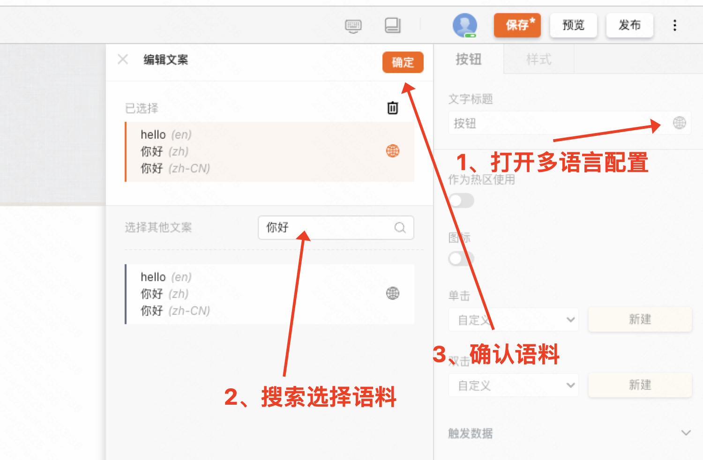
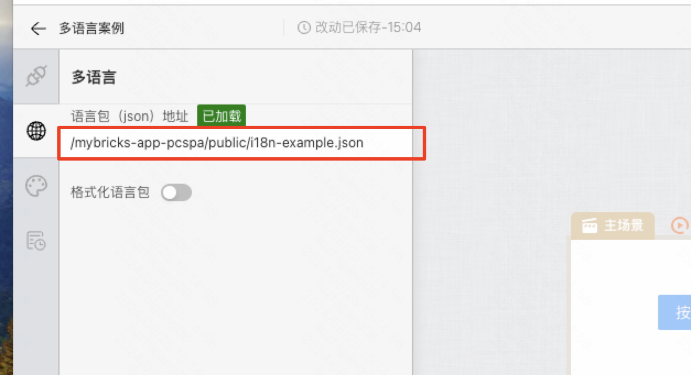
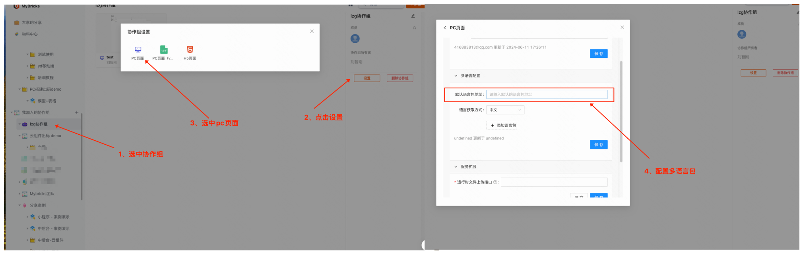
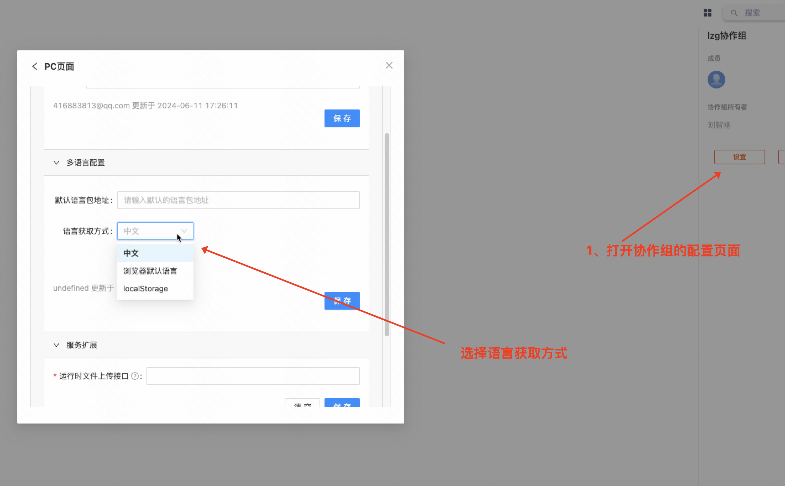

# 介绍
MyBricks 内置多语言功能，通过配置多语言和语言包，并在需要做语言处理的组件上选择对应的语料，即可实现页面的多语言的功能。

# 简单使用
> pc页面内置了包含一个hello预料的语言包，如果需要配置语言包，可以参考后面的详细配置
- 1、直接在组件的输入框编辑项上打开国际化配置
- 2、选择语料即可



# 详细配置
## 一、配置语言包
  - 1. 单个页面配置语言包: 在配置框填入json语言包地址
  ```javscript
  // json内容格式
  // 唯一id作为key
{
  "1": {
    "id": "1",
    "content": {
      "en": "hello",
      "zh": "你好",
      "zh-CN": "你好",
      ... // 其他语言
    }
  },
  ... // 其他语料
}
  ```
  


  - 2. 多个页面配置语言包：在协作组配置语言包，会自动应用到组内所有页面（页面内单独配置语言包不会被覆盖）
  

## 二、配置多语言获取方式
 > 可以在协作组的PC配置页面配置语言包获取方式，支持一下三种
  - 1、默认为显示中文
  - 2、按照浏览器默认语言显示
  - 3、指定localStorage key, 根据key值进行显示
  

## 三、云组件多语言配置
  > 云组件也支持多语言
  - 1、云组件的多语言包需要单独在页面内配置
  - 2、云组件的语言获取方式跟随所在的pc页面控制


