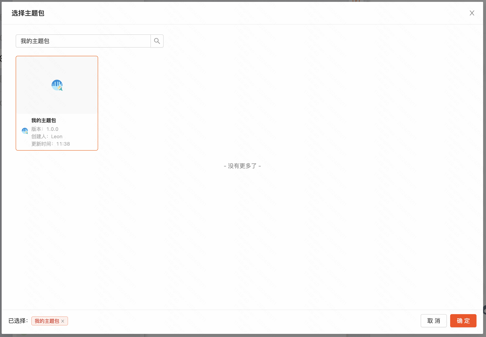
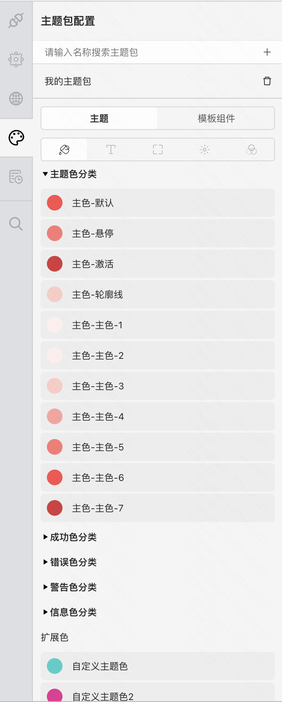
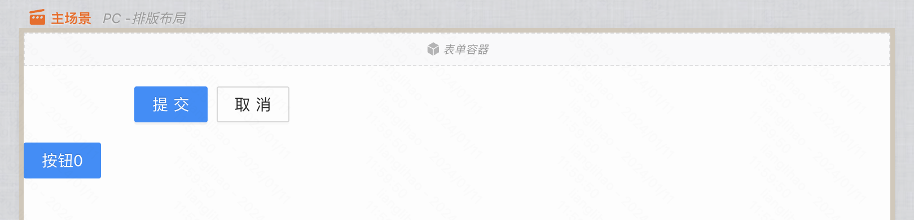
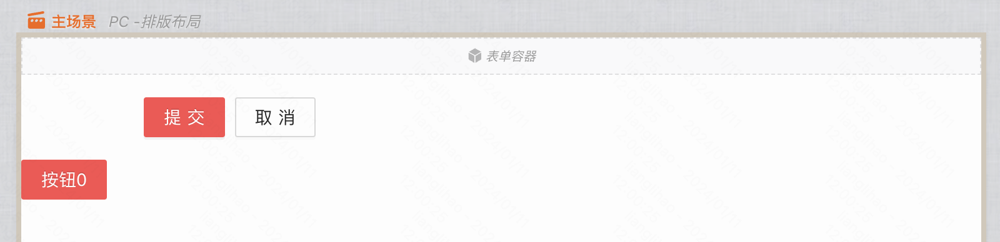
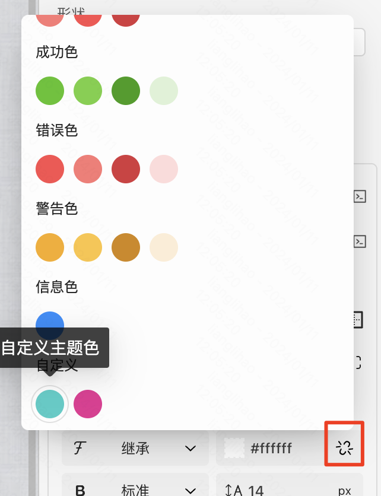
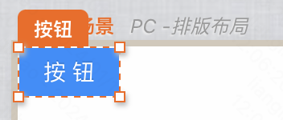
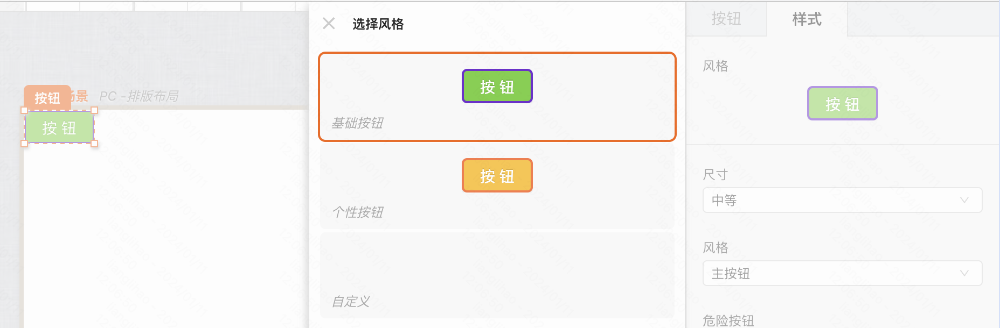
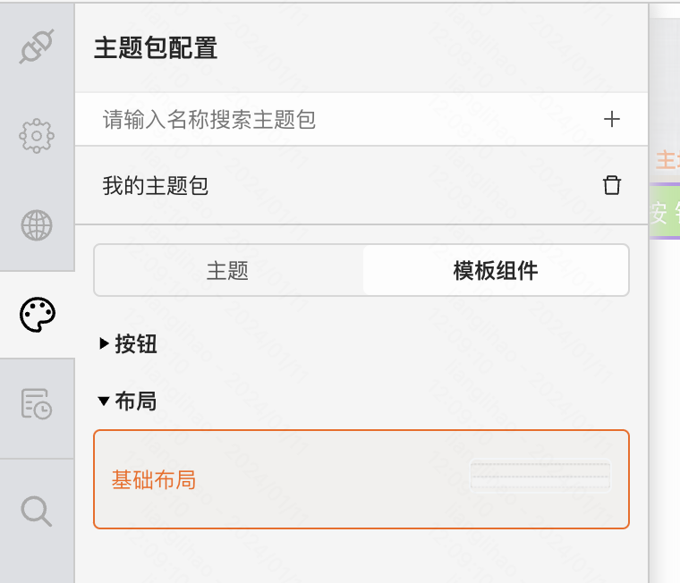
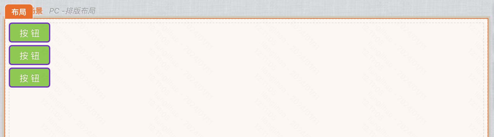

:::tip
通过本章节，了解如何使用主题包（在您了解上一章节“搭建主题包”的基础上查阅此章节）。
:::

## 添加主题包

点击主题包插件，点击“+”。

选择需要使用的主题包，并点击“确定”。

添加后，可以看到在搭建主题包时配置的设计规范。

## 主题包效果

### 设计规范

拖入表单容器、工具条等组件，可以看到，主色已被修改。

默认。

使用主题包后。

若组件需要二次修改色值，在编辑器中支持了可选择设计规范中的色值，包括自定义扩展色。

## 组件规范

拖入按钮组件。

默认。

使用主题包后，自动使用了默认的按钮组件规范。

## 模板组件

点击打开“模板组件”面板，选择需要使用的模板组件，点击即可添加至画布。

结合上一章节搭建的内容可以看到，布局与页面边缘留出了一定的空间，内部组件间也留出了设计的空间（行间距）。

