## 1\. 简介

一个可用于搭建的组件需要具备的基本能力： **组件运行时 + 属性配置能力 + 逻辑编排能力** 。

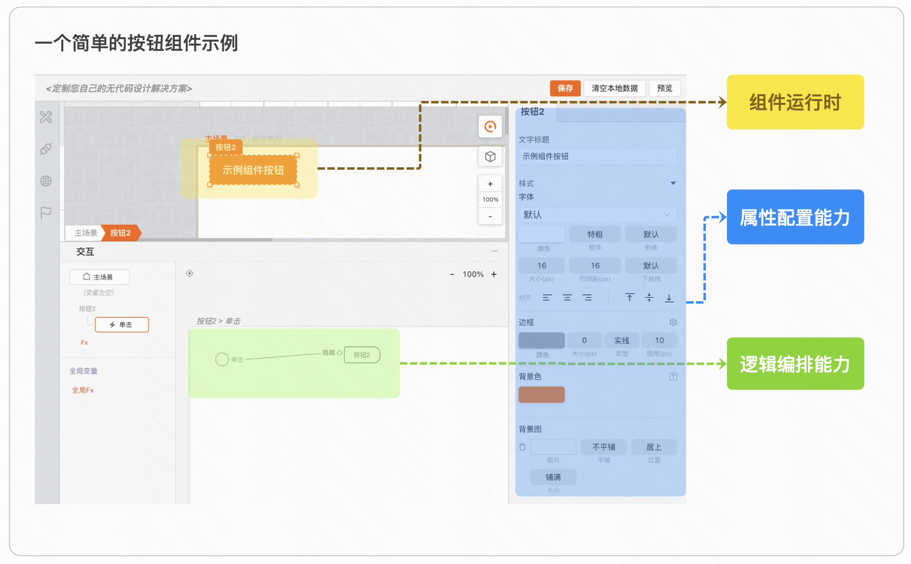

> 基于 MyBricks 组件开发规范，可以开发出强大的组件，包括编辑、I/O 通信、类型系统、Slots、多语言、权限、基于 Schema 的父子组件联动（表单容器等场景）、响应式等各个方面

1.  支持视图组件、逻辑组件等类型，视图组件支持 Vue、React、React Native 等不同技术栈；
2.  支持可组合、可扩展、基于区域的声明式编辑器，编辑器中除常规编辑器之外，还包含了一些高级编辑器，例如代码编辑器、富文本编辑器等（详见附件中的内置编辑器类型清单）；
3.  布局方面，组件支持流式、绝对定位、固定定位，基于环境（env.canvasType 手机、Pad、PC 等）的响应式布局等方式；
4.  支持具名插槽，作用域插槽，动态插槽等，插槽中的布局可自定义，具名插槽应用于组件基于规则的组合，例如商品列表与商品卡片的组合，作用域插槽提供了 I/O 编排能力；
5.  组件支持 Inputs 与 Outputs（简称 I/O ），I/O 基于数据流图，在框图的扩展下可实现图灵完备，是组件在逻辑层面联动的重要能力；
6.  可扩展 API，通过基于场景的 env 注入方式实现扩展，例如可以注入埋点上报、jsbridge 等能力；
7.  多语言、权限声明式控制、埋点方案、主题方案等；
8.  AIGC 支持等；

## 2\. 如何创建第一个组件库

### 2.1 安装开发环境

[https://marketplace.visualstudio.com/items?itemName=MyBricks.MyBricks](https://marketplace.visualstudio.com/items?itemName=MyBricks.MyBricks)

或在 vscode 中通过「扩展」在应用商店中搜索扩展「MyBricks」，安装该扩展即可

### 2.2 初始化组件库

点击 VSCode 界面左侧活动栏上的 **「MyBricks 图标」** ，新建一个组件库

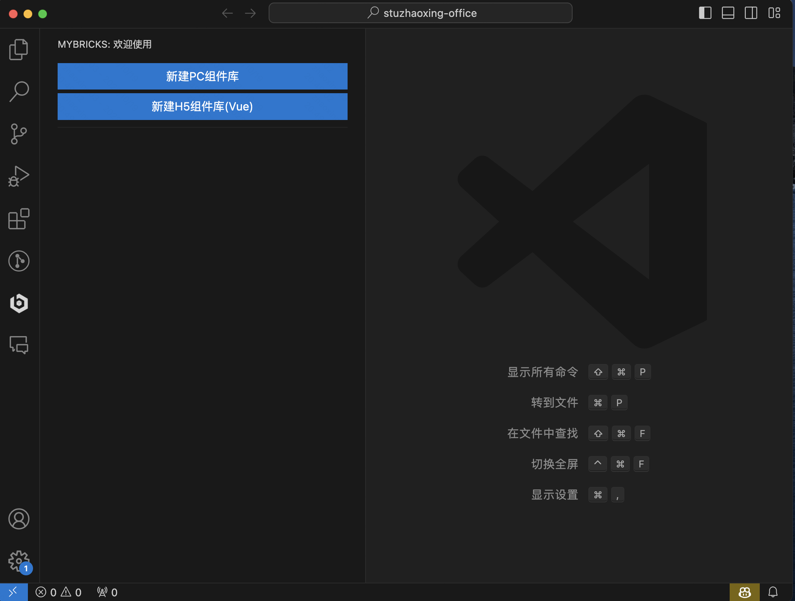

### 2.3 ⚙️ 组件库配置【重要勿忘】

配置根目录下的 mybricks.json 文件，主要修改以下几个部分

```JSON
{
  /* 组件发布相关信息 */
  "domain": "http://example.com",  // 此处修改为对应的 MyBricks 平台地址
  "userName": "xxx@gmail.com",  // 此处修改为开发者在平台注册的账号，可在平台左下角查看并复制

  /* 是否开启 px 到 vw 的转换，移动端H5使用，PC端勿开启 */
  "pxToVw": {}, // 添加该行内容，即可开启转换，默认基准值为 375px

  /* 组件库信息 */
  "componentType": "PC",      // 组件库类型，PC请填写PC、H5请填写H5
  "namespace": "test-normal-lib", // 组件库的唯一标识，必填！类比npm中package.json的name，修改了就是另一个组件库了
	"comAry": [                 // 组件库列表配置
    "./src/button/com.json",  // 组件入口文件相对路径
    "./src/comA/com.json",
    "./src/comB/com.json"
  ],
  "tags": "vue" // 如果使用vue组件开发，必须填写vue
}
```

> 如何获取 userName？

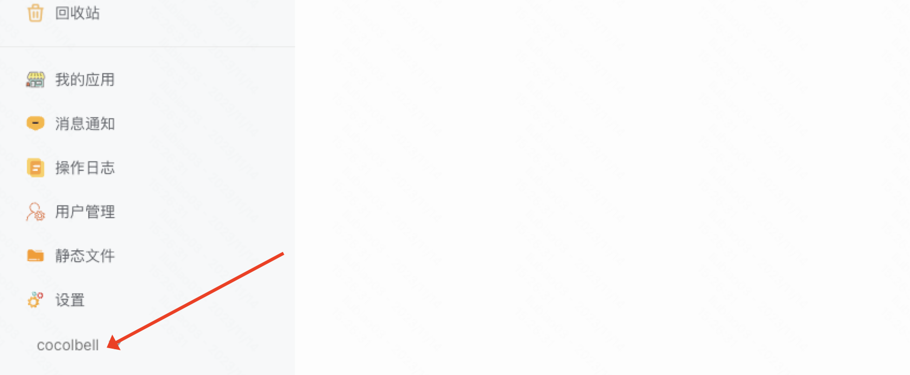

### 2.4 启动调试环境

当项目下有 \*.mybricks.json 配置文件时，就能够看到 **MYBRICKS DEVELOP** 面板，点击调试，选择需要调试的配置文件即可

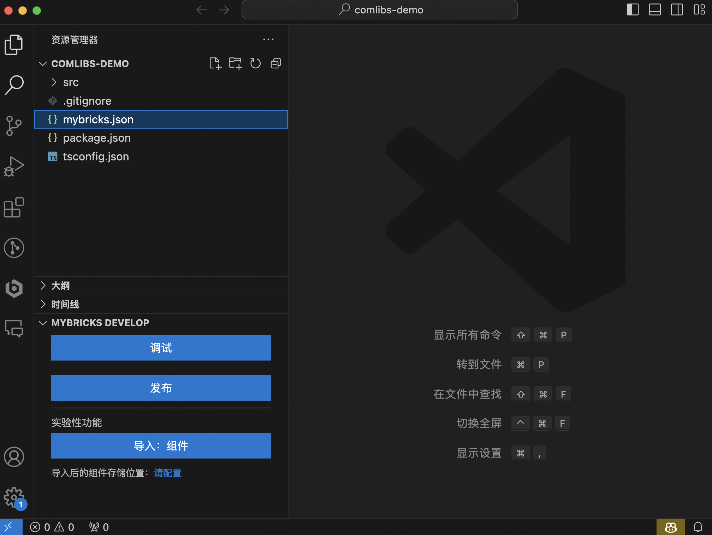

点击 **「调试」** 按钮，等待编译完成后会打开浏览器，接下来就可以开始开发组件了

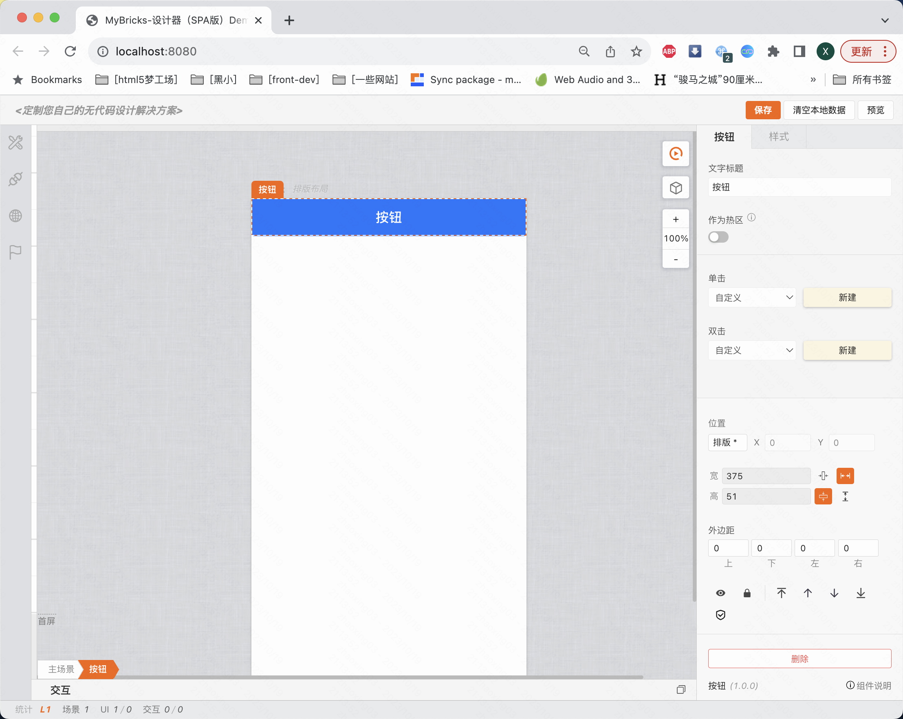

### 2.5 发布组件到物料中心

与 **调试** 同理，点击 **「发布」** 按钮，选择相应的配置文件， **请确保 2.3 的配置配置完成**

选择 **发布至物料中心选项** ，等待上传完成即可

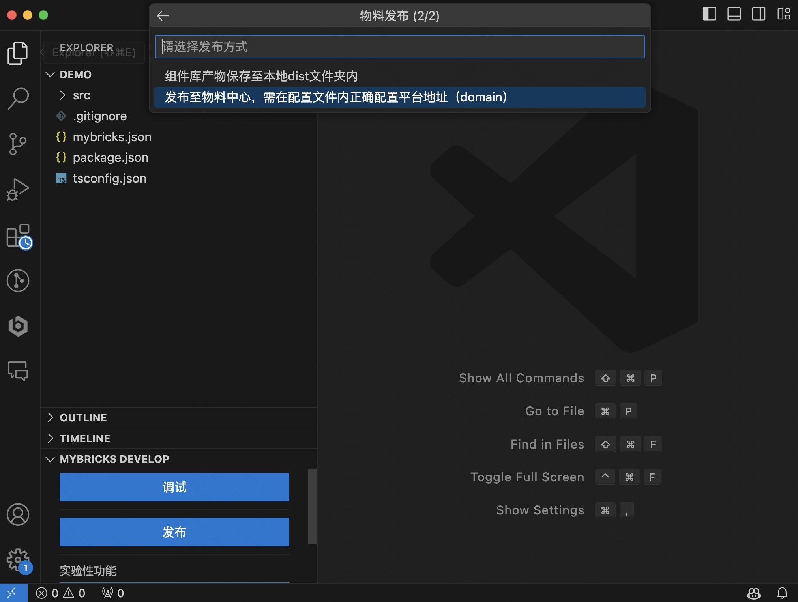

### 2.6 🎉 使用组件

打开应用，添加组件库


选中刚刚发布的组件库即可直接使用


## 3\. 如何为组件添加编辑器

打开前面初始化好的组件库代码，进入 src/button 目录

打开 editors.tsx 文件

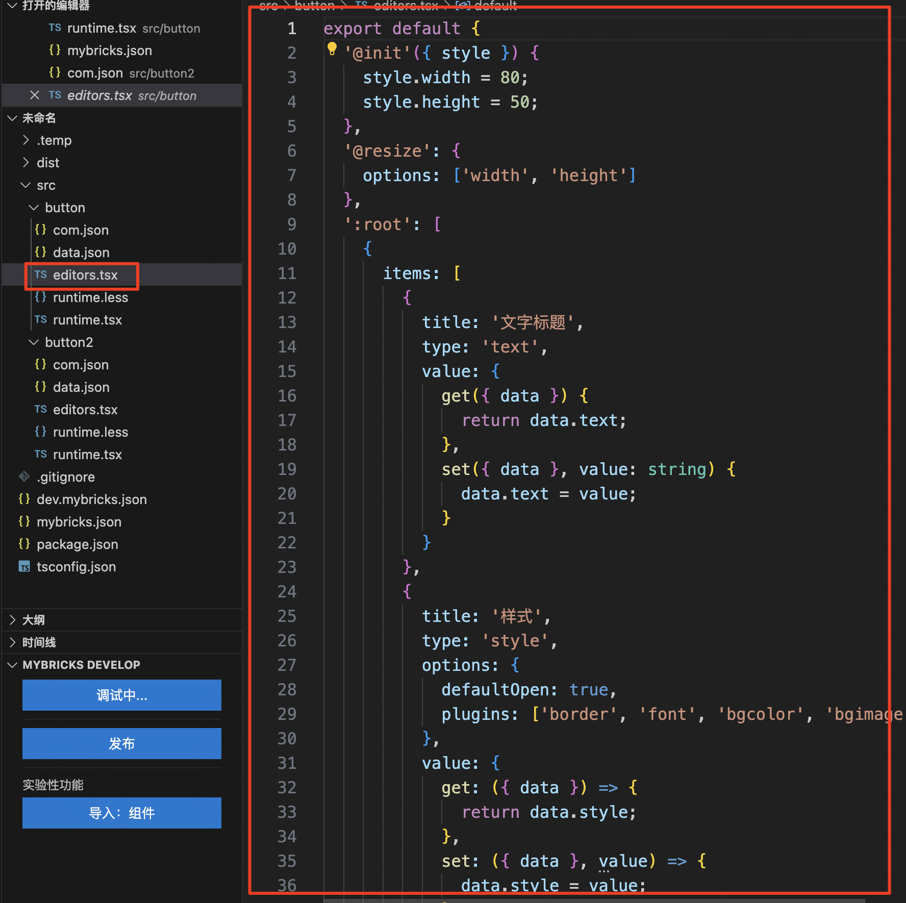

修改组件初始化的配置

```Typescript
  //修改组件初始化时候的宽高
  '@init'({ style }) {
    style.width = 80;
    style.height = 50;
  },
	//配置组件支持修改的属性（宽、高）
  '@resize': {
    options: ['width', 'height']
  },
```

将组件的一些数据写活，支持由 MyBricks 编辑器进行修改

```Typescript
  ':root': [
    {
       items: [
        {
          title: '文字标题',
          type: 'text',
          value: {
            get({ data }) {
              return data.text;
            },
            set({ data }, value: string) {
              data.text = value;
            }
          }
        },
        {
          title: '样式',
          type: 'style',
          options: {
            defaultOpen: true,
            plugins: ['border', 'font']
          },
          value: {
            get: ({ data }) => {
              return data.style;
            },
            set: ({ data }, value) => {
              data.style = value;
            }
          }
        }
      ]
    }
   ]
```

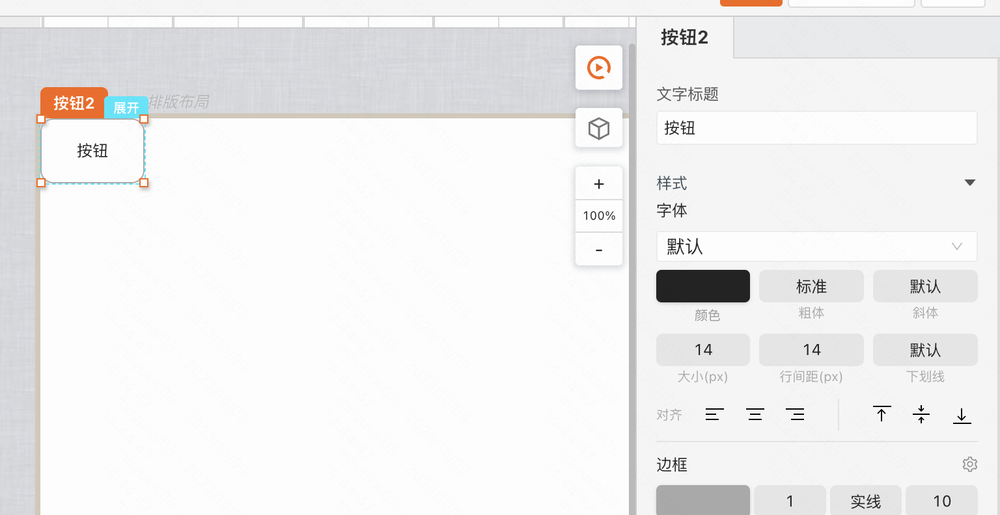

在 runtime.tsx 中使用 data.text,和编辑器修改的 data.text 进行关联

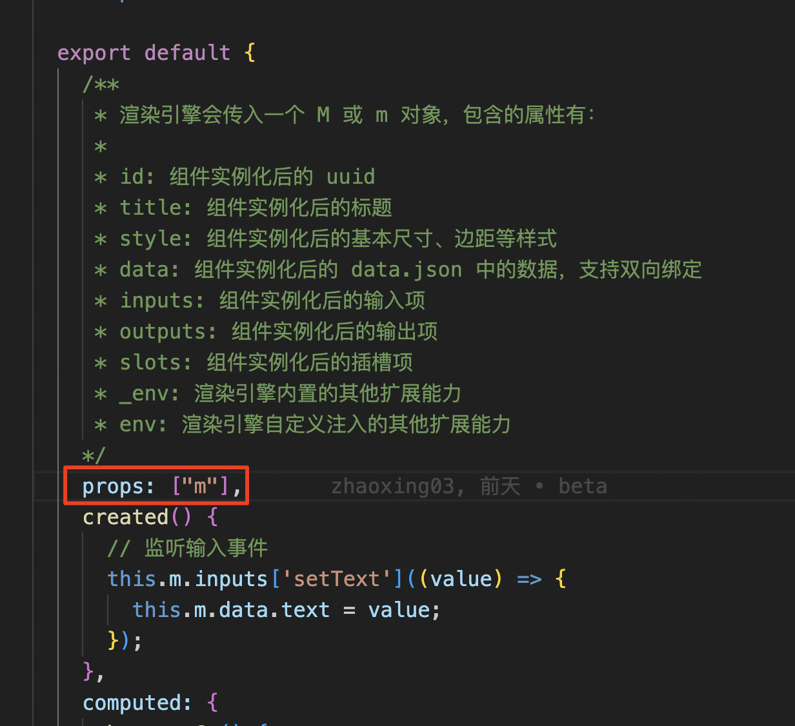


至此我们就完成了一个拥有配置能力的组件开发。

## 4\. 深入组件

组件分为 **UI 组件** 和 **逻辑组件** 两种类型，其中 UI 组件支持多种框架，比如 **Vue、React、Taro 或其他自定义版本** 等。

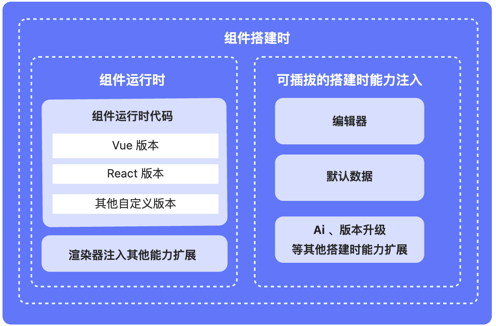

### 4.1 不同框架的组件运行时区别

渲染器会通过 props 为组件提供增强能力，包括但不限于 id, title, data, inputs, outputs, slots, env。我们看到 Vue 和 React 组件略有一个差别就是 Vue 组件中想要获取这些能力比 React 组件多了一层 m，这是因为我们为了避免 this.data 和 Vue 的 data 在书写的时候引起歧义。

Vue 组件、React 组件或其他技术栈组件唯一的不同点在于运行时文件的实现，例如 runtime.vue、runtime.tsx。

Vue

```Typescript
{
  ...,
  "runtime": "./runtime.vue", // 如果是 vue 组件，runtime 所引用的文件路径需要为 .vue 文件
  ...
}
```

```Typescript
<template>
  <div class="button">{{ m.data.text }}</div>
</template>

<script>
export default {
  props: ["m"],
}
</script>
```

React

```Typescript
{
  ...,
  "runtime": "./runtime.tsx", // 如果是 react 组件，runtime 所引用的文件路径需要为 .tsx 文件
  ...
}
```

```Typescript
import React from "react";

export default function ({id, title, data, inputs, outputs, slots, env}) {
  return (
    <div className="button">{data.text}</div>
  );
}
```

### 4.2 编辑器

编辑器可对组件进行编辑，包括但不限于配置组件的搭建时生命周期；修改组件 Prop 中的 data 属性值；注入组件样式等。

编辑器代码在组件运行时会被忽略，仅在搭建时会被引用。

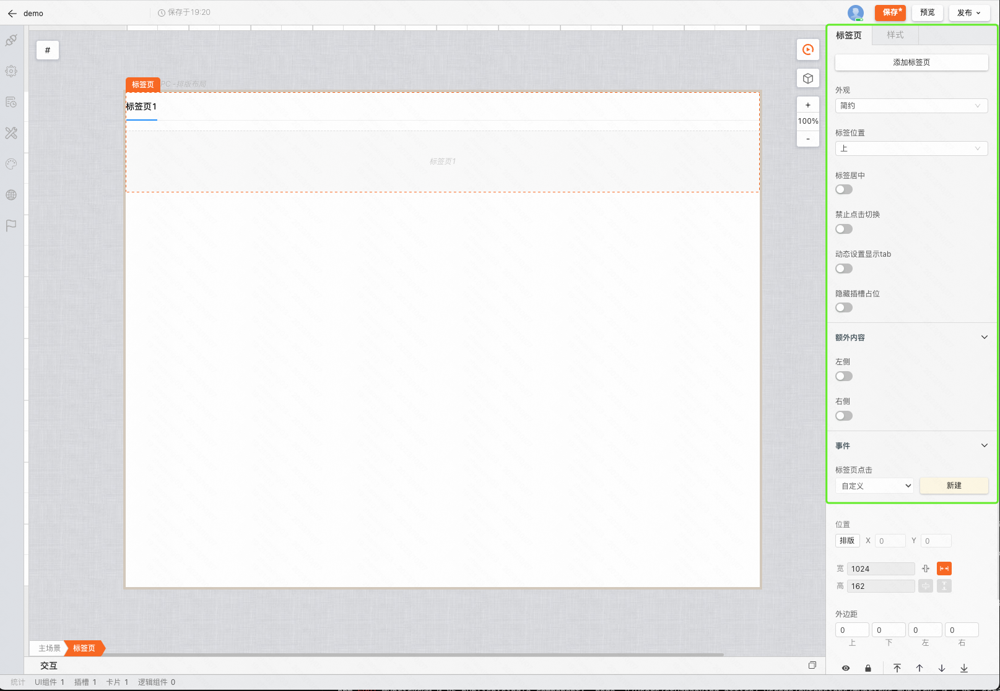

图例：编辑器为右侧绿框区域

编辑器的生效首先需要在 com.json 中声明。例：

```Typescript
{
  ...,
  "editros": "./myEditors.tsx",
  ...
}
```

#### 搭建时生命周期

| **功能描述** | **示例代码** |
| ---------------------------------- | ---------------------------------- |
| @init 组件在拖入画布的时候触发函数 | <pre><code>export default {<br>  '@init'({ data, style, input, output, slot }){<br>    style.width = "100%";<br>    style.height = 60;<br>  },<br>  ...<br>}</code></pre> |
| @resize 声明组件支持调整宽、高     | <pre><code>export default {<br>  '@resize': {<br>    options: ['width', 'height']<br>  },<br>  ...<br>}</code></pre> |

#### 区域选择能力

我们通过下方的动图可以看到一个组件在被拖入画布之后，在点击组件的不同区域时，编辑器区域所渲染的编辑项会有所变化，该特性有助于将组件复杂的编辑项进行拆分，在点击某区域时，才会渲染对应区域的编辑项。


代码示例：

```TypeScript
export default {
  ...,
  // 通过 css selecotr 来声明区域即可
  ":root": {
    items: [...全局相关编辑项声明]
  },
  ".demo-a": {
    title: "demo A",
    items: [...A相关编辑项声明]
  },
  ".demo-b": {
    title: "demo B",
    items: [...B相关编辑项声明]
  },
};
```

#### 编辑项联动

我们通过下方的动图可以看到编辑项的渲染可以存在联动。


代码示例：

```TypeScript
export default {
  ":root": {
    items: [
      {
        title: "使用自定义文本",
        type: "switch",
        value: {
          get({ data }) {
            return data.useCustomText;
          },
          set({ data }, value) {
            data.useCustomText = value;
          },
        },
      },
      {
        ifVisible({ data }) {
          return data.useCustomText;
        },
        title: "自定义文本",
        type: "textinput",
        value: {
          get({ data }) {
            return data.customText;
          },
          set({ data }, value) {
            data.customText = value;
          },
        },
      },
    ],
  },
};
```

#### 开发自定义编辑项

引擎内置了多种编辑器类型，详见附录**预置编辑器列表**，如果预置编辑器无法满足需求，可以通过扩展自定义编辑器来实现个性化需求。

```TypeScript
export default {
  ...
  {
    title: "自定义编辑项",
    type: "editorRender", //自定义编辑器
    options: {
      render: ({ editConfig }) => {
        return (<div onClick={() => {
					//设置数据
          editConfig.value.set("new value");
        }}>当前数据：{ editConfig.value.get() }</div>);
      }
    },
    value: {
      get({data}){
        return data.text;
      },
      set({data}, value){
        data.text = value;
      }
    }
  }
  ...
}
```

#### 样式注入

有两种方式注入样式，第一种就是基于通用的 style 编辑器类型来配置组件 prop 中的 data 值，第二种可以更加便捷，只需要添加配置项，无需关注渲染逻辑。

```TypeScript
export default {
  ...
  ":root": {
    style: [
      title: "标题",
      options: ["border", "background"], //支持哪些 css 配置
      target: ".demo" //作用到哪个 css selector
    ]
  }
  ...
}
```

options 支持的值有：font、padding、margin、size、border、background、shadow 等。

### 4.3 插槽

#### 基础插槽

最常见的插槽，可以理解为具名插槽，它允许您在组件的 **任意位置预留坑位** ，在搭建时可以拖入任意组件

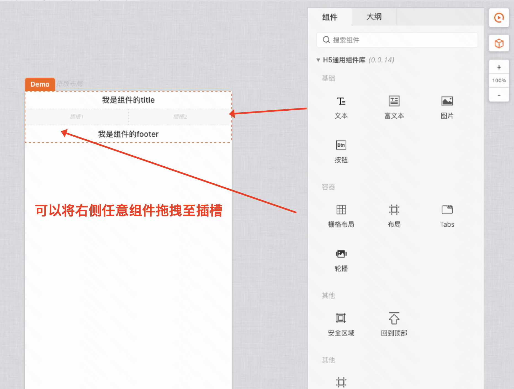

**Step1:** 在 com.json 文件声明插槽的信息

```Typescript
{
  "title": "demo",
  "namespace": "xxx",
  ...
  "slots": [
    {
      "id": "content1", // 声明插槽的ID，待会runtime会用到
      "title": "插槽1" // 声明插槽的名称，搭建时会展示出来
    },
    {
      "id": "content2",
      "title": "插槽2"
    }
  ]
}
```

**Step2:** 在 runtime 中使用 slot

```Typescript
<template>
  <div class="layout">
    <div class="text">我是组件的title</div>
    <div class="body">
      <div>
        <slot name="content1" />
      </div>
      <div>
        <slot name="content2" />
      </div>
    </div>
    <div class="text">我是组件的footer</div>
  </div>
</template>
```

### 4.4 组件间通信

施工中...

## 5\. Github 组件/编辑库 资源

[PC 基础组件库](https://github.com/mybricks/comlib-basic)

[PC 通用组件库](https://github.com/mybricks/comlib-pc-normal)

[H5 通用组件库（Vue 版）](https://github.com/mybricks/comlib-h5-normal-vue/tree/main)

[通用编辑库](https://github.com/mybricks/editors-pc-common)

## 附录

### 目录结构

```JSON
my-comlibs/
├── package.json      //基础信息
├── mybricks.json
├── dev.mybricks.json //*.mybricks.json 文件，用于不同环境、不同阶段的发布
├── ...
└── src/
    ├── button/
    │   ├── com.json //组件声明文件
    │   └── runtime.tsx //react 组件运行时
    ├── text/
    │   ├── com.json //组件声明文件
    │   └── runtime.vue //vue 组件运行时
    ├── comB/
    ├── comC/
    └── ...
```

### 组件库配置文件 mybricks.json

```JSON
{
  /* 组件发布相关信息 */
  "domain": "http://example.com",  // 此处修改为对应的 MyBricks apaas 平台地址
  "userName": "xxx@gmail.com",  // 此处修改为开发者在平台注册的账号，可在平台左下角查看并复制

  /* 是否开启 px 到 vw 的转换，移动端H5使用，PC端勿开启 */
  "pxToVw": {}, // 添加该行内容，即可开启转换，默认基准值为 375px

  /* 组件库信息 */
  "componentType": "PC",      // 组件库类型，PC请填写PC、H5请填写H5
  "namespace": "test-normal-lib", // 组件库的唯一标识，必填！类比npm中package.json的name，修改了就是另一个组件库了
	"comAry": [                 // 组件库列表配置
    "./src/button/com.json",  // 组件入口文件相对路径
    "./src/comA/com.json",
    "./src/comB/com.json"
  ],
  "tags": "vue" // 如果使用vue组件开发，必须填写vue
}
```

### 组件声明文件说明

| 属性        | 说明                                         | 类型                                                              | 必须 | 默认值      |
| ----------- | -------------------------------------------- | ----------------------------------------------------------------- | ---- | ----------- |
| title       | 标题                                         | string                                                            | Y    | \-          |
| namespace   | 全局命名空间，组件的唯一标识                 | string（可用 - \_ . 作为分隔，如 mycompany.bu.name）              | Y    | \-          |
| author      | 作者 ID                                      | string                                                            | Y    | 'anonymous' |
| author_name | 作者                                         | string                                                            | N    | '匿名作者'  |
| version     | 版本号（ MyBricks 对于组件有严格的版本控制） | VersionType(例:1.0.0)                                             | Y    | \-          |
| icon        | 图标路径或地址                               | path(例:./icon.svg) 或 URL                                        | Y    | 默认图标    |
| runtime     | 运行时                                       | path(例:./NormalButton.tsx)                                       | Y    | \-          |
| editors     | 编辑项                                       | path(例:./editors.tsx)                                            | N    | \-          |
| data        | model 数据描述（用于组件作为预览及其他用途） | path(例:./data.json)                                              | N    | \-          |
| inputs      | 输入项数组                                   | {id:string（当前组件唯一）, title:string, schema?:JSONSchema}\[\] | N    | \-          |
| outputs     | 输出项数组                                   | {id:string（当前组件唯一）, title:string, schema?:JSONSchema}\[\] | N    | \-          |
| slots       | 插槽数组                                     | {id:string（当前组件唯一）, title:string, scoped?:boolean}\[\]    | N    | \-          |
| description | 组件描述信息                                 | string                                                            | N    | \-          |

### 预置（随引擎搭载）编辑器列表

| **标题** | **代码示例** | **图例** |
| ---- | ---- | ---- |
| 按钮（button）            | <pre><code>{<br>  title: "demo",<br>  type: "button",<br>  value: {<br>    set({ data }) {<br>      // 无需返回值<br>    },<br>  },<br>};</code></pre> |  |
| 文本（textinput）         | <pre><code>{<br>  title: "demo",<br>  type: "textinput",<br>  value: {<br>    get({ data }) {<br>      return data.mysetting;<br>    },<br>    set({ data }, value) {<br>      data.mysetting = value;<br>    },<br>  }<br>};</code></pre> |  |
| 文本域（textarea）        | <pre><code>{<br>  title: "demo",<br>  type: "TEXTAREA",<br>  value: {<br>    get({ data }) {<br>      return data.mysetting;<br>    },<br>    set({ data }, value) {<br>      data.mysetting = value;<br>    },<br>  },<br>};</code></pre> | 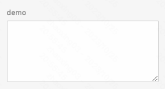  |
| 数字框（inputnumber）     | <pre><code>{<br>  title: "demo",<br>  type: "inputnumber",<br>  options: [<br>    { title: "宽", width: 100 },<br>    { title: "高", width: 100 },<br>  ],<br>  value: {<br>    get({ data }) {<br>      return [data.mysetting1, <br>              data.mysetting2];<br>    },<br>    set({ data }, value) {<br>      [data.mysetting1, <br>       data.mysetting2] = value;<br>    },<br>  },<br>};</code></pre> |   |
| 富文本（richtext）        | <pre><code>{<br>  title: "demo",<br>  type: "richtext",<br>  options: {<br>    type: "h5",<br>  },<br>  value: {<br>    get({ data }) {<br>      return decodeURIComponent(<br>        data.mysetting);<br>    },<br>    set({ data }, value) {<br>      data.mysetting = <br>        encodeURIComponent(value);<br>    },<br>  },<br>};</code></pre> | 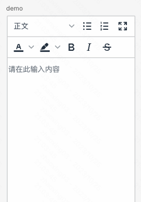  |
| 图片选择（imageselector） | <pre><code>{<br>  title: "demo",<br>  type: "IMAGESELECTOR",<br>  value: {<br>    get({ data }) {<br>      return data.mysetting;<br>    },<br>    set({ data }, value) {<br>      data.mysetting = value;<br>    },<br>  },<br>};</code></pre> |   |
| 单选（radio）             | <pre><code>{<br>  title: "demo",<br>  type: "radio",<br>  options: [<br>    { label: "选项1", value: "1" },<br>    { label: "选项2", value: "2" },<br>    { label: "选项3", value: "3" },<br>  ],<br>  value: {<br>    get({ data }) {<br>      return data.mysetting;<br>    },<br>    set({ data }, value) {<br>      data.mysetting = value;<br>    },<br>  },<br>};</code></pre> |   |
| 下拉框（select）          | <pre><code>{<br>  title: "demo",<br>  type: "SELECT",<br>  options: [<br>    { label: "选项一", value: "1" },<br>    { label: "选项二", value: "2" },<br>    { label: "选项三", value: "3" },<br>  ],<br>  value: {<br>    get({ data }) {<br>      return data.mysetting;<br>    },<br>    set({ data }, value) {<br>      data.mysetting = value;<br>    },<br>  },<br>};</code></pre> | 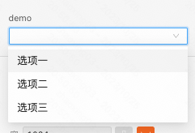  |
| 开关（switch）            | <pre><code>{<br>  title: "demo",<br>  type: "switch",<br>  value: {<br>    get({ data }) {<br>      return data.mysetting;<br>    },<br>    set({ data }, value) {<br>      data.mysetting = value;<br>    },<br>  },<br>};</code></pre> |   |
| 滑块（slider）            | <pre><code>{<br>  title: "demo",<br>  type: "slider",<br>  options: {<br>    max: 24,<br>    min: 1,<br>    steps: 1,<br>  },<br>  value: {<br>    get({ data }) {<br>      return data.mysetting;<br>    },<br>    set({ data }, value) {<br>      data.mysetting1 = value;<br>    },<br>  },<br>};</code></pre> |     |
| 对象编辑器（map）         | <pre><code>{<br>  title: "demo",<br>  type: "MAP",<br>  value: {<br>    get({ data }) {<br>      return data.mysetting;<br>    },<br>    set({ data }, value) {<br>      data.mysetting = value;<br>    },<br>  },<br>}</code></pre> | 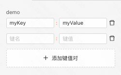  |
| 数组编辑器（array）       | <pre><code>{<br>  title: "demo",<br>  type: "ARRAY",<br>  options: {<br>    // 自定义标题渲染<br>    getTitle(item, index) {<br>      return (<br>        <div style={{color: "red"}}><br>        标题：{index}<br>        </div><br>      );<br>    },<br>    // 添加一项时的默认值<br>    onAdd() {<br>      return {<br>        key1: "key1默认值",<br>        key2: "key2默认值",<br>      };<br>    },<br>    // 数组项<br>    items: [<br>      {<br>        title: "标题1",<br>        type: "text", // 编辑器类型<br>        value: "key1",// 对象的 key<br>      },<br>      {<br>        title: "标题2",<br>        type: "textarea",<br>        value: "key2",<br>      },<br>    ],<br>  },<br>  value: {<br>    get({ data }) {<br>      return data.mysetting;<br>    },<br>    set({ data }, value) {<br>      data.mysetting = value;<br>    },<br>  },<br>}</code></pre> | 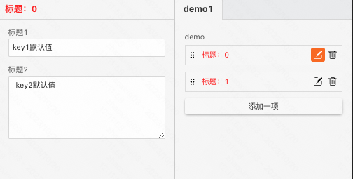  |
| 代码编辑器（code）        | <pre><code>{<br>  title: "demo",<br>  type: "CODE",<br>  value: {<br>    get({ data }) {<br>      return data.mysetting;<br>    },<br>    set({ data }, value) {<br>      data.mysetting = value;<br>    },<br>  },<br>};</code></pre> | 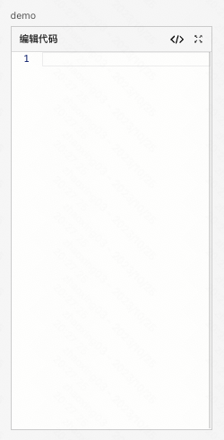  |
| 颜色选择器（colorpicker） | <pre><code>{<br>  title: "demo",<br>  type: "colorpicker",<br>  value: {<br>    get({ data }) {<br>      return data.mysetting;<br>    },<br>    set({ data }, value) {<br>      data.mysetting = value;<br>    },<br>  },<br>};</code></pre> | 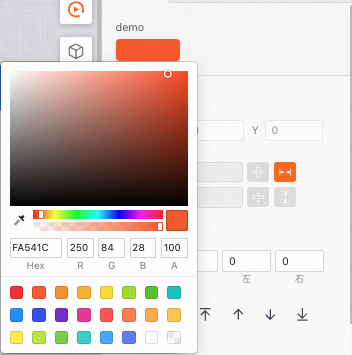 |
| 事件（\_event）           | <pre><code>{<br>  title: "demo",<br>  type: "_event",<br>  options: {<br>    outputId: "myOutputId",<br>  },<br>};</code></pre> |  |


### 多端渲染

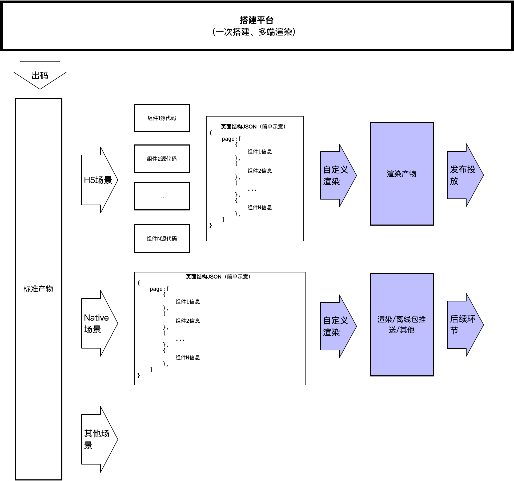