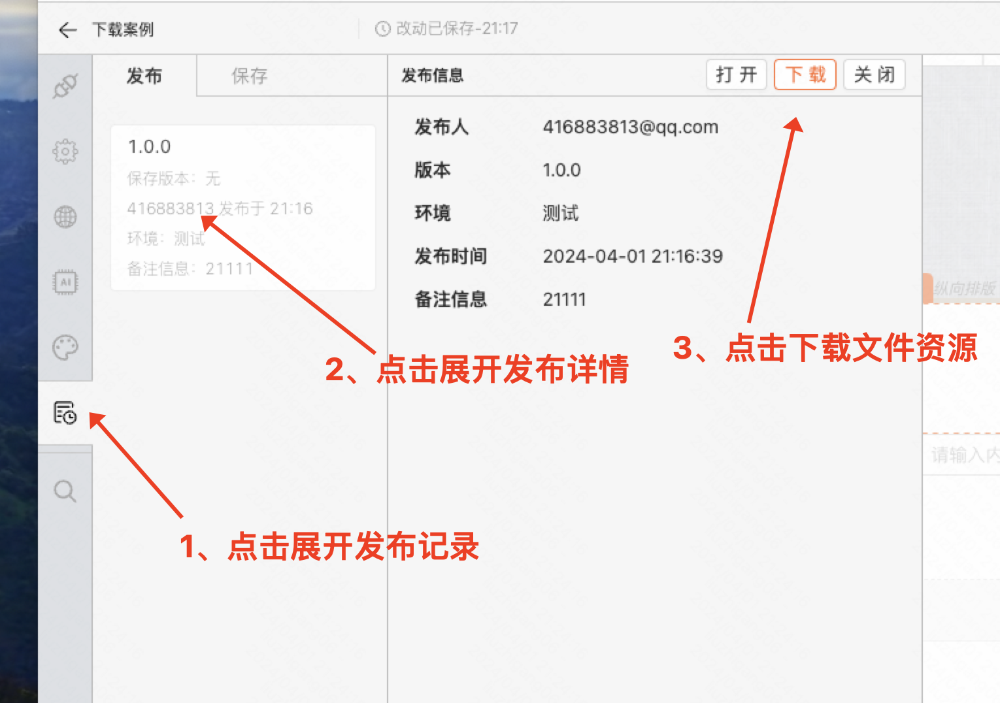

# 如何下载
- 页面发布之后，可以在左侧发布记录中找到下载按钮



# 下载后的页面如何在项目中使用

- 将zip包解压，内包含3个文件，各文件使用方法如下
- [点击下载文档中的zip包资源](https://mybricks-material.oss-cn-hangzhou.aliyuncs.com/%E4%B8%8B%E8%BD%BD%E6%96%87%E4%BB%B6%E5%AE%9E%E4%BE%8B.zip)


## 方式一：静态HTML页面
- 1.部署成静态页面直接访问
- 2.如果需要在项目中引入，可通过qiankun等微前端框架引用页面URL地址即可

## 方式二: 作为React组件在项目中引入

``` ts
import React from 'react'
import Page from './549439123873861-app'
import { createRoot } from 'react-dom/client';
const domNode = document.getElementById('app');
const root = createRoot(domNode);
root.render(<Page />)
```

## 方式三：作为Vue组件在项目中引入

``` ts
import { createApp } from 'vue';
import Page from './549439123873861-app-vue3.vue'
const app = createApp(Page)
app.mount('#app');
```

