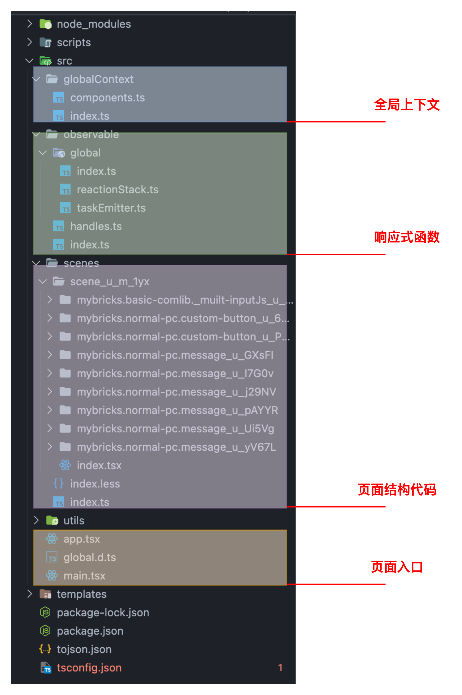
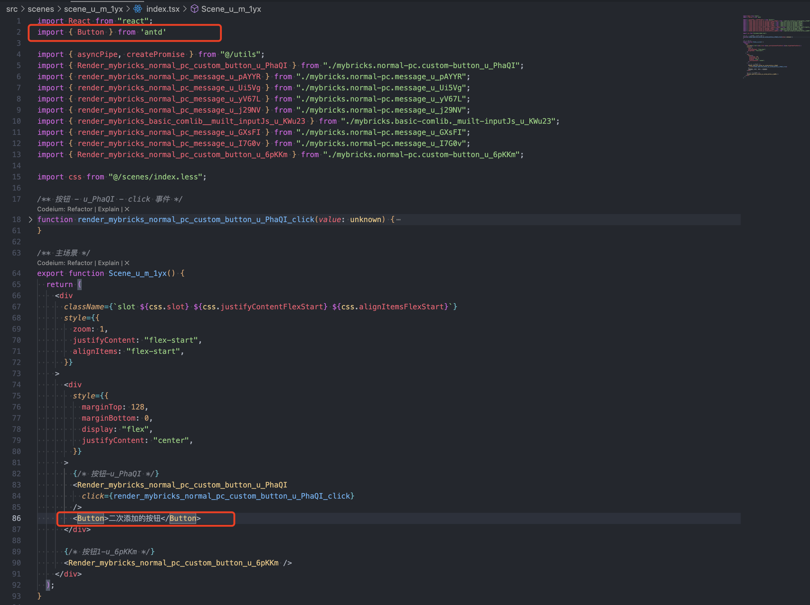

**搭建出码** 

# 一、基本原理

根据搭建的页面协议进行解析，其中代码生成器部分可以跟需要来完成所需要的技术栈代码生成


# 二、目标码解析

搭建产物目前是一份JSON 作为页面标准协议，所需要做的就是基于这份协议进行解析生成所需要的源代码

```JSON
{
  "themes": { "comThemes": {} }, // 主题相关信息
  "global": { // 全局相关信息
    "comsReg": {},
    "consReg": {},
    "pinRels": {},
    "pinProxies": {},
    "fxFrames": []
  },
  "scenes": [ // 场景信息
    {
      "-v": "1.0.19",
      "deps": [ // 当前场景所依赖的组件信息
        {
          "namespace": "mybricks.normal-pc.custom-button",
          "version": "1.0.23"
        },
        {
          "namespace": "mybricks.basic-comlib._muilt-inputJs",
          "version": "1.0.14",
          "rtType": "js-autorun"
        },
        {
          "namespace": "mybricks.normal-pc.message",
          "version": "1.0.4",
          "rtType": "js"
        }
      ],
      "coms": { // 当前场景所有组件信息
        ...
      },
      "id": "u_RLsZQ",
      "title": "主场景",
      "comsAutoRun": {},
      "_inputs": [],
      "_outputs": [],
      "inputs": [ // 主场景 inputs
        {
          "id": "open",
          "title": "打开",
          "type": "normal",
          "schema": { "type": "any" }
        }
      ],
      "outputs": [  // 主场景 outputs事件
        {
          "id": "click",
          "title": "点击",
          "type": "event",
          "schema": { "type": "any" }
        },
        ...
      ],
      "cons": { // 组件事件节点信息
        "u_QBnga-click": [
          {
            "id": "u_NHpzy",
            "type": "com",
            "frameKey": "_rootFrame_",
            "targetFrameKey": "_rootFrame_",
            "startPinParentKey": "u_IQ6pQ",
            "comId": "u_O0wpy",
            "def": {
              "namespace": "mybricks.basic-comlib._muilt-inputJs",
              "version": "1.0.14",
              "rtType": "js-autorun"
            },
            "pinId": "input.inputValue0",
            "pinType": "param",
            "direction": "input"
          }
        ],
  			...
      },
      "pinRels": { // 节点关系
        "u_QBnga-dynamicTitle": ["setDynamicTitleDone"],
        "u_QBnga-dynamicDisabled": ["setDynamicDisabledDone"],
        "u_f7ywb-showMsg": ["showMsgDone"]
      },
      "pinProxies": {},
      "pinValueProxies": {},
      "slot": { // 插槽信息
        "id": "u_RLsZQ",
        "title": "主场景",
        "layoutTemplate": [
          {
            "id": "u_QBnga",
            "name": "u_i3I8J",
            "def": {
              "namespace": "mybricks.normal-pc.custom-button",
              "version": "1.0.23"
            }
          }
        ],
        "comAry": [
          {
            "id": "u_QBnga",
            "name": "u_i3I8J",
            "def": {
              "namespace": "mybricks.normal-pc.custom-button",
              "version": "1.0.23"
            }
          }
        ],
        "style": {
          "zoom": 1,
          "layout": "smart",
          "justifyContent": "flex-start",
          "alignItems": "flex-start",
          "height": 800,
          "width": 1024
        }
      }
    }
  ],
  "plugins": { // 插件信息
    "@mybricks/plugins/service": [],
    "@mybricks/plugins/locale": {
      "langPackLink": "",
      "formatFn": "export%20default%20function%20(packContentLoaded)%20%7B%0A%2F**%20%E8%BF%94%E5%9B%9E%E6%A0%BC%E5%BC%8F%EF%BC%9A%0A%20*%20Array%3C%7B%0A%20%20%20%20id%3A%20stirng%2C%20%2F%2F%20%E5%8D%95%E4%B8%AA%E8%AF%AD%E6%96%99%E7%9A%84%E5%94%AF%E4%B8%80%E8%AF%86%E5%88%ABid%0A%20%20%20%20content%3A%20%7B%0A%20%20%20%20%20%20%5Blang%3A%20string%5D%3A%20string%2C%20%2F%2F%20lang%E4%B8%BA%E8%AF%AD%E7%A7%8D%EF%BC%8C%20%E5%80%BC%E4%B8%BA%E8%AF%A5%E8%AF%AD%E7%A7%8D%E4%B8%8B%E7%9A%84%E6%96%87%E6%9C%AC%0A%20%20%20%20%7D%0A%20%20%7D%3E%0A**%2F%0A%20%20return%20packContentLoaded%3B%0A%20%7D%0A",
      "usedIds": []
    },
    "@mybricks/plugins/theme/use": {}
  }
}
```

# 三、源代码示例

 **React 源代码：** 



# 四、如何扩展

1.  源代码二次开发：以React源代码为例，生成后产物为一份普通的React代码工程，可以基于此工程之上再进行业务开发

例1：图中额外引入了 antd 按钮组件 与搭建出的源代码进行混合开发



2.  代码生成器：理论上可以由页面协议解析生成任意技术栈源代码