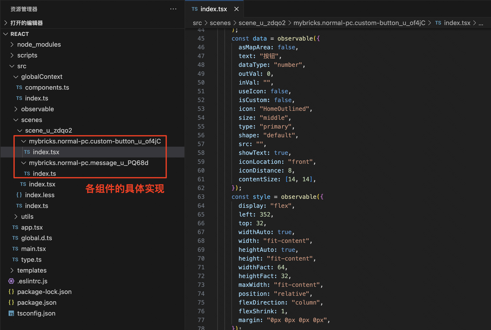

**搭建出码** 

# 一、基本原理

根据搭建的页面协议进行解析，其中代码生成器部分可以跟需要来完成所需要的技术栈代码生成


# 二、目标码解析

## 页面搭建

按钮点击触发消息提示


## 产物解析
搭建产物目前是一份JSON 作为页面标准协议，所需要做的就是基于这份协议进行解析生成所需要的源代码

```JSON
{
  "themes": { // 主题信息
    "comThemes": {}
  },
  "global": { // 全局变量、FX等
    "comsReg": {},
    "consReg": {},
    "pinRels": {},
    "pinProxies": {},
    "fxFrames": []
  },
  "scenes": [ // 场景信息，对应每一个画布
    {
      "-v": "1.0.19",
      "deps": [ // 当前场景依赖的组件基础信息
        {
          "namespace": "mybricks.normal-pc.custom-button",
          "version": "1.0.23"
        },
        {
          "namespace": "mybricks.normal-pc.message",
          "version": "1.0.4",
          "rtType": "js"
        }
      ],
      "coms": { // 当前场景所有组件详细信息
        ...
      },
      "id": "u_zdqo2",
      "title": "主场景",
      "comsAutoRun": {},
      "_inputs": [],
      "_outputs": [],
      "inputs": [ // 主场景 输入 事件
        ...
      ],
      "outputs": [ // 主场景 输出 事件
        ...
      ],
      "cons": { // 各逻辑面板节点连接信息
        "u_of4jC-click": [
          {
            "id": "u_w4lhF",
            "type": "com",
            "frameKey": "_rootFrame_",
            "targetFrameKey": "_rootFrame_",
            "startPinParentKey": "u_okv4t",
            "comId": "u_PQ68d",
            "def": {
              "namespace": "mybricks.normal-pc.message",
              "version": "1.0.4",
              "rtType": "js"
            },
            "pinId": "showMsg",
            "pinType": "normal",
            "direction": "input"
          }
        ]
      },
      "pinRels": { // 节点关系（输入后是否有输出）
        "u_of4jC-dynamicTitle": [
          "setDynamicTitleDone"
        ],
        "u_of4jC-dynamicDisabled": [
          "setDynamicDisabledDone"
        ],
        "u_PQ68d-showMsg": [
          "showMsgDone"
        ]
      },
      "pinProxies": {},
      "pinValueProxies": {},
      "slot": { // 插槽信息
        "id": "u_zdqo2",
        "title": "主场景",
        "layoutTemplate": [ // 插槽内组件排版
          {
            "id": "u_of4jC",
            "elements": [
              {
                "id": "u_of4jC",
                "name": "u_AxVrM",
                "def": {
                  "namespace": "mybricks.normal-pc.custom-button",
                  "version": "1.0.23"
                }
              }
            ],
            "style": {
              "marginTop": 32,
              "marginBottom": 0,
              "display": "flex",
              "justifyContent": "center"
            }
          }
        ],
        "comAry": [ // 插槽内组件
          {
            "id": "u_of4jC",
            "name": "u_AxVrM",
            "def": {
              "namespace": "mybricks.normal-pc.custom-button",
              "version": "1.0.23"
            }
          }
        ],
        "style": { // 插槽样式
          "zoom": 1,
          "layout": "smart",
          "justifyContent": "flex-start",
          "alignItems": "flex-start",
          "widthFact": 768,
          "heightFact": 800
        }
      }
    }
  ],
  "plugins": { // 插件信息
    ...
  },
  "frames": [ // 各场景逻辑面板信息
    {
      "id": "u_zdqo2",
      "title": "主场景",
      "type": "root",
      "coms": {},
      "autoRunComs": {},
      "inputs": [],
      "outputs": [
        ...
      ],
      "diagrams": [ // 场景内各逻辑卡片信息
        {
          "id": "u_1FEb_",
          "title": "主场景",
          "createTime": 1710918742909,
          "starter": {
            "type": "frame",
            "frameId": "u_zdqo2",
            "pinAry": []
          },
          "conAry": [],
          "runtimeBefore": [],
          "runtimeAfter": []
        },
        {
          "id": "u_P0RDA",
          "title": "按钮 > 单击",
          "createTime": 1710918802787,
          "updateTime": 1710918965250,
          "updated": true,
          "starter": {
            "type": "com",
            "comId": "u_of4jC",
            "pinId": "click"
          },
          "conAry": [
            {
              "id": "u_w4lhF",
              "title": "从 单击 到 弹出提示 的连接",
              "startPinParentKey": "u_okv4t",
              "from": {
                "id": "click",
                "title": "单击",
                "parent": {
                  "type": "com",
                  "id": "u_of4jC"
                }
              },
              "to": {
                "id": "showMsg",
                "title": "弹出提示",
                "parent": {
                  "type": "com",
                  "id": "u_PQ68d"
                }
              }
            }
          ],
          "runtimeBefore": [],
          "runtimeAfter": []
        }
      ]
    }
  ]
}
```

# 三、源代码示例

**React 源代码：** 

产出的是一个完整的React工程，只需在控制台执行
```bash
npm install
npm run dev
```
即可启动工程


工程目录结构总览


应用入口


对应搭建时的各个场景


场景入口


对应搭建时的组件和逻辑卡片


各组件的具体实现，内包含画布中各组件的数据源、样式等配置，当前均以组件namespace+组件ID命名




# 四、如何扩展

1.  源代码二次开发：以React源代码为例，生成后产物为一份普通的React代码工程，可以基于此工程之上再进行业务开发

例1：图中额外引入了 antd 按钮组件 与搭建出的源代码进行混合开发


2.  代码生成器：理论上可以由页面协议解析生成任意技术栈源代码