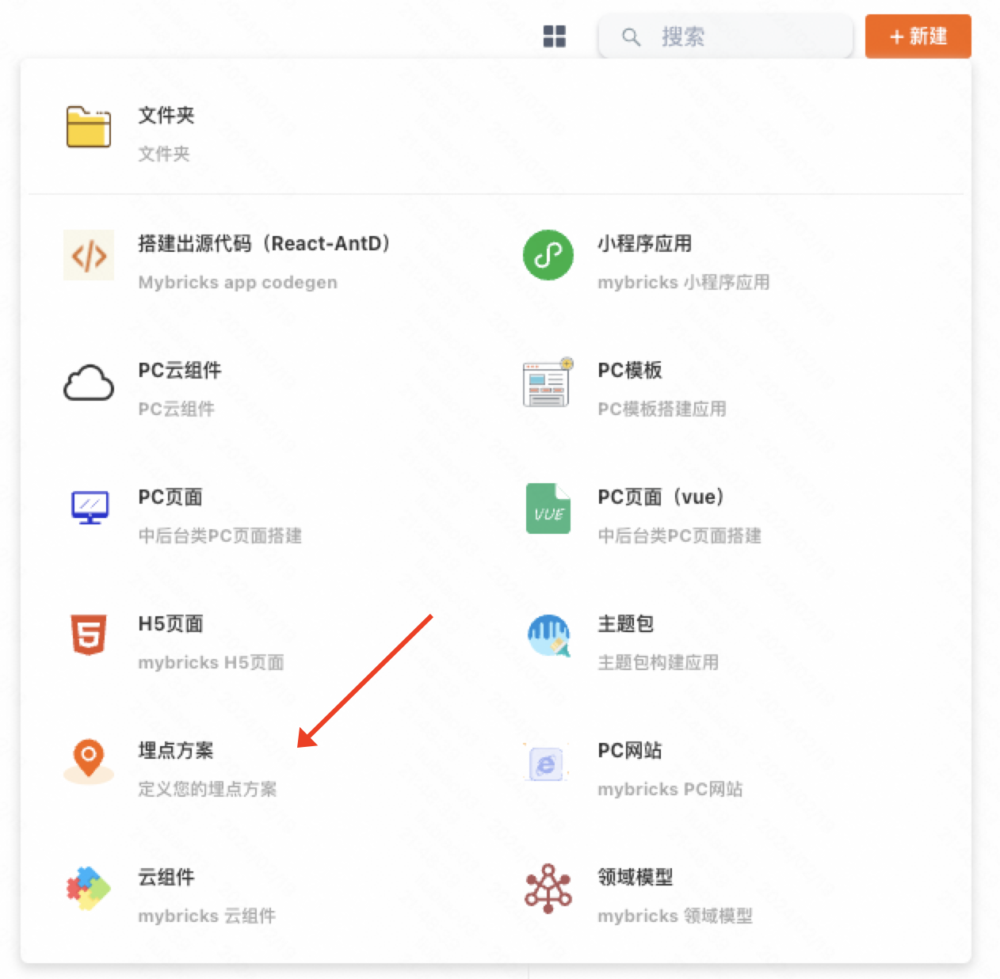
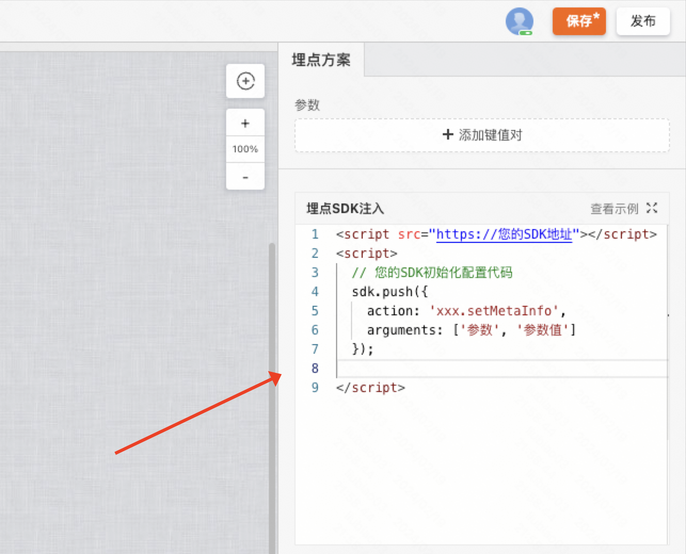
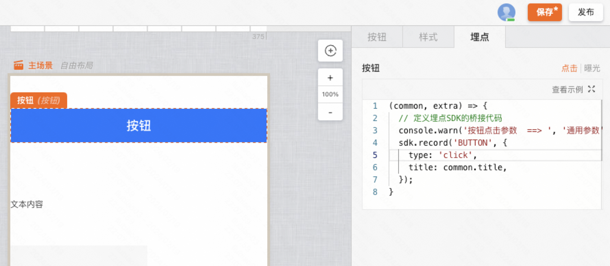

:::tip
本章节将会学习如何通过埋点方案来 **桥接** 不同的埋点SDK，方便使用我们通用组件库搭建出来的页面能够 **上报到各类埋点平台**。
:::

下面将会以阿里云的「[全域采集与增长分析](https://help.aliyun.com/document_detail/280490.html?spm=a2c4g.280490.0.0.b70b256fWO0VTZ)」平台来做示例教程

## 新建方案

常规埋点系统包含「**全局级别的埋点**」和「**事件级别的埋点**」

- 全局级别的埋点：往往SDK引入后会自动上报、比如 PV、UV、FMP 等页面级埋点
- 事件级别的埋点：元素的点击、曝光以及各类自定义事件等

在MyBricks中，一个埋点方案包含了上面的所有功能，我们可以通过新建来创建一个埋点方案

## 全局埋点配置
在搭建方案界面，我们可以完成全局埋点的配置，常见SDK都支持自动上报各类全局指标

### 引入并配置SDK
按照[官网文档](https://help.aliyun.com/document_detail/473456.html?spm=a2c4g.602417.0.0.c9ab256fzEEMWz)引入并初始化SDK，此处可直接编写Html代码

### 手动上报埋点（可选）
如果遇到部分不支持自动上报或者需要手动上报的指标，可以通过下面的方式来手动上报

TODO

## 事件埋点配置
在搭建系统中，事件级别的埋点往往需要依托于组件存在，我们可以通过定义每个组件的上报逻辑来完成埋点

### 定义组件的上报逻辑
聚焦到某一组件处，支持埋点的组件 **右侧编辑区** 会出现一个 **埋点页签**

比如下面的按钮组件，就支持「点击」和「曝光」事件的桥接，在此处可以直接调用刚刚 **全局引入的SDK方法** 进行上报

> 说明：当元素发生点击/曝光事件时会执行此处的 JavaScript 代码

## 发布方案
直接点击右上角发布即可～