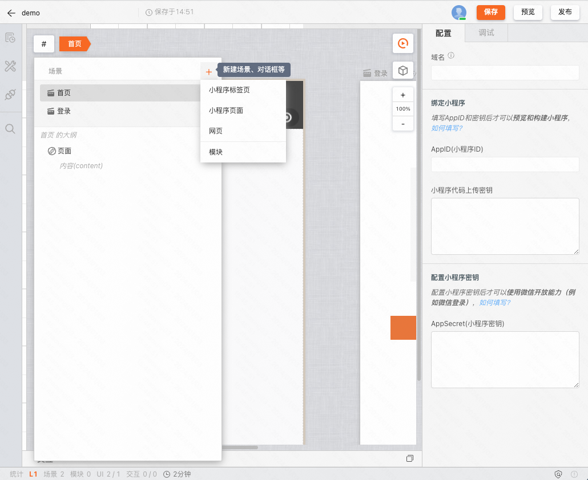
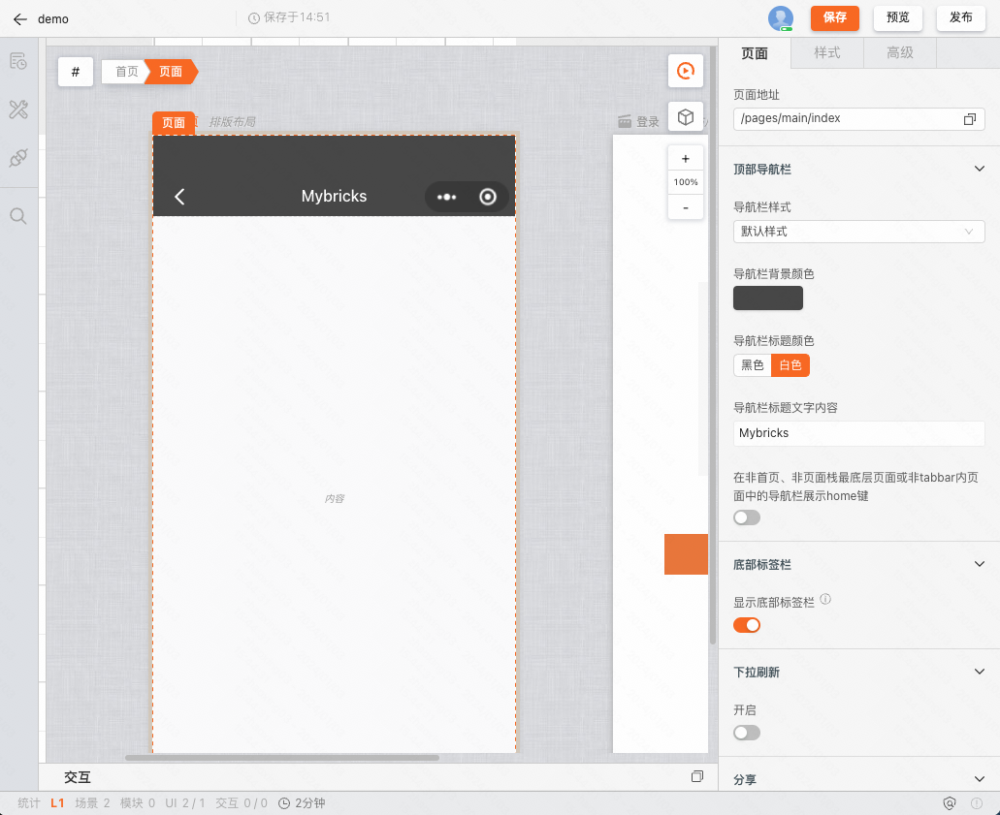
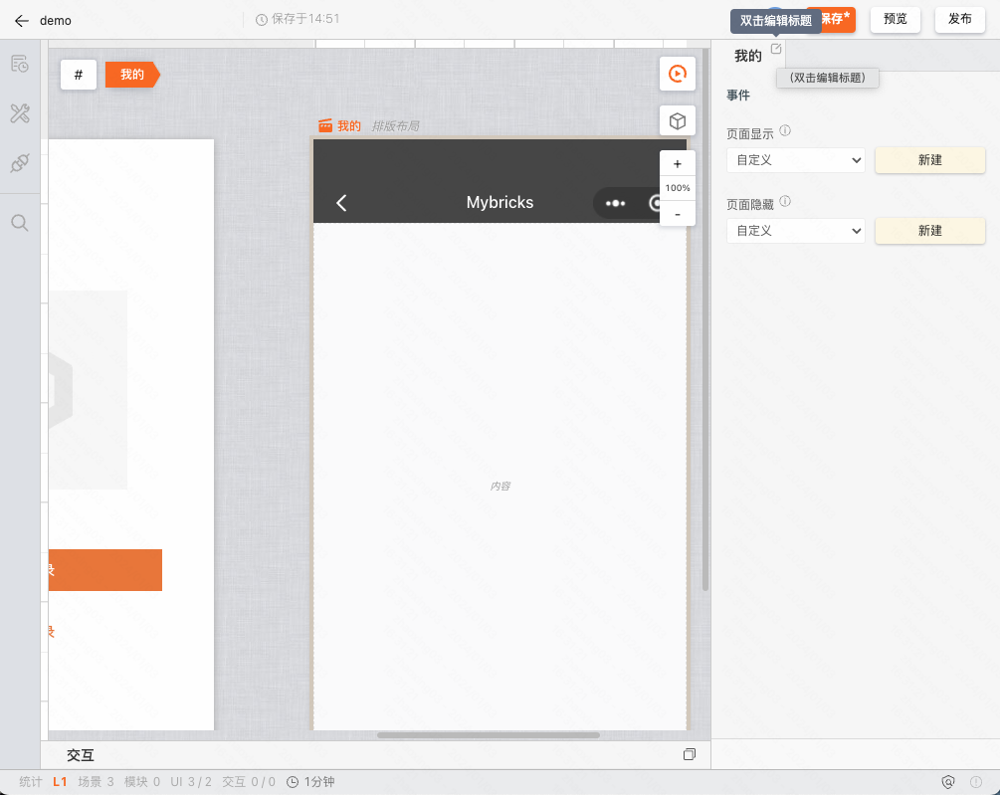
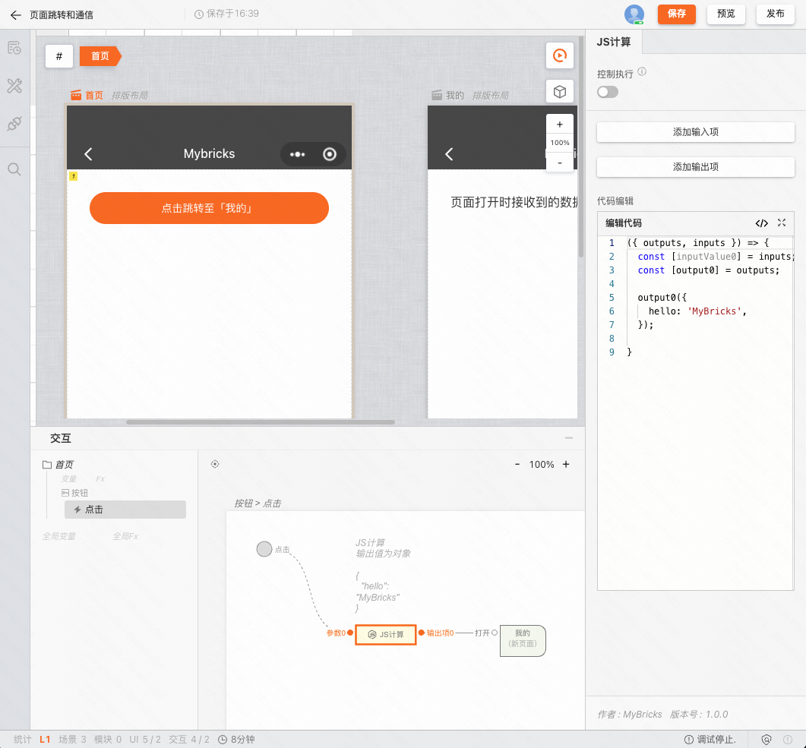
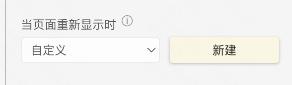
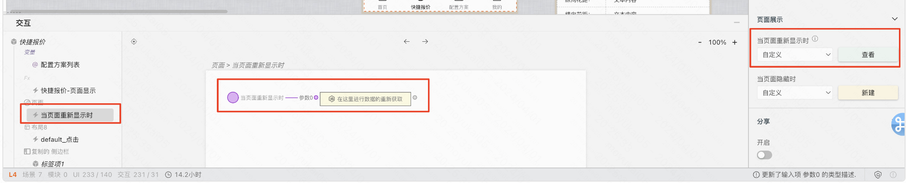
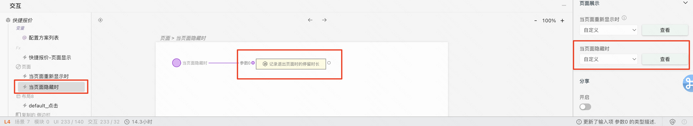

一个小程序应用由多张页面组成，这里我们利用了 MyBricks 引擎的[「多场景」](/docs/getstarted/user-interface/#%E5%A4%9A%E7%94%BB%E5%B8%83%E5%9C%BA%E6%99%AF)来实现。

## 添加页面

小程序的页面分为三类：

- Tabbar 页面
- 非 Tabbar 页面
- 网页

其中 Tabbar 和 非 Tabbar 页面可以在添加后通过「显示底部标签栏」编辑项进行相互转换。

需要注意的是根据 [微信小程序规范](https://developers.weixin.qq.com/miniprogram/dev/reference/configuration/app.html#tabBar) 如果需要启用 Tabbar，则必须满足最少 2 个、最多 5 个的设定，不在此范围内，我们会隐藏 Tabbar 的渲染。

在添加页面后，我们可以聚焦「页面」组件，在编辑器最上放可以看到页面 **分包前** 的路径，如 `/pages/main/index`

通过聚焦到场景的标题，双击编辑标题可以帮助我们更好的对页面进行定义

## 页面跳转

### 基本配置

我们可以在交互面板中搭建跳转逻辑，操作路径为「全局 > 其他场景 > 打开」。

:::tip
不用考虑分包时产生的路径变化，会自动处理分包路径的问题。
:::

### 跳转方式

点击跳转节点，在编辑器中可以选择打开方式，如新页面、重定向等。

:::tip
当页面被设置为 Tabbar 页面时，会自动强制切换为「跳转到 tabBar 页面」，无需手动配置
:::

### 页面传值

当传递给跳转节点的参数为对象时，将会把对象以 URL 参数的形式拼接到链接地址上，打开页面。

如动图中，「JS计算」输出对象 `{"hello": "MyBricks"}` 到跳转节点，则在小程序的运行时行为为打开了一张页面，URL 为 `/pages/u__8I6G/index?hello=MyBricks`

## 定义首页

在创建小程序应用时，我们默认初始化了两张页面，「首页」和「登录」，但是这并不是固定不变的。

### 当页面存在 Tabbar 时

Tabbar 左起第一项将默认成为首页。

可以通过聚焦某 Tab 项，通过前移，后移来进行排序。

### 当页面不存在 Tabbar 时

场景列表从上起第一项将默认成为首页。

可以通过聚焦场景标题，点击拖拽进行排序。

## 自动分包

在小程序构建时，将自动按照包大小的限制进行分包。这里我们自动做了路径的映射处理，用户可以完全不关心分包所带来的路径变化问题。

## 页面生命周期
:::tip
页面生命周期钩子，一般用来处理修改数据后，页面没有及时更新的问题
:::
### 当页面重新显示时

  

当通过页面跳转回到当前页面时，会触发当前事件。在一些业务场景中，例如：列表页和详情页之间的互相跳转，我们可能需要在页面重新显示时，重新请求数据，以保证数据的最新性。  

### 当页面隐藏时

当跳出当前页面时，会触发当前事件。在一些业务场景中，例如：页面浏览计时，我们可能需要在页面隐藏时，记录当前页面的停留时长，以便进行数据统计。

