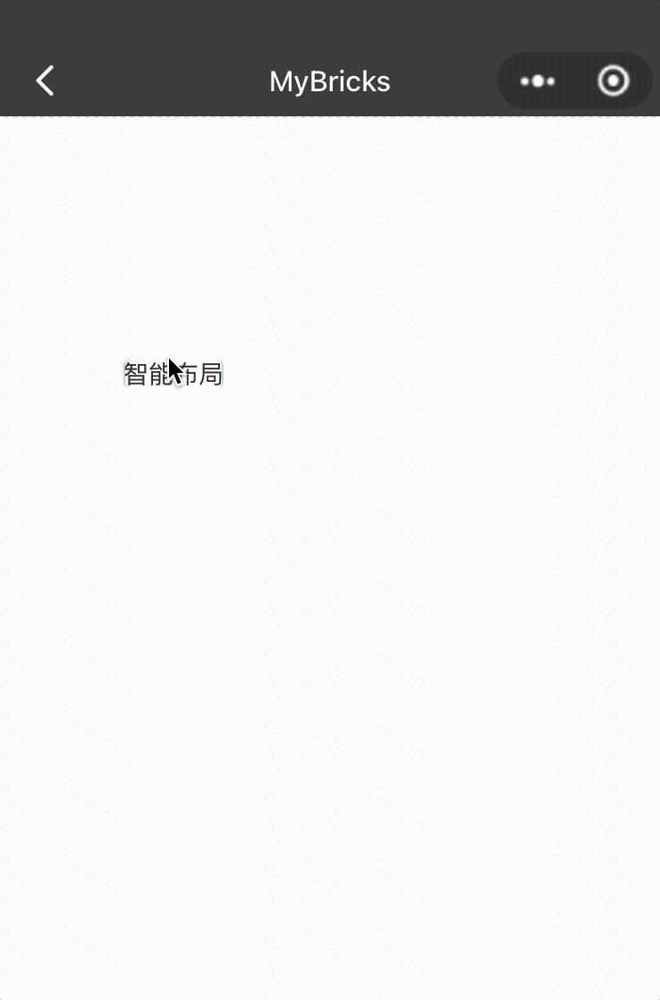
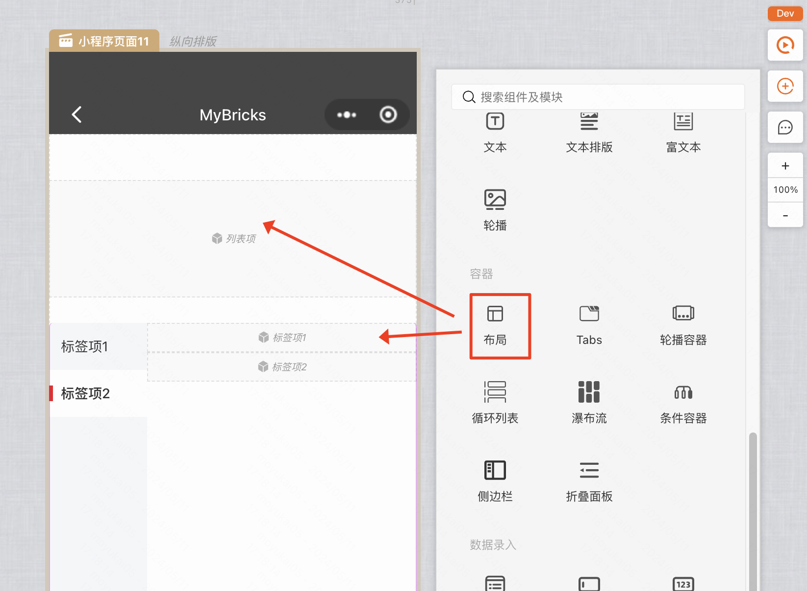
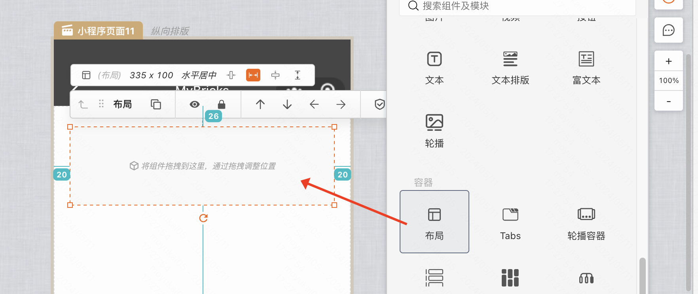

:::tip
本章将学习如何使用Mybricks的布局来搭建小程序的UI界面
:::

## 基本概念
在Mybricks搭建中，我们主要用到了智能布局来搭建小程序

### 智能布局
页面和布局组件的默认布局方式为智能布局，类似PPT等软件，内部的组件可以自由拖动位置

### 注意！！！
:::info
一部分组件内的插槽可能不是智能布局，不能自由拖动里面的组件，此时就需要往组件插槽内部拖入一个布局组件
:::

比如下图箭头所指区域，**列表和侧边栏的内容项，内部不是智能布局**，如果需要「智能布局」请先拖拽一个布局组件

## 最佳实践

### 搭建一个图文卡片
对于这种包含动态字段的卡片，我们可以直接用智能布局进行快速搭建

#### Step1：添加布局组件
添加组件，同时按照设计稿调整宽度和高度

#### Step2：添加/调整内部元素
添加内部组件并调整位置

> **搭建要点：** 对于需要水平居中，垂直居中，以及左对齐的元素，都需要拖拽到参考线提示已对齐的位置。

### 搭建一个配送信息卡片
对于这种元素比较规则，同时希望根据内容改变卡片高度的区块，我们同样可以使用智能布局来搭建

> **搭建要点**：文字信息都是动态的，比如「配送地址」长度可能出现一行两行三行的情况，此时卡片高度需要自动变化

#### Step1：添加布局组件

#### Step2：往布局内部拖入需要的组件，其中将地址内容设置为宽度固定（这样才能触发换行）并配置为文本居右

#### Step3：把在同一行的标题和内容编成一组，这样智能布局能识别出来，针对整一行自动调整高度

<!-- #### Step1：添加流式布局组件

#### Step2： -->

<!-- 详见 [画布视图](/docs/getstarted/geoView/) -->