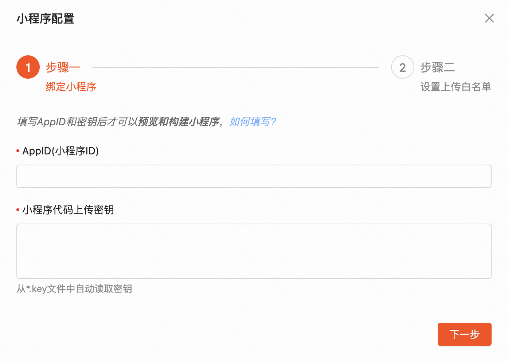
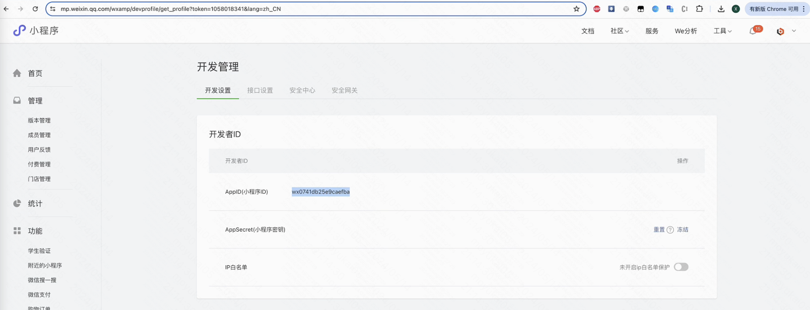
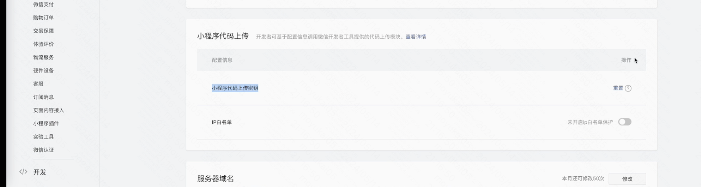
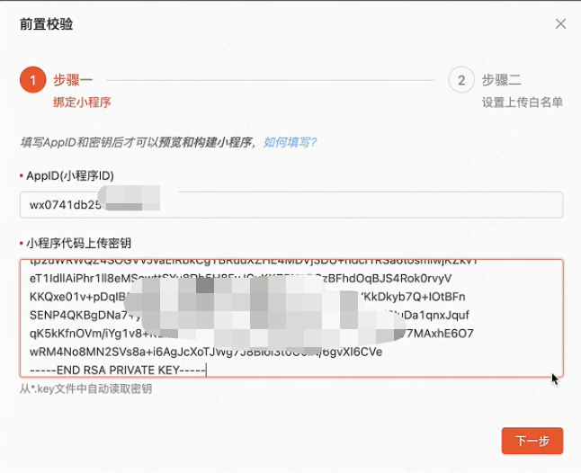

> 可以先观看下方的视频教程，了解如何预览小程序  
https://www.bilibili.com/video/BV1BH4y1G7W8/

### 首次点击预览会提示完善信息

### 登录小程序后台，在 开发管理--开发设置--开发者ID 中，获取AppID

### 接着在下方的 小程序代码上传 中，获取小程序代码上传密钥

### 把IP白名单功能关闭

### 最后，填写AppID和小程序代码上传密钥，点击预览即可
