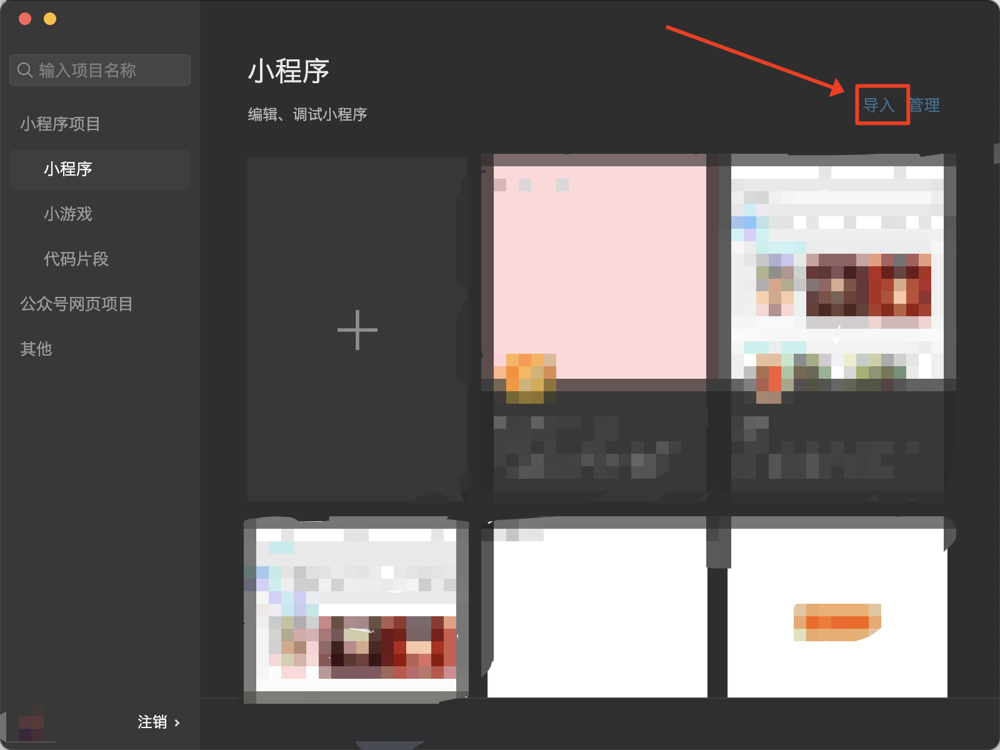

## 点击右上角的「编译到本地」按钮

## 选择导出到本地文件夹

## 使用微信开发者工具，打开刚刚选择的文件夹

## 后续在MyBricks中修改，点击「编译到本地」，对应本地的IDE会自动刷新
:::tip
有时候微信开发者工具会报错，这个时候，只需要关闭掉微信开发者工具，重新打开即可
:::

## 通过微信开发者工具进行小程序的发布
此时需要配置好正式的小程序的AppID，然后点击「上传」按钮即可

