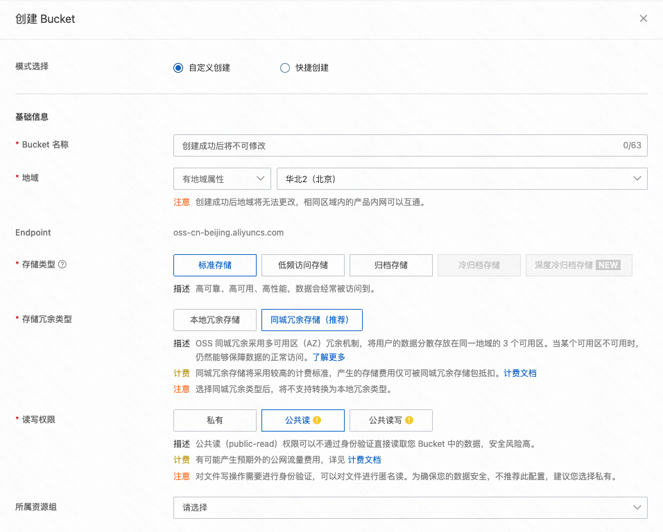
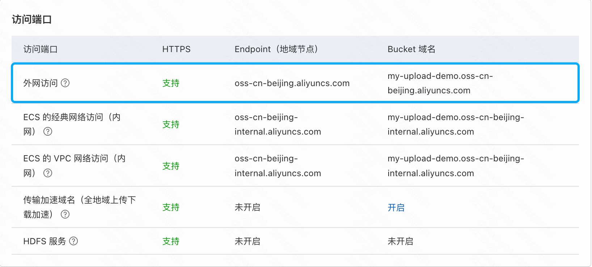
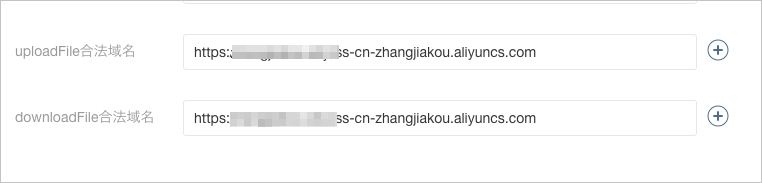

### 准备

首先我们需要注册一个 [阿里云](https://www.aliyun.com/?source=5176.11533457&userCode=ov4stazr) 账号，并且开通 [对象存储OSS](https://www.aliyun.com/product/oss?source=5176.11533457&userCode=ov4stazr) 服务。

完成后，登录[OSS管理控制台](https://oss.console.aliyun.com/overview)进行配置。

### 步骤1：创建 Bucket

### 步骤2：配置 Bucket 跨域访问

1. 单击Bucket列表，然后单击目标Bucket名称。
2. 在左侧导航栏，选择数据安全 > 跨域设置。
3. 在跨域设置页面，单击创建规则，配置如下图所示。

4. 单击确定。

### 步骤3：微信小程序配置域名白名单

您可以为微信小程序配置域名白名单，以实现微信小程序和OSS Bucket之间的正常通信。

1. 单击Bucket列表，然后单击目标Bucket名称。
2. 在存储空间概览页面的访问端口区域，查看Bucket域名。
3. 登录[微信小程序平台](https://mp.weixin.qq.com/)，通过「开发 > 开发管理 > 开发设置 > 服务器域名」将「uploadFile合法域名」、「downloadFile合法域名	」合法域名填写为Bucket的外网访问域名。

<figure>阿里云平台截图</figure>

<figure>微信小程序平台截图</figure>

### 在 MyBricks 中搭建

[Demo](https://my.mybricks.world/mybricks-app-mpsite/index.html?id=549096483143749)

### 参考文档

[微信小程序直传实践](https://help.aliyun.com/zh/oss/use-cases/use-wechat-mini-programs-to-upload-objects)