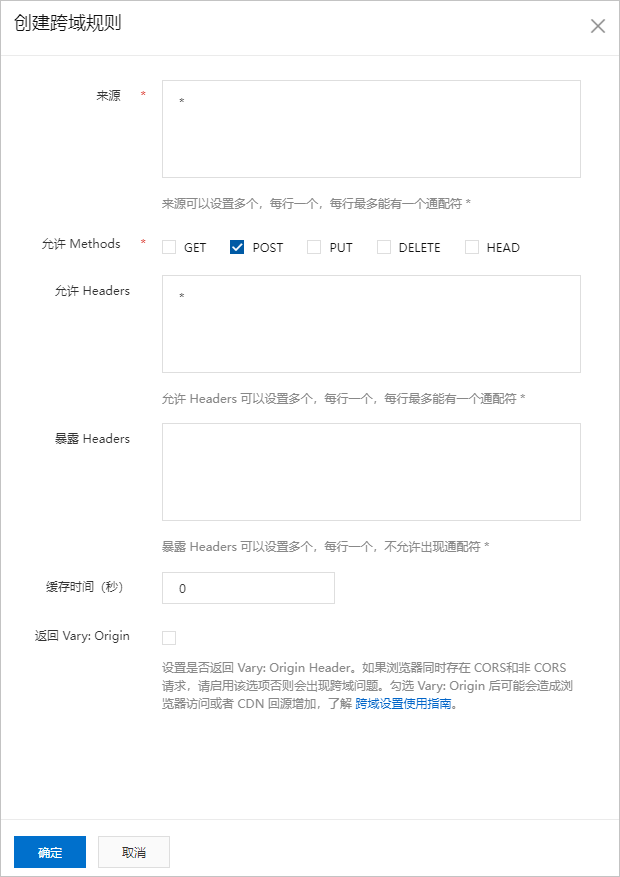
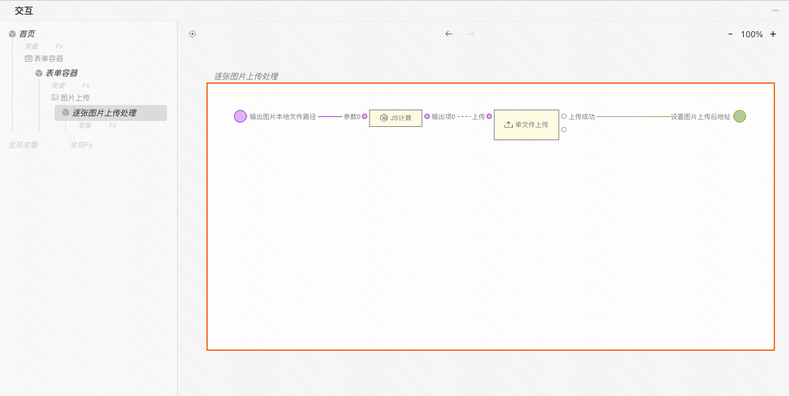
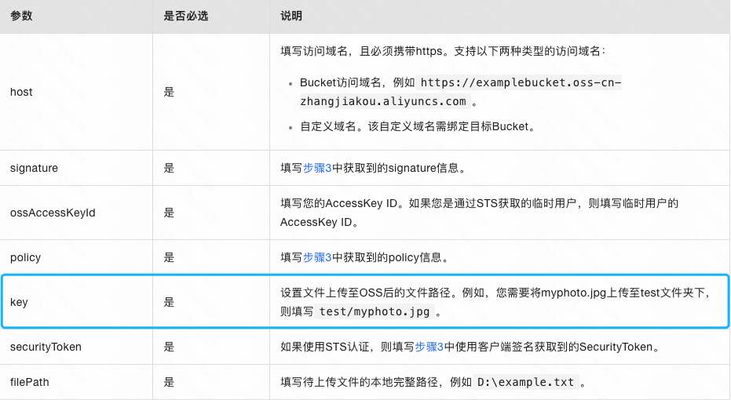
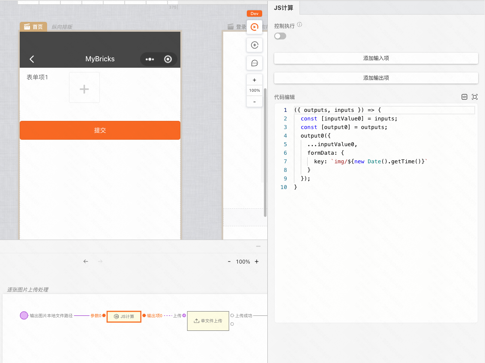

本文介绍如何在小程序环境下将文件上传到阿里云 OSS。

### 准备

首先我们需要注册一个 [阿里云](https://www.aliyun.com/?source=5176.11533457&userCode=ov4stazr) 账号，并且开通 [对象存储OSS](https://www.aliyun.com/product/oss?source=5176.11533457&userCode=ov4stazr) 服务。完成后，登录[OSS管理控制台](https://oss.console.aliyun.com/overview)进行配置。

#### 步骤1：创建 Bucket

如果还没有 Bucket，则先创建。

#### 步骤2：配置 Bucket 跨域访问

1. 单击Bucket列表，然后单击目标Bucket名称。
2. 在左侧导航栏，选择「数据安全 > 跨域设置」。
3. 在跨域设置页面，单击创建规则，配置如下图所示。

#### 步骤3：微信小程序配置域名白名单

您可以为微信小程序配置域名白名单，以实现微信小程序和OSS Bucket之间的正常通信。

1. 单击 Bucket 列表，然后单击目标 Bucket 名称。
2. 在存储空间概览页面的访问端口区域，查看 Bucket 域名。
3. 登录[微信小程序平台](https://mp.weixin.qq.com/)，通过「开发 > 开发管理 > 开发设置 > 服务器域名」将「uploadFile合法域名」、「downloadFile合法域名	」合法域名填写为Bucket的外网访问域名。

<figure>阿里云平台截图</figure>

<figure>微信小程序平台截图</figure>

#### 步骤4：获取签名

在阿里云平台的 [AccessKey](https://ram.console.aliyun.com/manage/ak) 页面，获取 **AccessKey ID** 和 **accessKey Secret**，在后续步骤中将会用到。

### 在 MyBricks 中搭建

在完成了前期的准备后，我们开始正式搭建。

[Demo](https://my.mybricks.world/mybricks-app-mpsite/index.html?id=549096483143749)

#### 配置1：增加 key 参数

根据阿里云文档，formData 参数中需要配置一个 key 字段，设置文件上传至OSS后的文件路径。例如，您需要将myphoto.jpg上传至test文件夹下，则填写test/myphoto.jpg。

例如：

#### 配置2：配置密钥

在「单文件上传」组件中，我们使用「快捷设置 > 阿里云」，然后填写我们在上文中获取到的 **「Bucket 域名，AccessKey ID 和 accessKey Secret」**

### 最后

到这里就已经完成了图片直传阿里云的搭建了。

### 参考文档

[微信小程序直传实践](https://help.aliyun.com/zh/oss/use-cases/use-wechat-mini-programs-to-upload-objects)