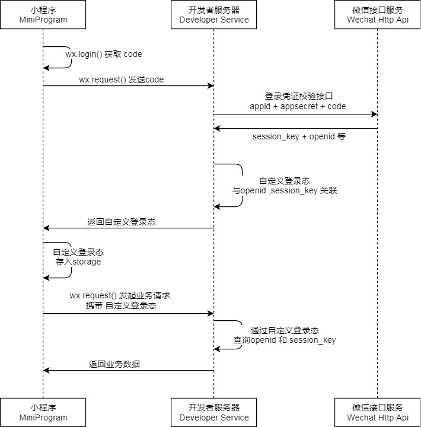
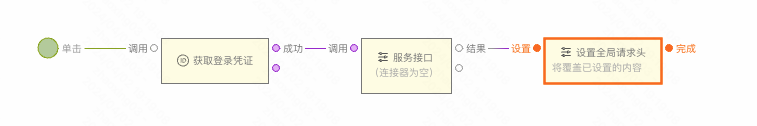
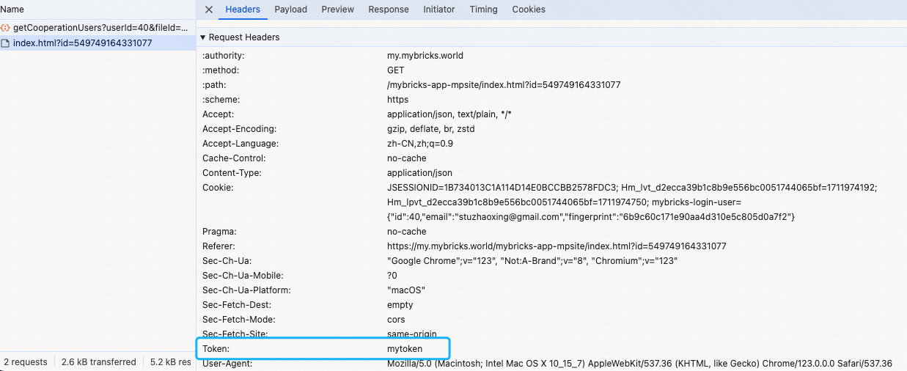
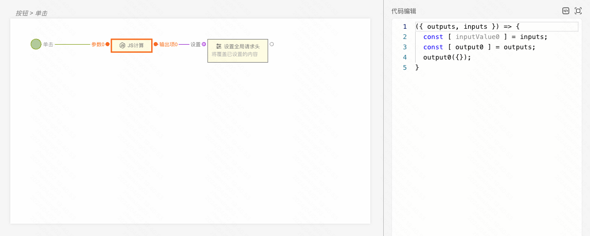
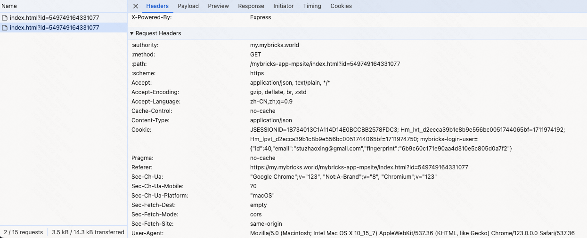

小程序可以通过微信官方提供的登录能力或者自定义基于账号密码等方式登录，建立小程序内的用户体系。

<figure>登录流程时序</figure>

:::tip
第一步的 `wx.login() 获取 code` 可以使用其他自定义方式代替，比如授权手机号、账号密码等。
:::

### 登录

1. **使用「登录凭证、授权手机号、账号密码」等方式，请求登录接口，获取自定义登录态信息（例如 token 等），并设置为全局请求头。**

2. **在之后的所有的「服务接口」请求中都会自动携带自定义登录态信息。**

### 登出

1. **通过「JS计算」组件构造一个空对象，并设置为全局请求头。**

2. **在之后的所有的请求中不携带自定义登录态信息。**

点击查看 [搭建 Demo](https://my.mybricks.world/mybricks-app-mpsite/index.html?id=549749164331077)

### 参考文档

[小程序登录](https://developers.weixin.qq.com/miniprogram/dev/framework/open-ability/login.html)
