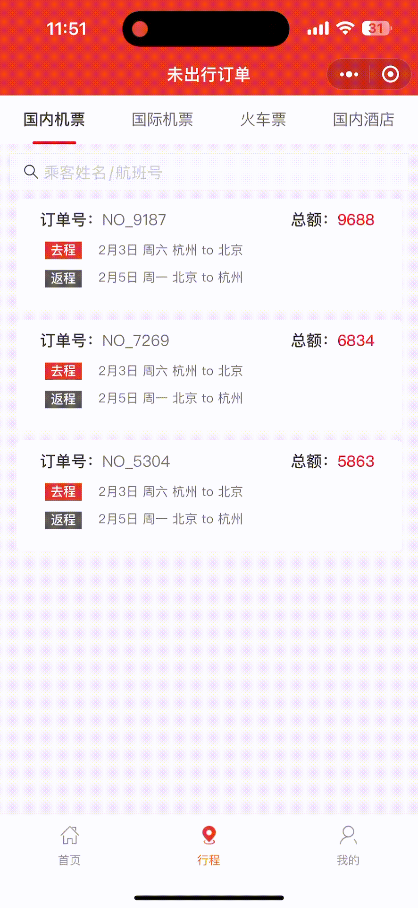
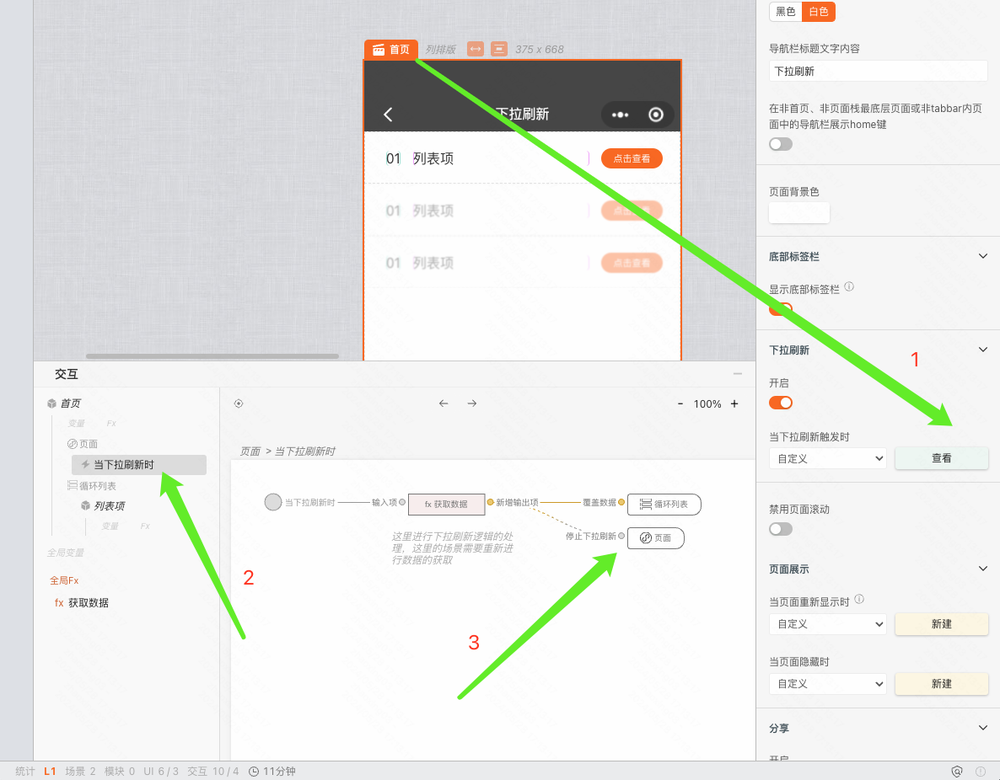

本文介绍如何给页面配置下拉刷新功能。

### demo地址

[页面下拉刷新demo](https://my.mybricks.world/mybricks-app-mpsite/index.html?id=549698809397317)

### 使用场景

在列表页或者tab页中，需要对页面的数据进行刷新重新获取

### 操作步骤

第一步：聚焦「页面」，开启下拉刷新，并新建下拉刷新事件。

第二步：在下拉刷新时，完成接口请求等逻辑后，连接到「页面」组件的「停止下拉刷新」。