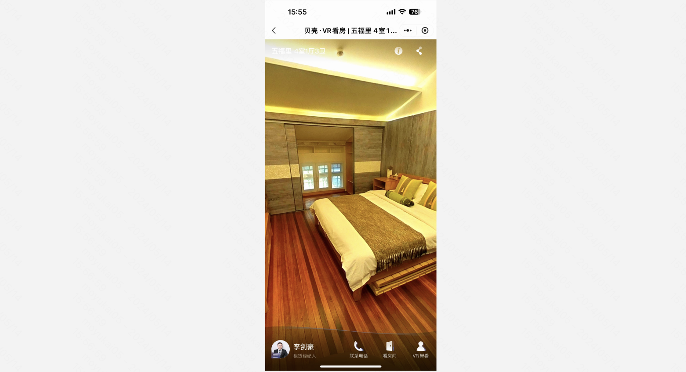
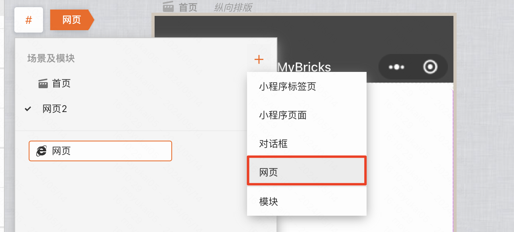
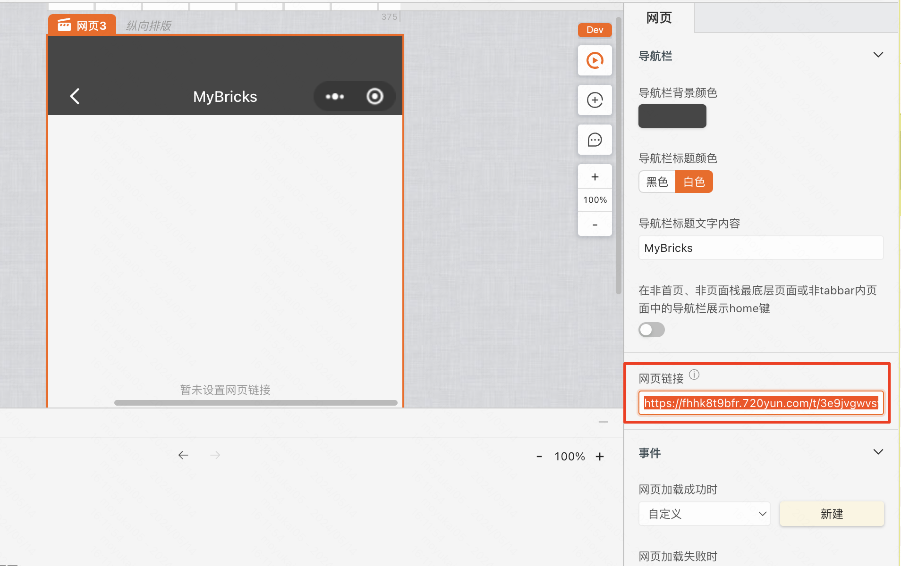

### 使用场景

VR看房、360全景等等  

### 接入步骤

[720云接入指南](https://www.720yun.com/bbs/article?id=687)

当你阅读上方文档，成功接入720云之后，你便能拿到一个类似如下的链接：
https://fhhk8t9bfr.720yun.com/t/3e9jvgwvsy7
通过跳转到这个网页链接，你便能看到一个360全景的效果。

### 使用方法
在MyBricks中，新建一张网页，并配置好网页链接就可以了

