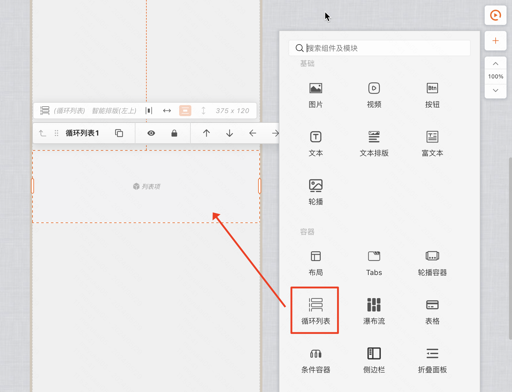
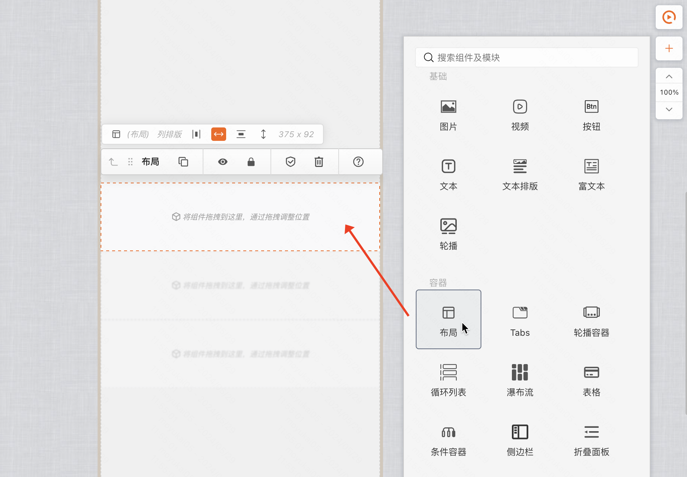
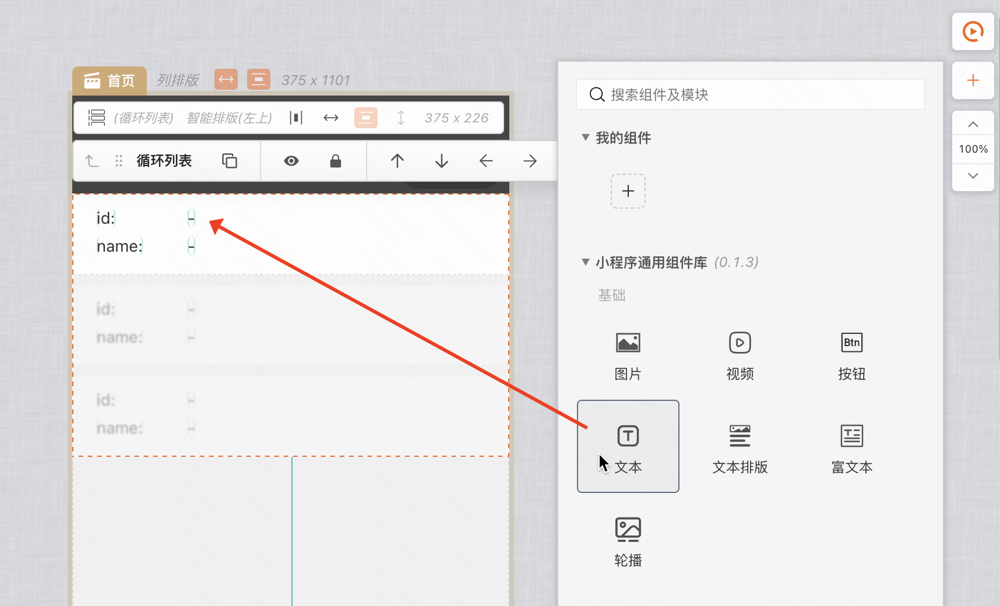
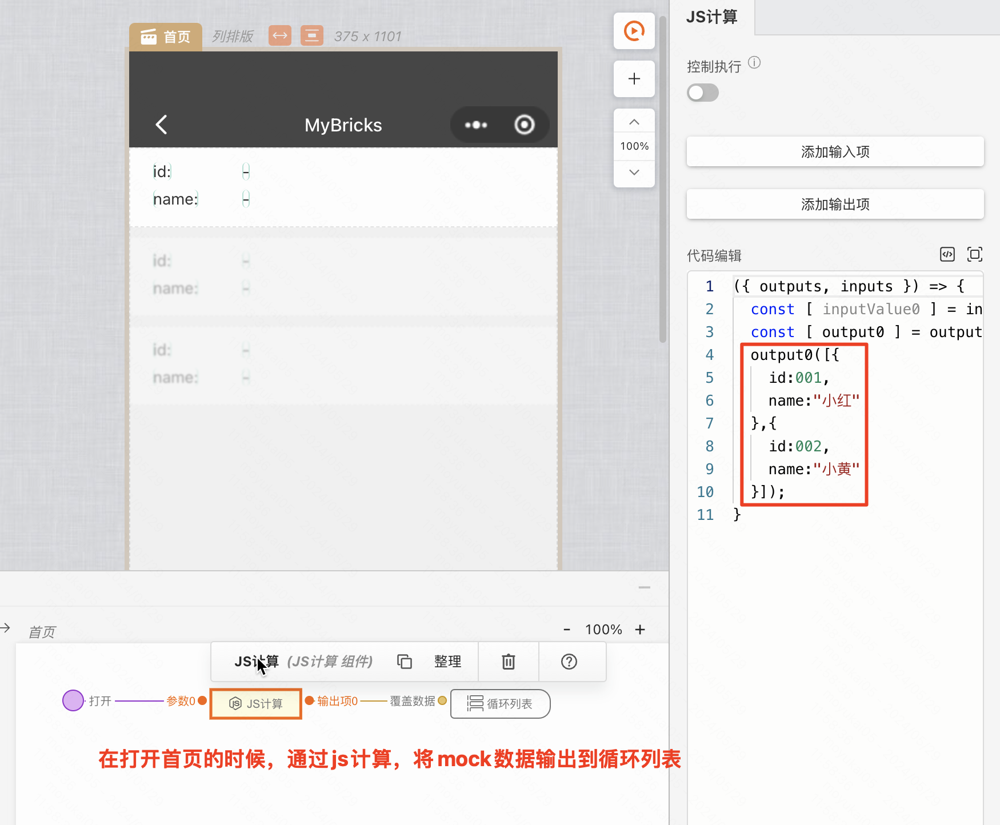
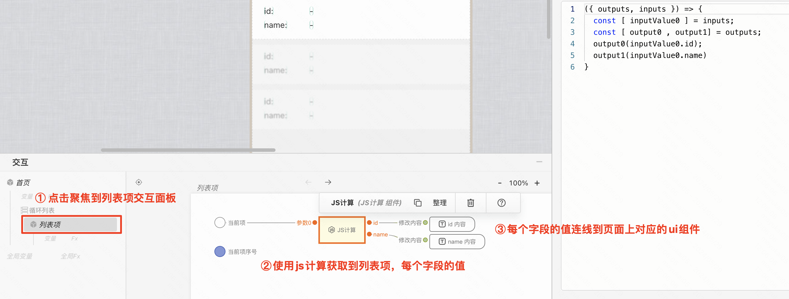
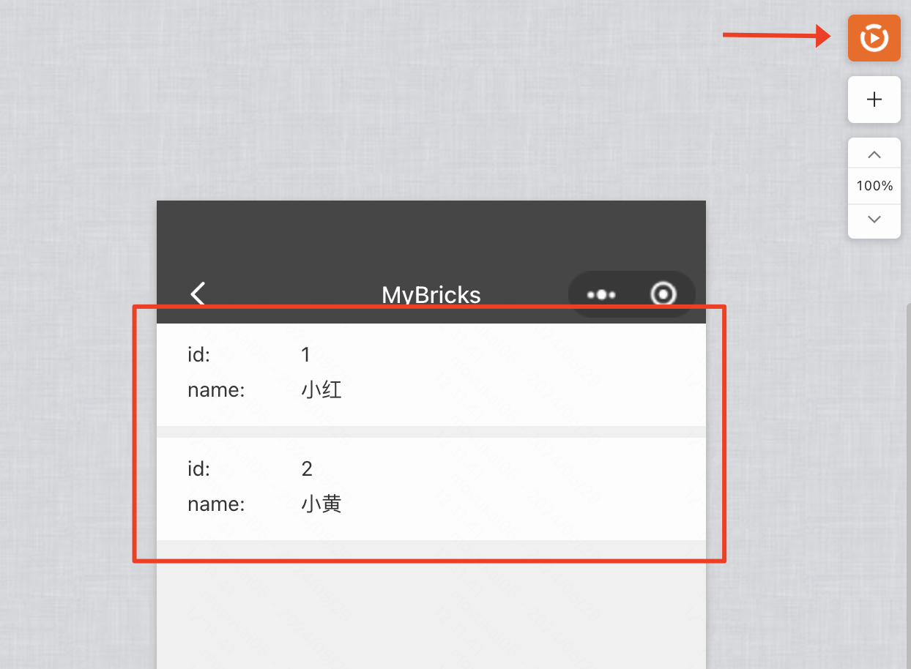

### 使用场景
在显示比如快递列表、商品列表等数据时，需要循环渲染数据的情况下，可以使用循环列表组件进行循环渲染。

### 示例的搭建链接
[循环列表的渲染demo](https://my.mybricks.world/mybricks-app-mpsite/index.html?id=569824193015877)

### 操作步骤
#### 第一步：在画布中拖入「循环列表」组件

#### 第二步：往循环组件中拖入一个布局，作为一个卡片项

#### 第三步：往刚刚拖入的布局中再拖入文本组件，作为列表项的内容

#### 第四步：在页面打开时，往循环列表输入数据

#### 第五步：给循环列表的列表项绑定数据

#### 第六步：点击右上角的预览图标，查看效果

