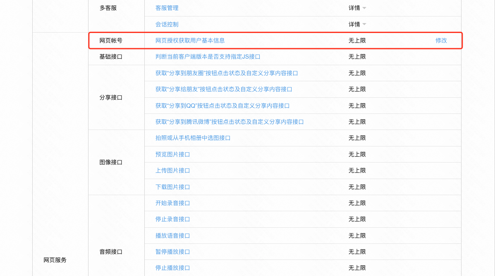

如果用户在微信或其他客户端中访问第三方网页，公众号可以通过微信网页授权机制，来获取用户基本信息，进而实现业务逻辑。

这里我们以微信为例，看如何实现网页授权。

**网页授权流程分为四步：**

1. 引导用户进入授权页面同意授权，获取code
2. 通过code换取网页授权access_token（与基础支持中的access_token不同）
3. 如果需要，开发者可以刷新网页授权access_token，避免过期
4. 通过网页授权access_token和openid获取用户基本信息（支持UnionID机制）

这里我们只需要在 mybricks 完成第一步，后面的步骤主要由后端接口完成。

查看 [搭建 demo](https://my.mybricks.world/mybricks-app-mpsite/index.html?id=578040857243717)

## 准备工作

我们需要自定准备一个认证通过的微信公众号，或者先使用 [公众平台测试账号](https://mp.weixin.qq.com/debug/cgi-bin/sandbox?t=sandbox/login&token=1596373160&lang=zh_CN)。

:::tip
以下内容将以 **公众平台测试账号** 和 **MyBricks默认发布地址** 为例
:::

## 配置微信公众号

通过「网页服务 > 网页账号 > 网页授权获取用户基本信息 > 修改」，填写 **my.mybricks.world**（注意这里填写的信息不要带 https:// ）

## 页面搭建

关键步骤

- 根据 cookie 或其他自定义状态判断是否需要进行登录

- 如果需要进行登录，再判断 URL search 是否有 code 参数

- 如果无 code 参数，则先重定向至微信网页授权页面，再重定向回用户页面并携带 code 参数

- 获取到 code 参数，请求后端接口获取用户信息和登录信息

## 附

[微信网页授权](https://developers.weixin.qq.com/doc/offiaccount/OA_Web_Apps/Wechat_webpage_authorization.html)
