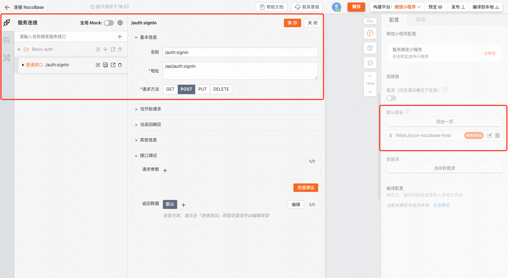
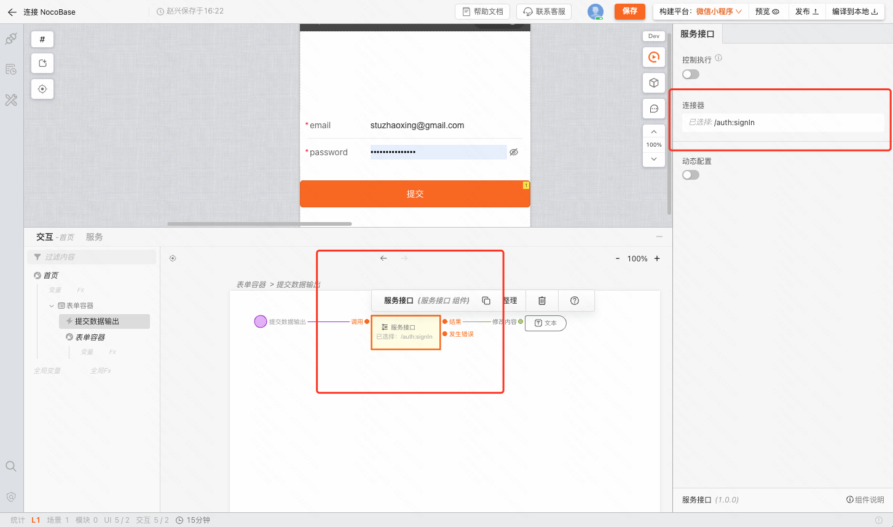

## 0. 背景

NocoBase 可以实现完整的管理后台无代码搭建，并对外提供 API。我们可以通过连接，为 NocoBase 扩展小程序搭建能力。

## 1. 准备工作

首先你需要部署一个 [NocoBase](https://www.nocobase.com/)，然后在「插件管理器 > [开启 API 文档 插件](https://docs-cn.nocobase.com/handbook/api-doc)」。

## 2. 使用 MyBricks 请求 NocoBase API

[搭建 Demo](https://my.mybricks.world/mybricks-app-mpsite/index.html?id=590416763494469)

### 详细步骤

第一步，在项目上添加并使用该「默认域名」；然后在「连接器」中根据 NocoBase 的 API 文档添加接口信息。

:::tip
以登录接口为例，通常完整的 API 地址是 **https://your-nocobase-host/api/auth:signIn**
:::

第二步，使用接口请求，我们只需要在逻辑面板中使用「服务接口」组件，并选择接口即可。

## 3. 特别注意

如果你的 NoceBase 部署的域名为 localhost，你需要在项目中开启「连接器 > 直连」，因为我们的服务器无法请求到你的 localhost 地址。

此时如果请求你的 NocoBase API 出现跨域报错，你可以通过下载并开启 [chrome 插件 > Allow CORS](https://chromewebstore.google.com/detail/allow-cors-access-control/lhobafahddgcelffkeicbaginigeejlf?hl=zh-CN&utm_source=ext_sidebar) 来解决跨域问题。

