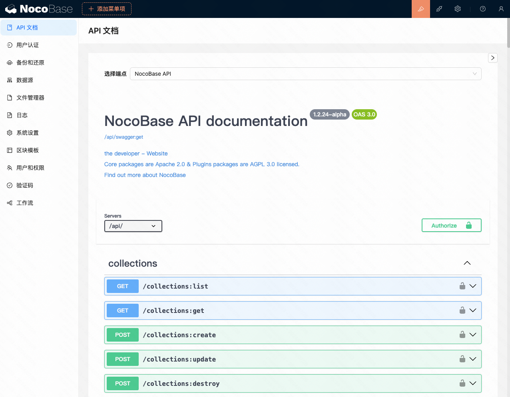
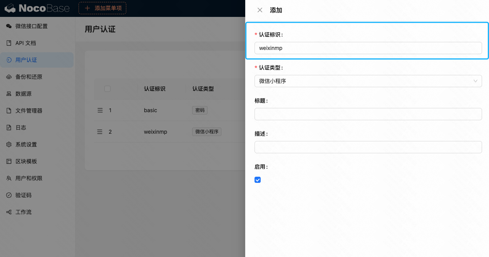
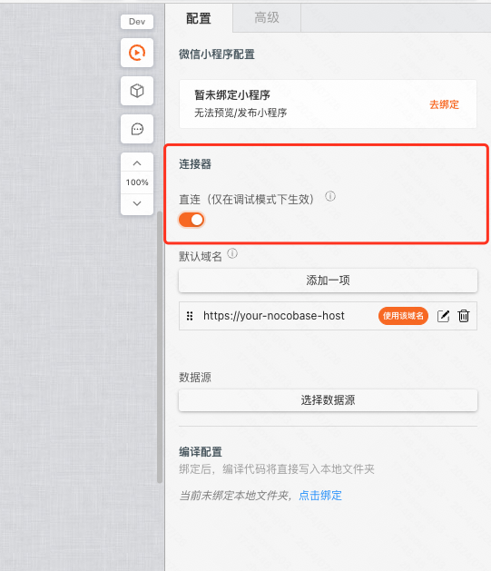

## 0. 背景

NocoBase 可以实现管理后台无代码搭建，并对外提供 API。我们可以通过连接，为 NocoBase 扩展小程序搭建能力。

## 1. 准备工作

首先你需要部署一个 [NocoBase](https://www.nocobase.com/)，需 v0.14 及以上版本。

下载并安装 [微信 API 插件](https://mybricks-releases.oss-cn-hangzhou.aliyuncs.com/nocobase-plugin-weixin-api/weixin-api-1.0.0.tgz)，然后在「插件管理器 > 开启微信 API 插件」。


<figure>插件上传</figure>

然后在「插件管理器 > 开启 [API 文档 插件](https://docs-cn.nocobase.com/handbook/api-doc)」。



<figure>API 文档界面</figure>

## 2. NocoBase 配置

第一步：选择 **「设置菜单 > 微信接口配置」**，并按要求填写「微信小程序开发者 ID 设置」。


第二步：选择 **「设置菜单 > 用户认证 > 添加微信小程序登录方式」**，请注意，这个 **「认证标识」** 字段非常重要，在后面步骤中会用到，这里我们以填写「weixinmp」为例。按要求填写后，勾选「启用」。



:::tip
到这里，微信授权登录的接口我们就配置完成了，接下来我们配置一张数据表来作为增删改查的操作示例，如果你非常清楚 NocoBase 的操作可以自行决定后面的配置。
:::

第三步：选择 **「设置菜单 > 数据源 > main 数据源配置 > 创建数据表 > 普通数据表」**，然后如下填写，新增一张数据表。


然后选择刚才添加的 **「文章表 > 配置字段 > 添加字段」**，为文章添加标题(title)、正文(content)等字段。


第四步：选择 **「设置菜单 > API 文档 > 选择端点 > Collection API-文章」**，就可以在下方看到刚才添加的数据表的增删改查的接口文档。


:::tip
接下来我们要进入 MyBricks 进行小程序部分的搭建，点击查看 **[搭建 Demo](https://my.mybricks.world/mybricks-app-mpsite/index.html?id=592244920504389)**。
:::

<div style="position: relative; padding: 30% 45%;">
<iframe style="position: absolute; width: 100%; height: 100%; left: 0; top: 0;" src="//player.bilibili.com/player.html?isOutside=true&aid=112926652367489&bvid=BV1AEYbeFEyj&cid=500001642764072&p=1&autoplay=0" frameborder="no" scrolling="no"></iframe>
</div>

[原视频地址](https://www.bilibili.com/video/BV1AEYbeFEyj/)

## 3. 使用 MyBricks 登录 NocoBase

在请求文章的增删改查接口之前，有一个前置条件就是用户登录。我们可以先阅读 [如何实现登录/登出功能](/docs/miniprogram/common-scenarios/login-logout/)。

**关键步骤 1：登录接口配置**

在「当开始请求」钩子中，需要为 ```headers``` 添加 ```x-Authenticator```，值为上文中提到的 **「认证标识」** 字段。


**通常** 登录 API 地址是 https://your-nocobase-host/api/auth:signIn

```js
headers = {
  ...headers,
  "x-Authenticator": "weixinmp"
}
```

**关键步骤 2：登录逻辑编排**

登录流程为：获取微信小程序登录凭证 > 请求 NocoBase 的微信小程序登录接口 > 根据要求格式化数据 > 在微信小程序中持久化登录状态。

**注意「获取微信小程序登录凭证」仅在小程序中才可正确生成，请在预览开发版或发布体验版后在手机上体验。**


```js
({ outputs, inputs }) => {
  const [inputValue0] = inputs;
  const [output0] = outputs;
  output0({
    Authorization: `Bearer ${inputValue0.data.token}`
  });
}
```

## 4. 使用 MyBricks 请求 NocoBase 增删改查接口

登录成功后，我们就可以请求增删改查接口了。

**详见视频**

## 5. 特别注意

如果你的 NoceBase 部署的域名为 localhost，你需要在项目中开启「连接器 > 直连」，因为我们的服务器无法请求到你的 localhost 地址。

此时如果请求你的 NocoBase API 出现跨域报错，你可以通过下载并开启 [chrome 插件 > Allow CORS](https://chromewebstore.google.com/detail/allow-cors-access-control/lhobafahddgcelffkeicbaginigeejlf?hl=zh-CN&utm_source=ext_sidebar) 来解决跨域问题。



## 6. 附

如果你是期望使用「PC搭建」来扩展 NocoBase：

[原型即产品，使用 MyBricks 绘制专业原型图](/blog/draw-professional-prototypes-with-mybricks)

[案例：增删改查列表页](/training/pc-case/crud/)

[nocobase连接示例](https://my.mybricks.world/mybricks-app-pcspa/index.html?id=592126567915589)

[PC 连接NocoBase并实现增删改查](https://my.mybricks.world/mybricks-app-pcspa/index.html?id=592524615163973)
