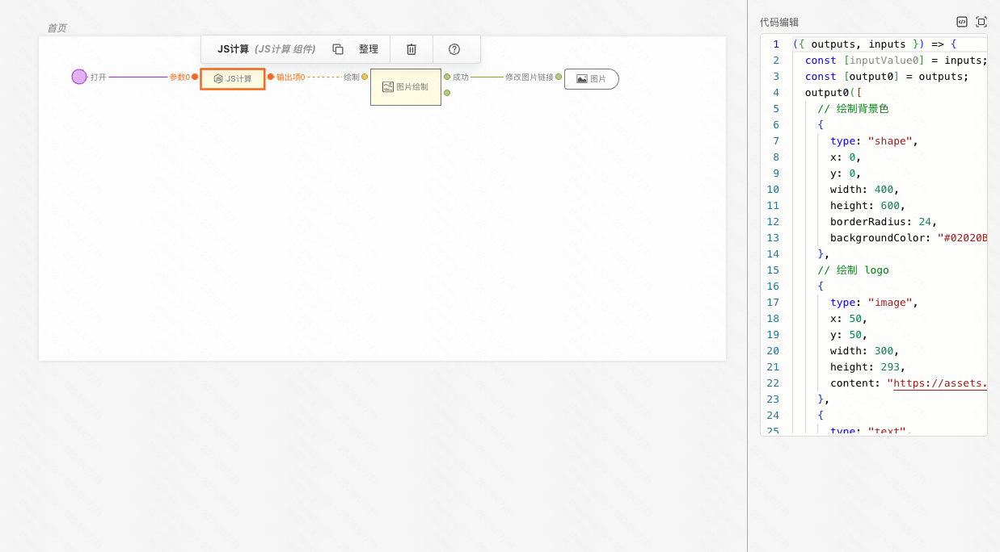
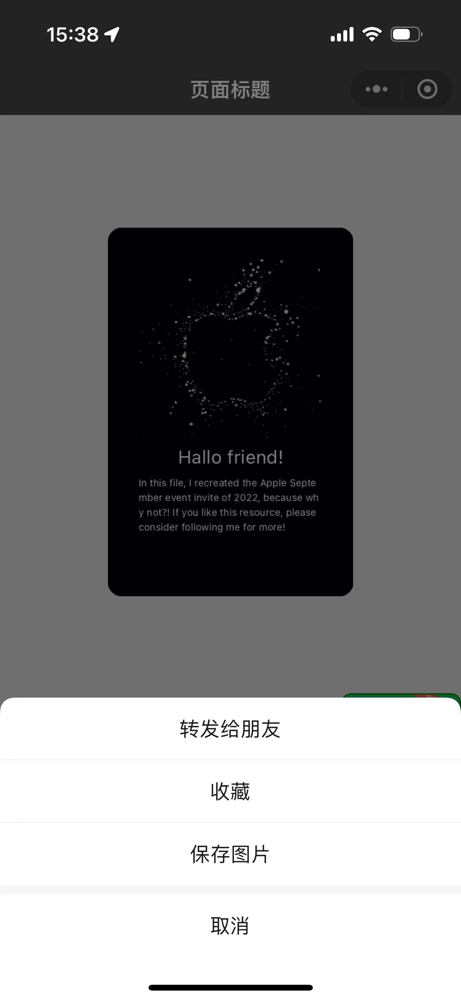

## 使用场景

通常我们会在 **「邀请好友」、「生成新头像」、「给表情包配文字」** 等场景用到动态绘制图片的能力。

## 使用方式

[搭建 Demo](https://my.mybricks.world/mybricks-app-mpsite/index.html?id=592143003729989)



我们仅需要三步即可完成这个功能

1. 按格式提供绘制的素材，这里支持三种素材形式，以数组格式给到「图片绘制」组件，这里图层的优先级为后面的覆盖前面的。

``` js
// 绘制形状
{
  type: "shape", 
  x: 0, // 左上角 X 坐标
  y: 0, // 左上角 Y 坐标
  width: 400, // 宽度
  height: 600, // 高度
  borderRadius: 24, // 圆角
  borderWidth: 10, // 边框宽度
  borderColor: "#ffffff", // 边框颜色
  backgroundColor: "#02020B" // 背景色
},
    
// 绘制图片
{
  type: "image",
  x: 50, // 左上角 X 坐标
  y: 50, // 左上角 Y 坐标
  width: 300, // 宽度
  height: 293, // 高度
  borderRadius: 24, // 圆角
  borderWidth: 10, // 边框宽度
  borderColor: "#ffffff", // 边框颜色
  content: "https://assets.mybricks.world/GUpSgGBIpOtEPiQwNnw5HsPK5S13pJvz-1722407910899.png" // 图片地址
},

// 绘制文字    
{
  type: "text",
  x: 50, // 左上角 X 坐标
  y: 50, // 左上角 Y 坐标
  width: 400, // 宽度，超出后自动换行
  height: 40, // 高度，超出后显示省略号
  textAlign: "center", // 文字对齐方式，支持的值：left, right, center
  fontSize: 30, // 文字字号
  lineHeight: 40, // 行高
  color: "#ffffff", // 文字颜色
  content: "Hallo friend!" // 文字内容
}
```

2. 为「图片绘制」组件配置生成的画布尺寸，建议为 2倍图或者3倍图（即，如果在手机上展示为 200*200 像素，那么画布尺寸设置为 400*400 或者 600*600 为佳）

3. 在「图片绘制 > 成功」输出的值连线到「图片」组件，并且开启图片组件的「支持长按识别微信二维码或转发、保存图片」开关

**最后，我们在手机上预览小程序，即可看到动态生成的图片，并且通过长按可以保存图片了。**

