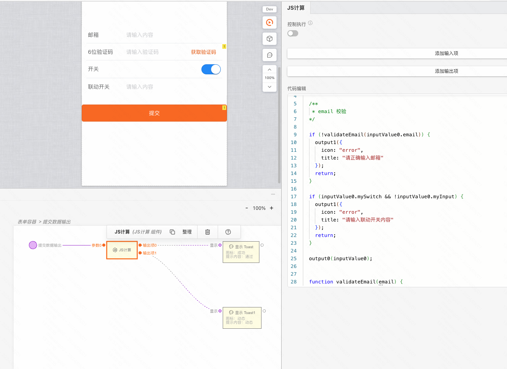
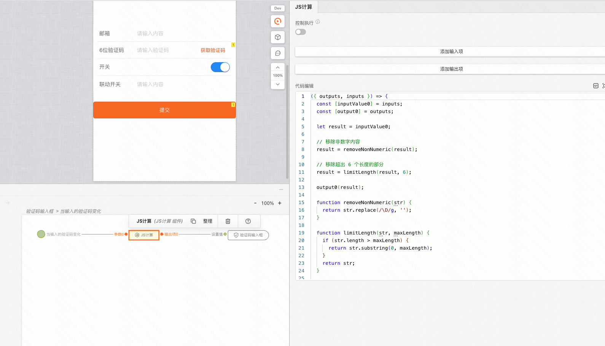

## 背景

表单内置的校验只有「必填」规则，但是在需求中，通常我们会遇到各种自定义的校验规则，这里就需要通过 「JS计算」来实现。

## 搭建方式

[搭建 Demo](https://my.mybricks.world/mybricks-app-mpsite/index.html?id=592481944535109)

关键操作1:

在表单提交时，使用「JS计算」组件实现自定义校验。

关键操作2:

在表单项的「值变化时」，使用「JS计算」组件实现自定义校验。

