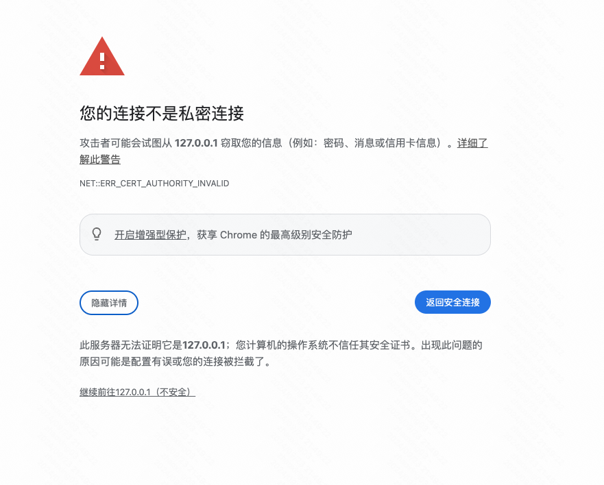
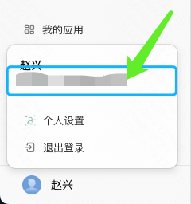

## 环境准备

点击下载 [「组件库模板」](https://www.baidu.com) 

首先进行初始化配置：

修改 `package.json` 文件的 `name`、`description` 字段；

再修改 `mybricks.json` 的 `namespace` 字段。

最后执行 `yarn install` 就完成了初始化的所有准备。

**注意，这里需要使用 yarn 来正确安装所有依赖**

## 调试

执行 `npx mybricks dev`，此时会出现提示 **「请填写期望用于调试组件库的搭建页面 URL」**

我们可以在 MyBricks 平台上创建一个移动端文件后，将搭建地址粘贴到控制台，例如：

```
https://my.mybricks.world/mybricks-app-mpsite/index.html?id=611378132680773
```

填写后将会自动打开调试页面。

:::tip
如果组件库未正常加载，请在浏览器中手动打开地址 https://127.0.0.1:8000/libEdt.js，在安全提示中，依次点击「高级 > 继续前往 127.0.0.1」
:::



页面可以加载多个组件库，如果当前页面中包含了该调试组件库，则会被替换为本地的组件库，如果未包含则会追加本地组件库。


## 预览

在修改了组件代码后，需要进行「预览、发布」等操作之前，需要先进行一次构建

`npx mybricks build`


## 发布组件库到物料中心

发布到物料中心之前，我们需要准备 3 个信息：

1. 私有化部署的平台域名，如 `https://my.mybricks.world`

2. 私有化部署的平台账户



3. 修改 `package.json` 中的 `version` 字段。

最后执行 `npx mybricks publish`，依次填写信息即可将组件发布至物料中心。

## 附

其他内容详见 [自定义组件开发](docs/docs/29-component-extension/24-component-extend/24-component-extend.md)