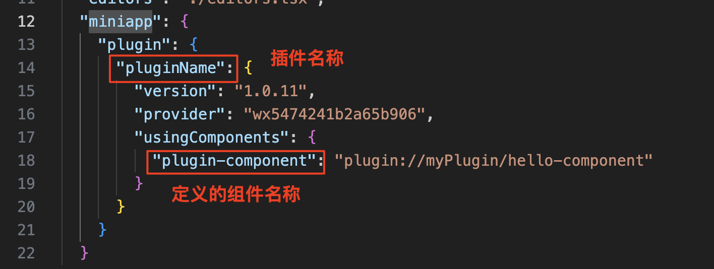
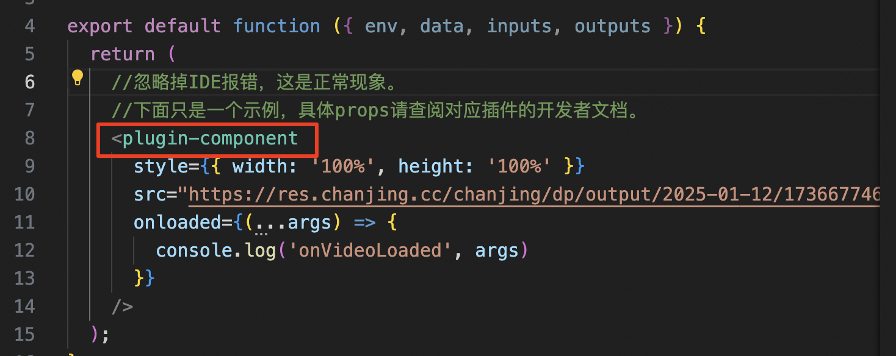
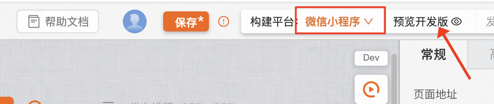

:::tip
小程序插件是微信小程序中特有的，因此引入插件后，必须在真机环境下进行调试&预览。（在搭建时无法预览）
:::

## 环境准备

- 在使用插件前，首先要在小程序管理后台的“设置-第三方服务-插件管理”中添加插件。开发者可登录小程序管理后台，通过 appid 查找插件并添加。如果插件无需申请，添加后可直接使用；否则需要申请并等待插件开发者通过后，方可在小程序中使用相应的插件。[「微信开发者文档 - 插件」](https://developers.weixin.qq.com/miniprogram/dev/framework/plugin/using.html)  [「微信服务市场 - 第三方插件」](https://fuwu.weixin.qq.com/search?tab=3&category=&serviceType=4-3-9&industry=&scene=&type=&kw=)

- 在MyBricks中，插件是在组件中进行使用的，所以需要先创建一个自定义组件，然后才能使用插件。点击下载 [「组件库模板」](https://f2.beckwai.com/udata/pkg/eshop/fangzhou/demo/comlib-taro-demo.zip) 

## 使用微信小程序插件

### 1.新建一个自定义组件，然后在com.json中新增miniapp定义，如下图引入微信小程序插件：

> 建议先观看前面一章[「如何开发自定义组件」](https://docs.mybricks.world/docs/miniprogram/custom-component/)教程 

### 2.在组件中使用插件，如下图：

### 3.最后选择预览到小程序
> 由于插件是微信小程序中特有的，因此引入插件后，必须在真机环境下进行调试&预览。（在搭建时也无法预览）

