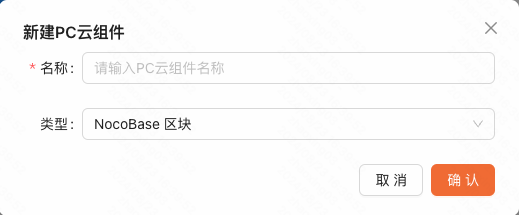
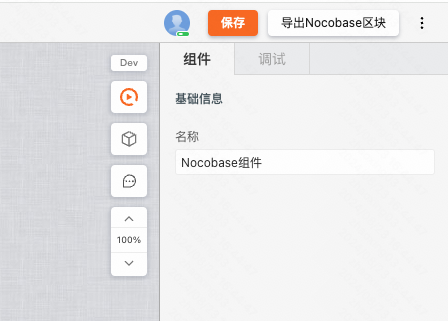
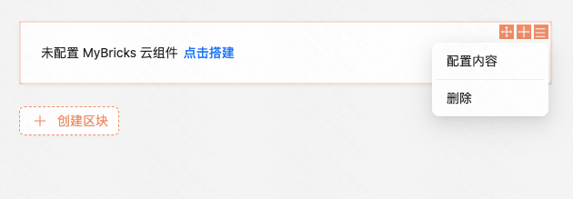
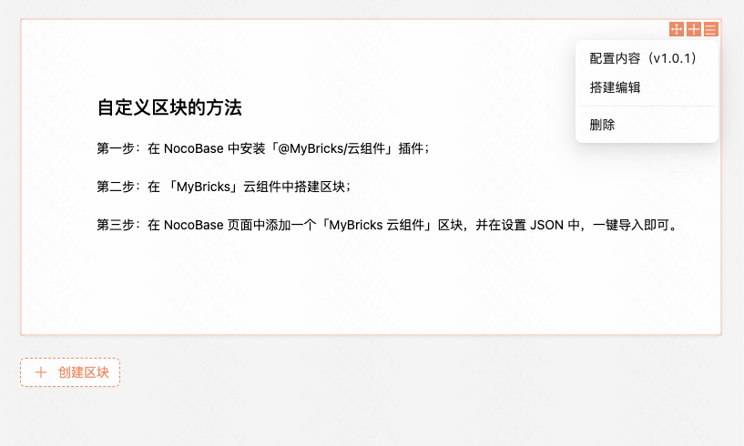
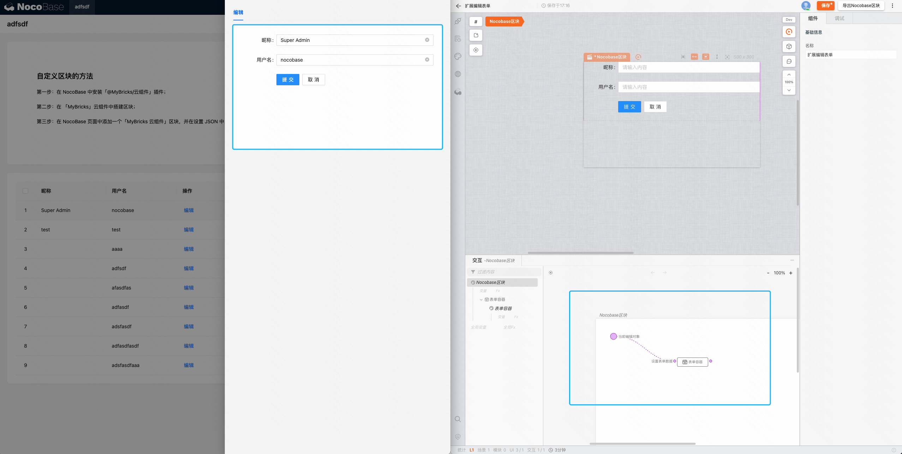

:::tip
插件升级到 1.1.0 版本后，建议配合「PC 云组件」应用 1.1.60 以上使用
:::

### 第一步：安装

下载 NocoBase 插件 **[「@MyBricks/云组件 v1.1.0」](https://releases.mybricks.world/nocobase-plugin-cloud-com/cloud-com-1.1.0.tgz)**，安装并开启插件。（下载 [@MyBricks/云组件 v1.1.0 next 分支](https://releases.mybricks.world/nocobase-plugin-cloud-com/cloud-com-1.1.0-next.tgz)）

### 第二步：添加区块

通过「创建区块 > 其他区块 > MyBricks 云组件」，向页面中添加区块。


### 第三步：搭建 MyBricks 云组件

在新建「MyBricks PC 云组件」时，类型选择 **NocoBase 区块**。



通过「MyBricks PC 云组件」应用，搭建组件，自由定制样式、交互、接口请求等。

然后点击右上角「导出 NocoBase 区块」，将内容 **复制到剪切板**。



**[打开链接快速导出](https://my.mybricks.world/mybricks-app-pc-cdm/index.html?id=596783300124741)**

### 第四步：导入到 NocoBase

通过「区块设置 > 配置内容」，将内容粘贴至文本框中，点击 **确定**，就完成了云组件的导入。



配置内容后，我们可以看到当前云组件对应的版本，以及通过「搭建编辑」快速打开 MyBricks 云组件的编辑页面。



### 附1：为表格扩展自定义编辑表单

在 NocoBase 区块中，有一个 **「当前编辑对象」** 的输入项，当区块被用在「表格编辑弹出层」中时，该区块会自动获取到当前行数据，并通过该输入项传递进组件中。



### 附2：为云组件添加 NocoBase 连接器

```
插件标识：@mybricks/nocobase-service-interface
中文名称：NocoBase接口列表
插件类型：连接器
插件地址：https://f2.eckwai.com/kos/nlav12333/nocobase-plugin-service/plugin.js
runtime地址：https://f2.eckwai.com/kos/nlav12333/nocobase-plugin-service/index.js
```
