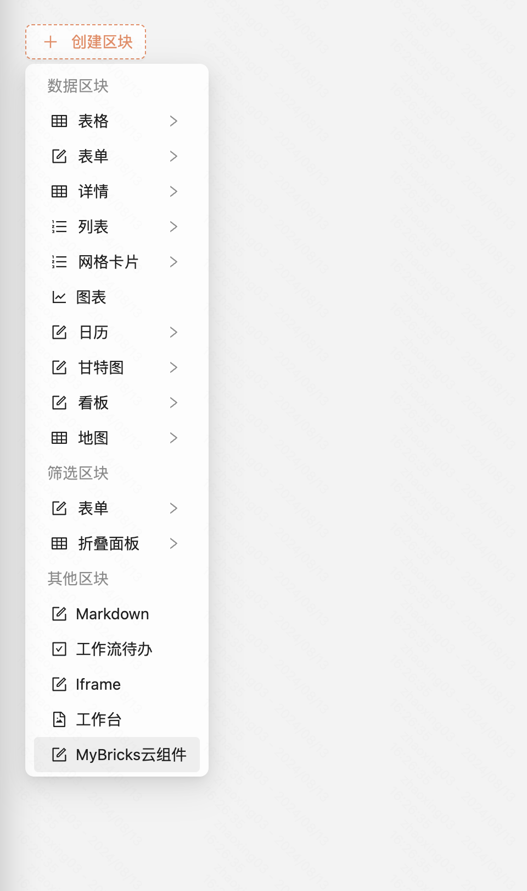
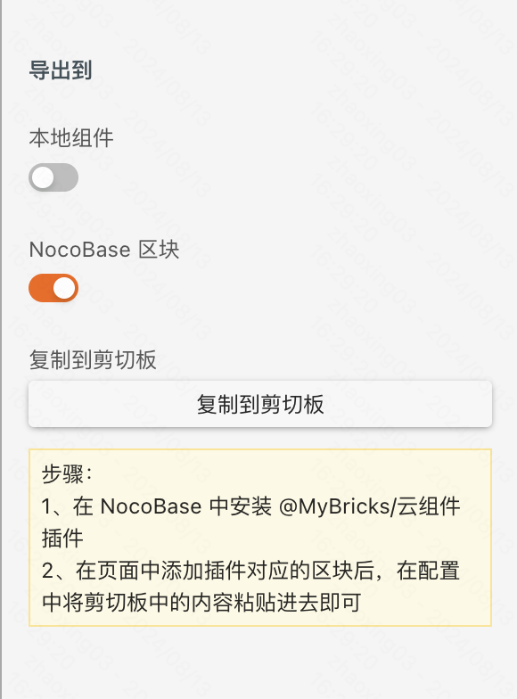
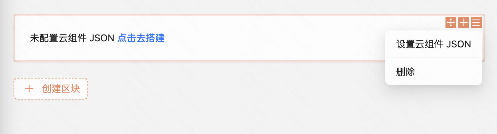
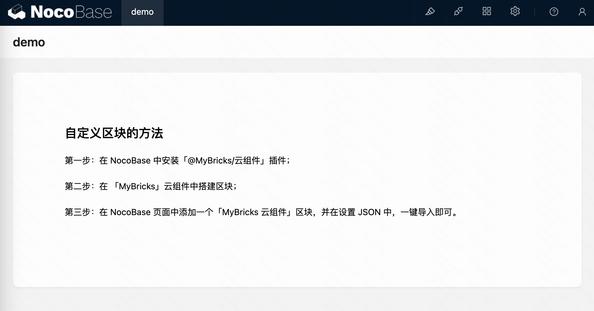

### 第一步：安装

下载 NocoBase 插件 **[「@MyBricks/云组件」](https://releases.mybricks.world/nocobase-plugin-cloud-com/cloud-com-1.0.1.tgz)**，安装并开启插件。

### 第二步：添加区块

通过「创建区块 > 其他区块 > MyBricks 云组件」，向页面中添加区块。

### 第三步：搭建 MyBricks 云组件

通过「MyBricks PC 云组件」应用，搭建组件，自由定制样式、交互、接口请求等。

然后「导出到 > NocoBase 区块」，点击 **复制到剪切板**。

**[打开链接快速导出](https://my.mybricks.world/mybricks-app-pc-cdm/index.html?id=596783300124741)**

### 第四步：导入到 NocoBase

通过「区块设置 > 设置云组件 JSON」，将内容粘贴至文本框中，点击 **确定**，就完成了云组件的导入。

