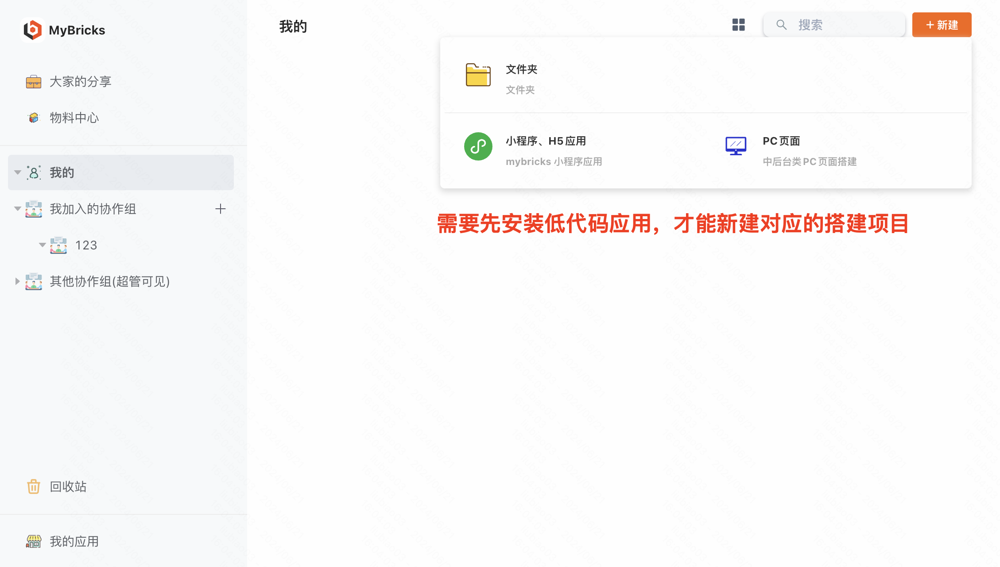
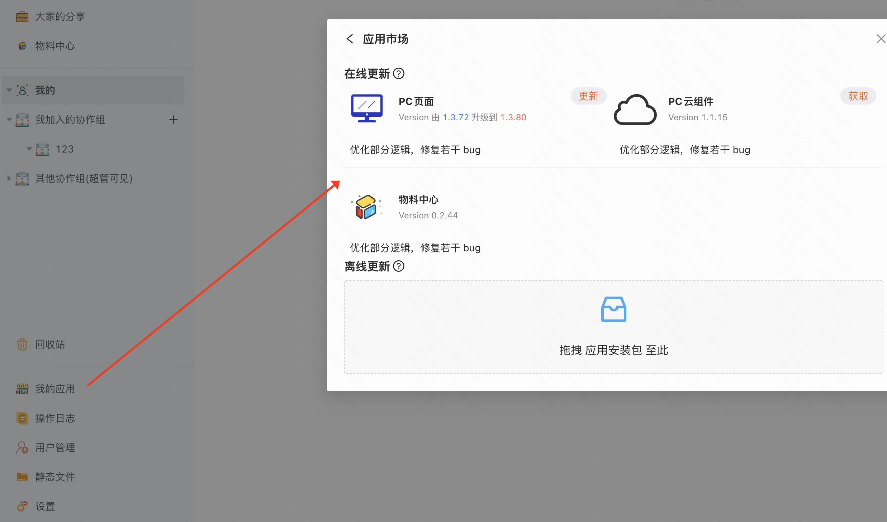
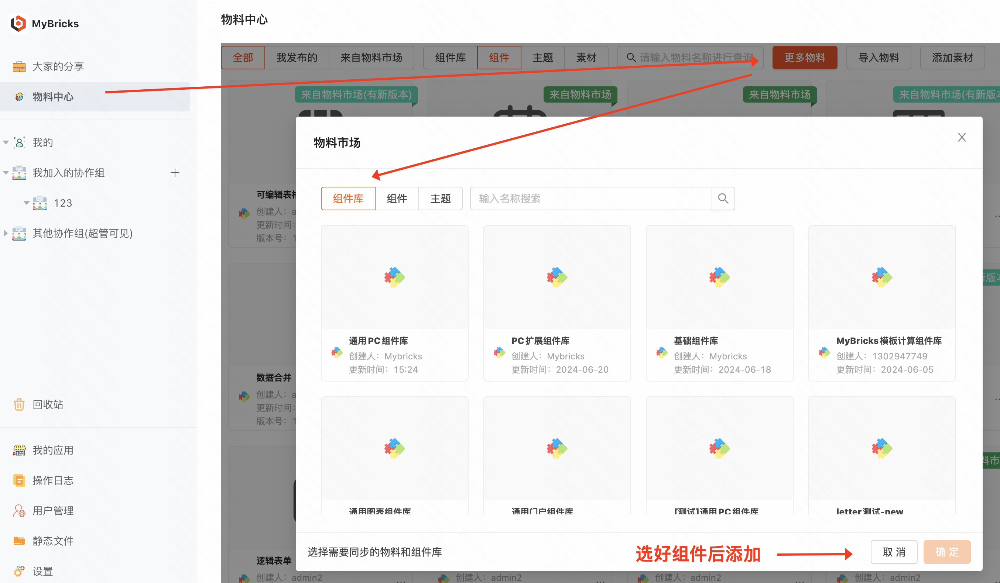
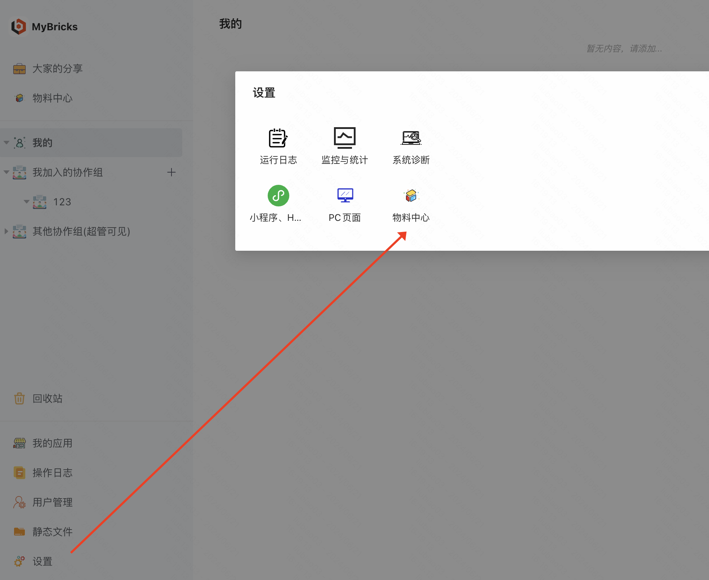
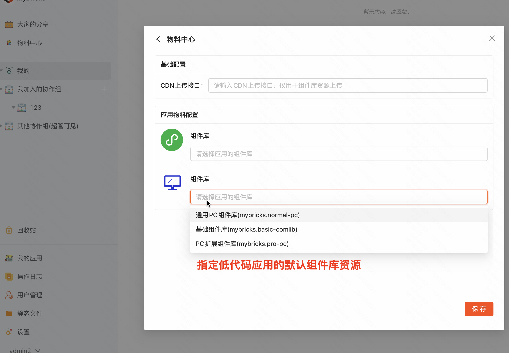

经过上一步部署流程，如果一切顺利，那么恭喜🎉，我们已经可以成功访问到平台，接下来需要对平台进行一些 **必要的初始化配置**

## 登录
访问启动好的平台，第一步就是登录，这里可以使用我们配置文件的配置好的adminUser进行登录

:::tip
如果启动平台之前没有配置管理员，可以重新配置一下，并执行 npm run prepare:start，会自动添加管理员账户
:::

## 安装应用
平台打开后，我们可以根据需要安装各类低代码应用，安装了应用才可以新建对应的搭建项目

eg: 比如需要要搭建PC页面，那就安装PC应用

安装的方式为，点击平台左下角「我的应用」-> 「跳转到应用市场」

建议的安装顺序
1. 安装「物料中心」应用，物料中心主要的能力是可以从 **MyBricks中心化服务** 拉取最新的组件库
2. 安装 各类低代码 应用，比如PC应用就是专门用于中后台PC页面搭建的应用

## [可选] 从中心化服务获取最新组件库
通过物料中心，我们可以从 **MyBricks中心化服务** 上获取最新组件库

**前置依赖**：需要平台已安装「物料中心」应用

在平台的左上角「物料中心」处，点击「更多物料」可以获取到 **MyBricks中心化服务** 的最新组件库，可以按需添加

## [可选] 指定应用的默认组件库
通过物料中心，我们可以指定每个低代码应用的初始化组件库，不用每次新建项目的时候重新添加组件库

**前置依赖**：需要平台已安装「物料中心」应用，并且已获取过组件库

点击设置，选择「物料中心」，可以对物料中心进行配置，我们可以对「已安装的低代码应用」进行配置

**Step1: 进入物料中心配置页面**

**Step2: 配置物料**

