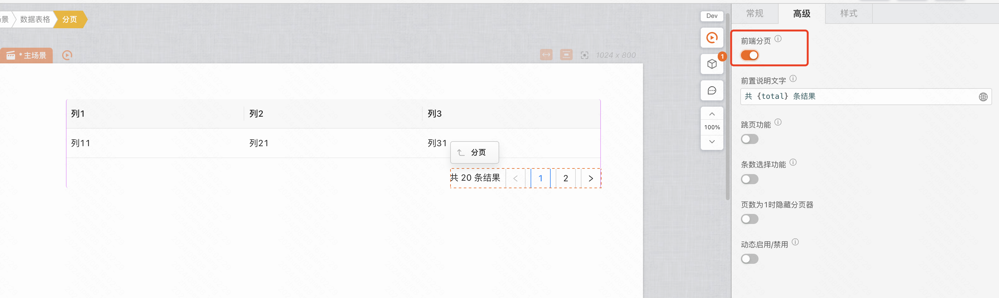

## 列表类组件渲染最佳实践

如果表格渲染或者列表类组件渲染数据时，如 **数据表格** 、 **列表容器** ，出现了卡顿现象，通常有以下解决方案：

- 检查是否设置了 **唯一标识字段**

唯一标识字段，通常为数据库表中的 **主键** 或者是在一组数据中能够 **唯一标识** 每条数据的字段。设置了该字段通常能够减少 DOM 额外不必要的重新渲染开销，以达到提升性能的目的

| **组件名** | **配置项**           |
| ---------- | -------------------- |
| 数据表格   |  |
| 列表容器   |  |

- 是否一次性展示了大量数据，可对数据进行 **分页展示** 处理

同一时间展示了大量数据也会对性能产生影响，对于较老版本的浏览器以及配置较低的电脑影响更为明显

| **组件名** | **配置项**                                                                                                                                                                                                                                                                                                                                                                         |
| ---------- | ---------------------------------------------------------------------------------------------------------------------------------------------------------------------------------------------------------------------------------------------------------------------------------------------------------------------------------------------------------------------------------- |
| 数据表格   |  - 【推荐】开启 “分页模式”，减少每次渲染的数据量  - 默认为 “后端分页”  - 支持 “前端分页”  - 聚焦到 “分页器” - “高级”，开启 “前端分页”  - 开启“数据懒加载”，减少首次渲染数据量，滚动到底后再依次加载，直到数据渲染完全  -   - Tips：懒加载并不能完全解决性能问题，一旦加载的数据量上来后，还是会有概率出现卡顿情况  |
| 列表容器   |  - 搭配“分页器”组件，实现后端分页效果                                                                                                                                                                                                                                                                                                                                        |

## 页面加载慢，疑似卡住？

可以从以下几点入手：

- 网络加载慢 或者 资源加载失败，打开浏览器控制台，观察网络加载情况
- 接口响应时长 或者失败后没有提示，也可以在控制台中观察接口响应情况
  - 失败提示：可在服务接口，发生错误时，连接一个“消息提示”组件
  - 
- 是否存在大数据量渲染，减少首次渲染数据量或者进行分页处理，具体可参考 [问题一](#列表类组件渲染最佳实践)

## 点击或者执行某个逻辑卡死

通常情况可能是搭建了一段 **死循环逻辑** ，检查交互逻辑中是否存在死循环，以下是场景的死循环场景：

Case 1：按钮点击后调用一个 Fx，Fx 内调用接口成功后再次调用当前 Fx，此时可以看到中间没有跳出逻辑，最终会导致死循环

Case 2：表单项的“值更新”事件输出后连接到“设置值”输入事件，“设置值”输入事件又会再次出发“值更新”事件，最终导致死循环

## // Todo... 不断更新中
