:::tip
这是服务接口的自助排查文档
:::

## 接口请求入参问题

### 页面内所有请求公共参数如何处理

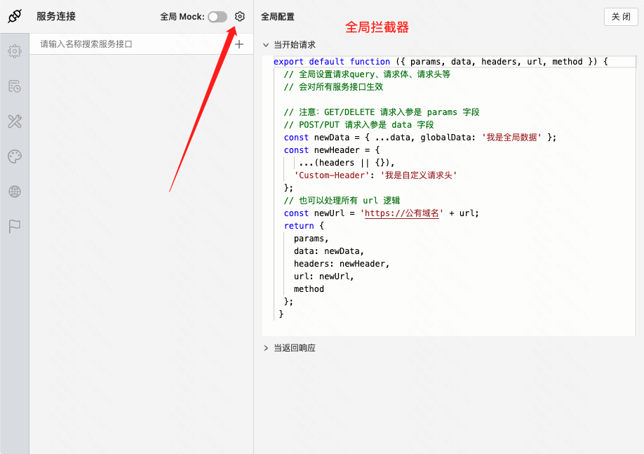

### 单个接口如何自定义参数（单接口自定义拦截逻辑）

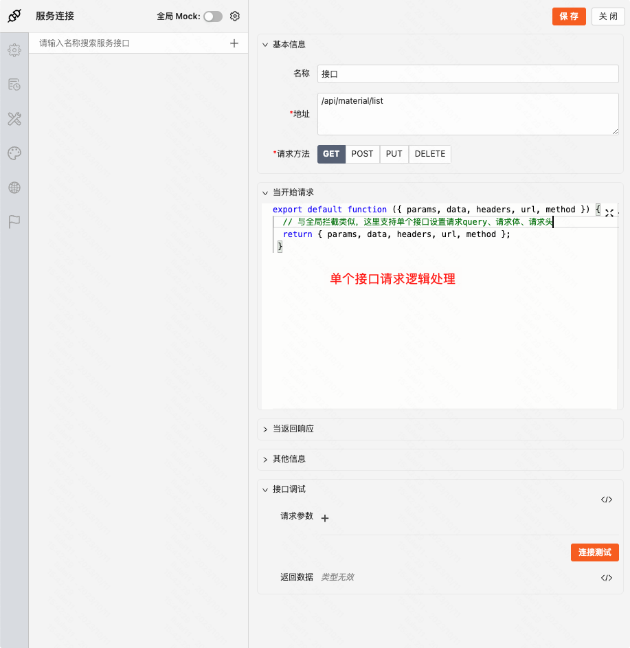

### 接口入参拦截器执行逻辑

发起请求 -> 全局拦截逻辑 -> 接口自定义拦截逻辑

### 导出文件如何搭建

- 拦截器配置 responseType: blob

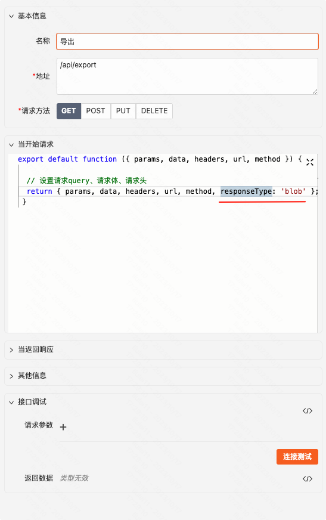

- 导出接口调用后，连接资源下载组件，配置文件类型

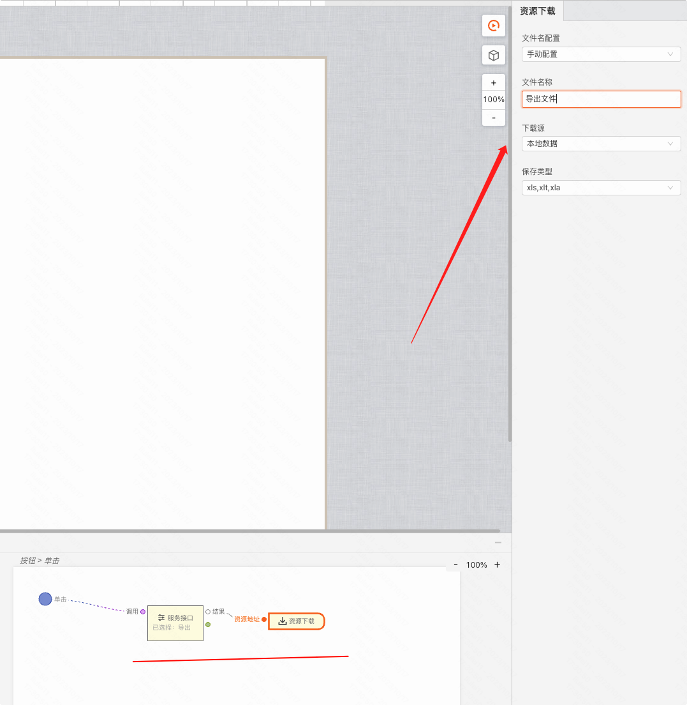

### 报错误：pluginRun(...) is not a function

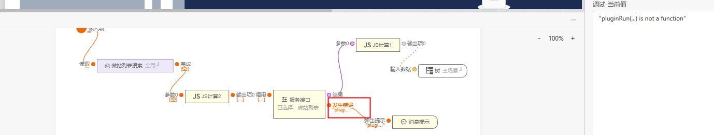

解决排查：

检查全局拦截的拦截器，以及当前接口的拦截器， **确保函数开头结尾不能变化**

```JavaScript
// 开头不能有任何多余字符，必须以 export default 开头，且不能有空格、换行等
//（这段代码只做演示，请不要直接复制使用）
export default function ({ params, data, headers, url, method }) {
  // 这里可以写任意代码
 }

```

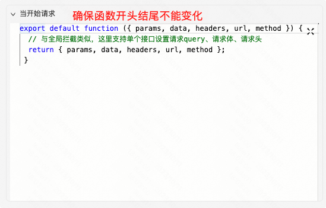

### 请求是 Content-Type: multipart/form-data（或文件上传）如何使用连接测试

#### 非文件上传

在请求拦截器里指定请求内容类型

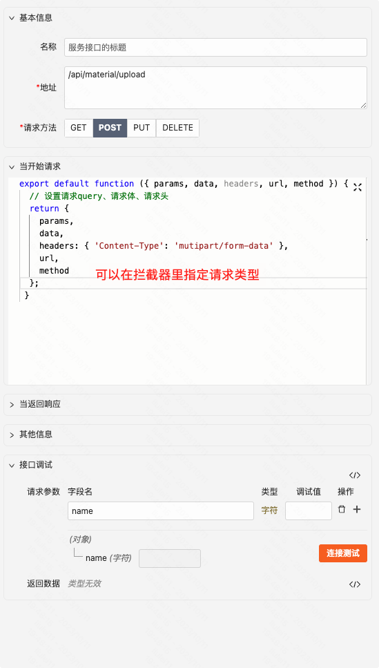

#### 文件上传场景

直接设置请求参数为文件类型，同时上传文件，再点击连接测试时，请求内容类型自动适配为 form-data

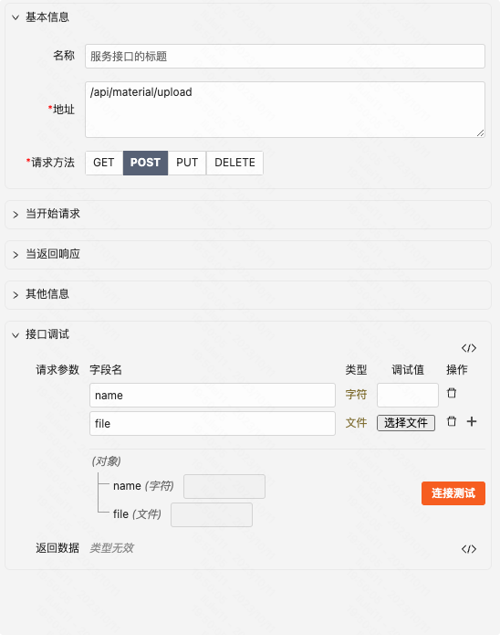

## 接口响应问题

### 接口 404

- 检查接口路径、域名是否错误

### 接口 500

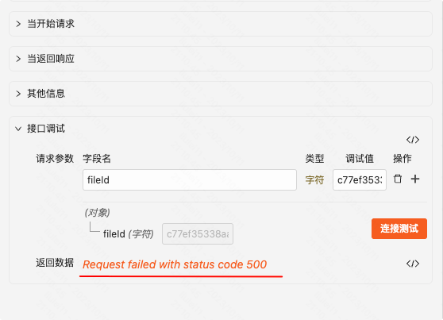

#### 故障排查

- 检查请求参数配置是否正确

- 查全局拦截器配置
- 对应接口拦截器配置
- 查具体传参

- 检查对应服务器是否能访问对应域名

### DNS 解析错误

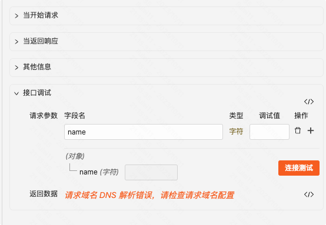

- 检查对应域名或 IP 配置是否正确

### 服务拒绝链接

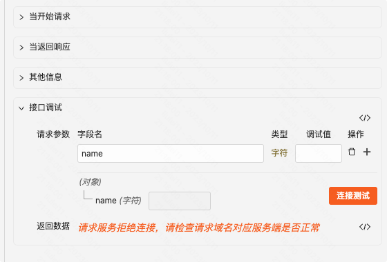

- 检查服务端是否正常

### 接口返回数据，但在逻辑组件里拿不到

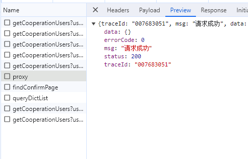

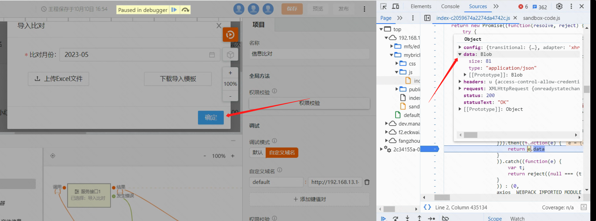

（案例如上:服务端返回数据为二进制数据，不能直接拿到，需要 js 处理转换）

- 先排查是否标记了返回错误字段（造成需要的数据无法返回）

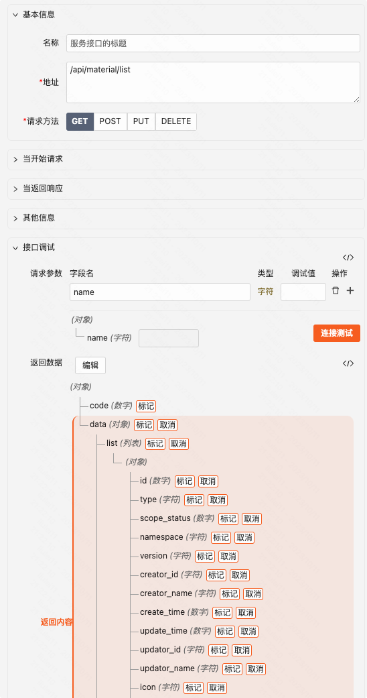

- 排查服务端返回数据格式是否为 json

### Content type multipart/form-data; 不支持

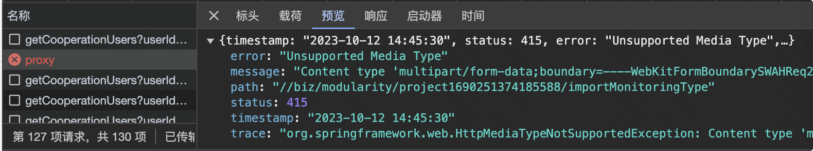

- 检查接口传参 content-type 是否正确
- 检查服务端接口支持的 content-type 是否跟前端请求类型一致（大概率是这个原因）

### 接口响应值跟预期不符合

打开连接器面板，点击连接测试，可在控制台获取详细日志，可调试拦截器等处理逻辑

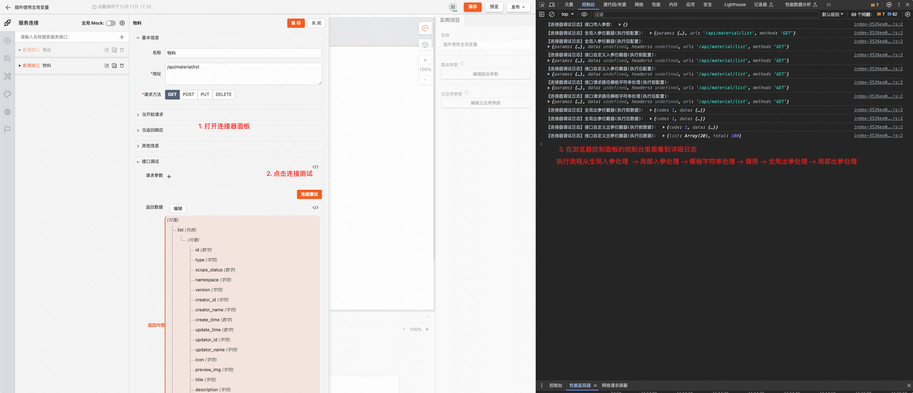

### 返回值报错：Failed to execute ‘setRequestHeader‘ on ‘XMLHttpRequest‘: String contains non ISO-8859-1 code point

**原因：**

请求 header 头中带了中文之类的特殊字符， **浏览器限制请求 header 不允许携带特殊字符** \*\*  
\*\* **解决办法：**

将 header 值 encode 转义，如下图

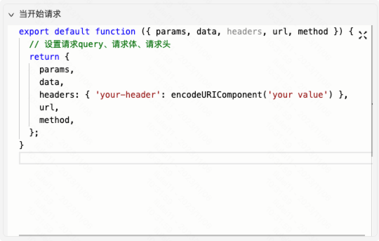
